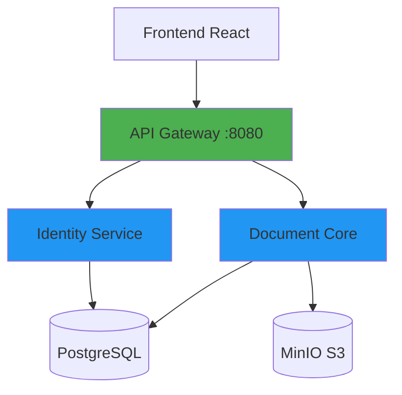

# DocFlow


**Sistema de Gestión Documental Inteligente con Control de Versiones y ACL Granular**

---

## 📋 Tabla de Contenidos

- [¿Qué es DocFlow?](#-qué-es-docflow)
- [✨ Features Principales](#-features-principales)
- [🗺 Estado del Proyecto y Roadmap](#-estado-del-proyecto-y-roadmap)
- [📦 Quick Start](#-quick-start)
- [🚀 Para Nuevos Desarrolladores](#-para-nuevos-desarrolladores)
- [🛠 Stack Tecnológico](#-stack-tecnológico)
- [🏗 Arquitectura del Sistema](#-arquitectura-del-sistema)
- [📚 Documentación Técnica](#-documentación-técnica)
- [🔧 Guías Rápidas](#-guías-rápidas)
- [🛠 Resolución de Problemas](#-resolución-de-problemas)
- [👥 Ficha del Proyecto](#-ficha-del-proyecto)
- [Reglas de Desarrollo](#reglas-de-desarrollo)

---

## 🎯 ¿Qué es DocFlow?

DocFlow es un **sistema modular de gestión documental (DMS)** diseñado con enfoque **API-First**, que combina control de versiones lineal, permisos granulares (RBAC/ACL) y capacidad de integración con sistemas externos (ERP/CRM).

**Problema que resuelve:** Elimina la dicotomía entre seguridad básica y facilidad de uso operativa en la gestión documental, permitiendo colaboración eficiente sin sacrificar control de acceso ni auditoría forense.

**Propuesta de valor:**
- **Para Administradores:** Control total de permisos, auditoría inmutable y métricas de seguridad
- **Para Desarrolladores:** APIs RESTful documentadas (OpenAPI), webhooks y arquitectura modular
- **Para Usuarios Finales:** Interfaz intuitiva tipo explorador, búsqueda rápida y versionado automático

**Visión futura:** Motor de búsqueda semántica basado en IA como plugin opcional (RAG/Vectorial), permitiendo deployments ligeros sin sobrecarga computacional para empresas con recursos limitados.

---

## ✨ Features Principales

### Core MVP (v0.1.0)
- ✅ **Autenticación multi-organización** - OAuth2/JWT con soporte para usuarios en múltiples organizaciones
- ✅ **RBAC Granular** - Control de acceso basado en roles (Ver, Editar, Administrar)
- ✅ **ACL por Carpeta/Documento** - Permisos específicos a nivel de carpeta y archivo
- ✅ **Gestión de Carpetas Jerárquica** - Estructura tipo árbol con soft delete
- ✅ **Control de Versiones Lineal** - Versionado automático (v1.0 → v1.1) con rollback
- ✅ **Almacenamiento Escalable** - Integración con MinIO/S3 para objetos binarios
- ✅ **Audit Trails** - Registro forense inmutable de todas las operaciones

### Planificado (v2.0)
- 🔮 **Búsqueda Semántica con IA** - Motor RAG/Vectorial que respeta ACL
- 🔮 **OCR Automático** - Extracción de texto de documentos escaneados
- 🔮 **Webhooks** - Notificaciones push a sistemas terceros
- 🔮 **API Keys Management** - Panel para gestión de integraciones externas
- 🔮 **Infraestructura Cloud** - Despliegue en Kubernetes con HA

---

## 🗺 Estado del Proyecto y Roadmap

**Versión Actual:** `v0.1.0-MVP` (Febrero 2026)

**Trabajo completado:**

| Épica | Estado | Descripción |
|-------|--------|-------------|
| ✅ **P0: Autenticación y Organización** | Completado | Login multi-org, JWT, cambio de organización |
| ✅ **P1: Administración de Usuarios** | Completado | CRUD de usuarios, asignación de roles |
| ✅ **P2: Permisos (ACL)** | Completado | ACL granular por carpeta/documento, herencia recursiva |
| ✅ **P3: Gestión de Carpetas** | Completado | Estructura jerárquica, soft delete, búsqueda |
| ✅ **P4: Documentos y Versionado** | Completado | Carga, versionado lineal, descarga, metadatos JSONB |

**En desarrollo (con bugs conocidos):**

| Épica | Estado | Notas |
|-------|--------|-------|
| 🚧 **P5: Auditoría** | En desarrollo | Logs de auditoría, pendiente UI de visualización |
| 🚧 **P6: Búsqueda Básica** | En desarrollo | Búsqueda por metadatos, bugs en filtros complejos |

**Backlog futuro:**
- 📋 **P7: Búsqueda Semántica IA** (Plugin opcional)
- 📋 **P8: Webhooks y Notificaciones**
- 📋 **P9: API Keys Management**
- 📋 **P10: Despliegue Cloud K8s**

> **Ver roadmap completo:** [US/Storys.md](US/Storys.md)  
> **Ver tickets en progreso:** [US/tickets/](US/tickets/)

---

## 📦 Quick Start

### Requisitos Previos

- **Java 21** (opcional si ejecutas servicios fuera de Docker)
- **Maven** 3.8+ (para builds backend)
- **Node** 18+ (para frontend local con Vite)
- **Docker** y **Docker Compose**

### Levantar Entorno Local (3 minutos)

```bash
# 1. Clonar variables de entorno
cp .env.example .env

# 2. Levantar infraestructura (PostgreSQL, MinIO, servicios backend)
docker compose up --build -d

# 3. Verificar estado de servicios
docker compose ps

# 4. Insertar datos de prueba
docker cp db/QueryTest.sql docflow-postgres:/tmp/QueryTest.sql
docker compose exec -T postgres psql -U docflow -d docflow -f /tmp/QueryTest.sql

# 5. Frontend (opcional - desarrollo local)
cd frontend
npm install
npm run dev
```

**Acceso a la aplicación:**
- Frontend: `http://localhost:80` (Docker) o `http://localhost:5173` (Vite local)
- API Gateway: `http://localhost:8080`
- MinIO Console: `http://localhost:9001` (admin/admin123)
- PostgreSQL: `localhost:5432` (docflow/docflow_secret)

**Usuario de prueba:**
- Email: `una-org@test.com`
- Password: `password`

> **Detalles de infraestructura:** Ver [README-docker.md](README-docker.md)

---

## 🚀 Para Nuevos Desarrolladores

### Checklist de Setup

1. ✅ Copiar `.env.example` → `.env` y ajustar si es necesario
2. ✅ Ejecutar `docker compose up -d` y verificar servicios con `docker compose ps`
3. ✅ Cargar datos de prueba con script `db/QueryTest.sql`
4. ✅ Revisar logs: `docker compose logs -f gateway`
5. ✅ Leer [Guía de Desarrollo](ai-specs/specs/development_guide.md)
6. ✅ Familiarizarse con [Estándares de Código](.github/copilot-instructions.md)

### Recursos de Onboarding

- **Arquitectura Hexagonal explicada:** [ai-specs/specs/backend-standards.md](ai-specs/specs/backend-standards.md#hexagonal)
- **Estructura de Features (Frontend):** [ai-specs/specs/frontend-standards.md](ai-specs/specs/frontend-standards.md)
- **Modelo de Datos completo:** [docs/DATABASE.md](docs/DATABASE.md)
- **Ejemplos de API:** [docs/API_REFERENCE.md](docs/API_REFERENCE.md)

### Primer Ticket Recomendado

Busca issues etiquetados como `good-first-issue` en las épicas P5 o P6 (bugs simples de UI/API) para familiarizarte con el flujo de desarrollo.

---

## 🛠 Stack Tecnológico

| Capa | Tecnologías | Versión/Detalles |
|------|-------------|------------------|
| **Frontend** | React, TypeScript, Vite, TailwindCSS, Zustand | React 19, Vite 6.x |
| **API Gateway** | Spring Cloud Gateway | Spring Boot 3.x |
| **Backend** | Spring Boot, Java, MapStruct, Lombok | Java 21, Spring Boot 3.x |
| **Base de Datos** | PostgreSQL | 15+ (JSONB, LTREE) |
| **Almacenamiento** | MinIO (S3-compatible) | Latest |
| **Testing** | JUnit 5, Mockito, Vitest, Cypress | Cobertura 90%+ |
| **Build** | Maven, npm | Maven 3.8+, npm 9+ |
| **Containerización** | Docker, Docker Compose | Docker 24+ |
| **Futuros** | Redis, MongoDB, Kafka, K8s | Planificado v2.0 |

**Patrones arquitectónicos:**
- Backend: Arquitectura Hexagonal (Ports & Adapters) + Clean Architecture
- Frontend: Feature-Driven Development (FDD) con Atomic Design
- Eventos: Event-Driven Architecture (planificado con Kafka)

---

## 🏗 Arquitectura del Sistema

### Diagrama de Componentes (MVP Actual)



**⚠️ Nota de Arquitectura:**  
El diagrama completo muestra servicios adicionales (Redis, MongoDB, Kafka, Search Service) que están **planificados para v2.0**. El MVP actual utiliza **Docker Compose local** en lugar de Kubernetes.

**Componentes implementados (MVP):**
- ✅ API Gateway (Spring Cloud Gateway)
- ✅ Identity Service (Autenticación, RBAC)
- ✅ Document Core Service (Gestión documental, ACL)
- ✅ PostgreSQL (Metadatos relacionales)
- ✅ MinIO (Almacenamiento de blobs)

### Ver Arquitectura Completa

Para diagramas detallados de despliegue, flujos de secuencia y decisiones arquitectónicas:  
**→ [docs/ARCHITECTURE.md](docs/ARCHITECTURE.md)**

---

## 📚 Documentación Técnica

### Por Audiencia

**Para Desarrolladores Backend:**
- [Estándares de Código Backend](.github/rules-backend.md)
- [Arquitectura Hexagonal Explicada](ai-specs/specs/backend-standards.md)
- [Modelo de Datos Completo](docs/DATABASE.md)

**Para Desarrolladores Frontend:**
- [Estándares de Código Frontend](.github/rules-frontend.md)
- [Guía de Features y Hooks](ai-specs/specs/frontend-standards.md)
- [Componentes UI y Atomic Design](frontend/src/common/)

**Para DevOps/Infraestructura:**
- [Guía de Docker Compose](README-docker.md)
- [Reglas de Infraestructura](.github/rules-infra-docker.md)
- [Despliegue Cloud (Visión)](docs/ARCHITECTURE.md#infraestructura-y-despliegue-visión-v20)

**Para Product Managers:**
- [Historias de Usuario (US)](US/Storys.md)
- [Roadmap y Épicas](US/Storys.md#épicas-priorizadas-mvp)
- [Estado del Proyecto](#-estado-del-proyecto-y-roadmap)

### Especificaciones Técnicas

- **API Reference:** [docs/API_REFERENCE.md](docs/API_REFERENCE.md)
- **OpenAPI Spec:** [ai-specs/specs/api-spec.yml](ai-specs/specs/api-spec.yml)
- **Data Model:** [ai-specs/specs/data-model.md](ai-specs/specs/data-model.md)
- **Development Guide:** [ai-specs/specs/development_guide.md](ai-specs/specs/development_guide.md)

---

## 🔧 Guías Rápidas

### Comandos de Desarrollo

**Backend (por servicio):**
```bash
cd backend/gateway
mvn clean package          # Build
mvn spring-boot:run        # Run local
mvn test                   # Tests unitarios
# Reportes en: target/surefire-reports
```

**Frontend:**
```bash
cd frontend
npm install                # Instalar dependencias
npm run dev                # Dev server (Vite) en :5173
npm run build              # Build producción
npm run preview            # Preview build local
npm run test               # Tests con Vitest
```

**Docker Compose:**
```bash
docker compose up -d       # Levantar servicios
docker compose ps          # Ver estado
docker compose logs -f gateway  # Logs en tiempo real
docker compose down -v     # Parar y limpiar volúmenes
```

### Estructura de Proyecto

```
docflow/
├── frontend/              # SPA React + TypeScript
│   └── src/
│       ├── features/      # Módulos funcionales (auth, folders, documents)
│       ├── common/        # Componentes compartidos
│       └── core/          # Servicios y configuración
├── backend/               # Microservicios Spring Boot
│   ├── gateway/           # API Gateway (Puerto 8080)
│   ├── identity/          # Servicio IAM
│   └── document-core/     # Servicio de documentos
├── docs/                  # Documentación técnica especializada
│   ├── ARCHITECTURE.md
│   ├── DATABASE.md
│   └── API_REFERENCE.md
├── db/                    # Scripts SQL de setup/testing
├── US/                    # Historias de usuario y tickets
└── docker-compose.yml     # Orquestación de servicios
```

---

##  🛠 Resolución de Problemas

### Docker

**Puerto ocupado:**
```bash
docker compose ps          # Ver qué está corriendo
# Modificar puertos en .env si hay conflicto
```

**Servicios no inician:**
```bash
docker compose logs -f <servicio>
docker compose down -v --remove-orphans
docker compose up --build -d
```

### Base de Datos

**Error de conexión a PostgreSQL:**
```bash
# Verificar que el contenedor esté corriendo
docker compose ps postgres
# Verificar credenciales en .env
DB_HOST=localhost
DB_PORT=5432
DB_NAME=docflow
DB_USER=docflow
DB_PASSWORD=docflow_secret
```

**Resetear datos:**
```bash
docker compose down -v     # Elimina volúmenes
docker compose up -d
# Volver a cargar QueryTest.sql
```

### Frontend

**Errores de CORS:**
- Verificar `CORS_ALLOWED_ORIGINS` en backend (no permite `*`)
- Configuración en `backend/gateway/src/main/resources/application.yml`

**Build falla:**
```bash
rm -rf node_modules package-lock.json
npm install
npm run build
```

### Backend

**Maven build falla:**
```bash
mvn clean install -U      # Forzar actualización de dependencias
mvn dependency:tree       # Ver árbol de dependencias
```

**Tokens JWT expiran:**
- Validez por defecto: 1 hora (3600s)
- Hacer login nuevamente para obtener nuevo token
- Configurar refresh token (planificado v2.0)

**MinIO permissions:**
```bash
# Verificar bucket existe
# MinIO Console: http://localhost:9001
# Usuario: admin / Password: admin123
# Bucket requerido: docflow-documents
```

---

## 👥 Ficha del Proyecto


* **Nombre:** Eduardo Guardado Ruiz
* **Proyecto:** DocFlow
* **Versión:** 0.1.0-MVP
* **Fecha:** Febrero 2026
* **Descripción:** Sistema modular de gestión documental (DMS) con enfoque API-First, control de versiones lineal y motor de búsqueda semántica basado en IA (plugin opcional), priorizando usabilidad, integración y accesibilidad para empresas de diversos tamaños.

---

## Descripción General del Producto

DocFlow es una **plataforma de gestión documental modular** diseñada como infraestructura backend que permite a otros sistemas heredar capacidades documentales avanzadas.

### Segmentos de Usuario

* **Administradores:** Configuración de roles, permisos y monitoreo del sistema
* **Desarrolladores/Sistemas:** Integradores que usan APIs para conectar ERPs/CRMs
* **Usuarios Finales:** Profesionales operativos que gestionan documentos diariamente

### Funcionalidades Clave

**Seguridad y Control de Acceso:**
- RBAC Granular (Ver, Editar, Administrar)
- ACL por carpeta y documento con herencia recursiva
- Audit Trails inmutables

**Gestión Documental:**
- Control de versiones lineal con rollback
- Estructura de carpetas jerárquica
- Metadatos JSONB personalizables
- Almacenamiento escalable (S3/MinIO)

**Inteligencia Artificial (Futuro):**
- Búsqueda semántica RAG/Vectorial
- OCR automático
- Filtros de seguridad que respetan ACL

**Integración:**
- API RESTful documentada (OpenAPI)
- Webhooks (planificado)
- API Keys management (planificado)

### Diseño de Experiencia

- **Administradores:** Dashboard con métricas de seguridad y gestión drag-and-drop de permisos
- **Desarrolladores:** Portal de documentación con Swagger UI interactivo
- **Usuarios Finales:** Interfaz tipo explorador nativo con búsqueda intuitiva

---

## Reglas de Desarrollo

Las reglas de desarrollo están centralizadas por área:

- **Índice General:** [.github/RULES.md](.github/RULES.md)
- **Backend:** [.github/rules-backend.md](.github/rules-backend.md)
- **Frontend:** [.github/rules-frontend.md](.github/rules-frontend.md)
- **Base de Datos:** [.github/rules-database.md](.github/rules-database.md)
- **Infraestructura:** [.github/rules-infra-docker.md](.github/rules-infra-docker.md)

**Principios clave:**
- TDD obligatorio (cobertura 90%+)
- Arquitectura Hexagonal en backend
- Feature-Driven Development en frontend
- Domain-Driven Design (DDD)

---

## Documentación Avanzada

### Arquitectura y Diseño
- **Arquitectura Completa:** [docs/ARCHITECTURE.md](docs/ARCHITECTURE.md) - Diagramas detallados, patrones, seguridad
- **Modelo de Datos:** [docs/DATABASE.md](docs/DATABASE.md) - ERD completo, diccionario de tablas, índices
- **API Reference:** [docs/API_REFERENCE.md](docs/API_REFERENCE.md) - OpenAPI spec, ejemplos de uso, códigos de error

### Especificaciones Técnicas
- **OpenAPI YAML:** [ai-specs/specs/api-spec.yml](ai-specs/specs/api-spec.yml)
- **Data Model Spec:** [ai-specs/specs/data-model.md](ai-specs/specs/data-model.md)
- **Backend Standards:** [ai-specs/specs/backend-standards.md](ai-specs/specs/backend-standards.md)
- **Frontend Standards:** [ai-specs/specs/frontend-standards.md](ai-specs/specs/frontend-standards.md)
- **Development Guide:** [ai-specs/specs/development_guide.md](ai-specs/specs/development_guide.md)

### READMEs de Componentes
- **Docker Compose:** [README-docker.md](README-docker.md)
- **Frontend:** [frontend/README.md](frontend/README.md)
- **API Gateway:** [backend/gateway/README.md](backend/gateway/README.md)
- **Document Core:** [backend/document-core/README.md](backend/document-core/README.md)
- **Identity Service:** [backend/identity/README.md](backend/identity/README.md)

---

## Historias de Usuario y Tickets

- **Historias de Usuario (Épicas P0-P6):** [US/Storys.md](US/Storys.md)
- **Tickets de Trabajo:** [US/tickets/](US/tickets/)
  - [P0: Autenticación](US/tickets/P0-Autenticacion/)
  - [P1: Administración](US/tickets/P1-Administracion/)
  - [P2: Permisos ACL](US/tickets/P2-Permisos/)
  - [P3: Gestión de Carpetas](US/tickets/P3-Gestion/)
  - [P4: Documentos](US/tickets/P4-Documentos/)
  - [P5: Auditoría](US/tickets/P5-Auditoria/)
  - [P6: Búsqueda](US/tickets/P6-Busqueda_sin_IA/)

---

## Diagrama Resumido de Arquitectura

**Visión v2.0 (Kubernetes - Futuro):**

Los diagramas detallados de arquitectura cloud, despliegue en K8s, flujos de secuencia y decisiones técnicas están disponibles en:

**→ [docs/ARCHITECTURE.md](docs/ARCHITECTURE.md)**

**MVP Actual (Docker Compose):**

```
Frontend (React) → API Gateway :8080 → Identity Service → PostgreSQL
                                      → Document Core → PostgreSQL + MinIO
```

**Servicios MVP:**
- ✅ API Gateway (Spring Cloud Gateway)
- ✅ Identity Service (IAM, RBAC)
- ✅ Document Core (Gestión documental, ACL)
- ✅ PostgreSQL (Metadatos)
- ✅ MinIO (Almacenamiento S3)

**Servicios planificados v2.0:**  
Redis, MongoDB, Kafka, Search & Intelligence (IA), Vault

Para diagramas completos de arquitectura, componentes, flujos de secuencia y decisiones técnicas:

**→ Ver [docs/ARCHITECTURE.md](docs/ARCHITECTURE.md)**

---

## Contribución al Proyecto

**Este es un proyecto privado con fines educativos.**

Para contribuir o reportar issues, contacta directamente al propietario del proyecto.

---

## Licencia

Proyecto privado - Todos los derechos reservados © 2026 Eduardo Guardado Ruiz