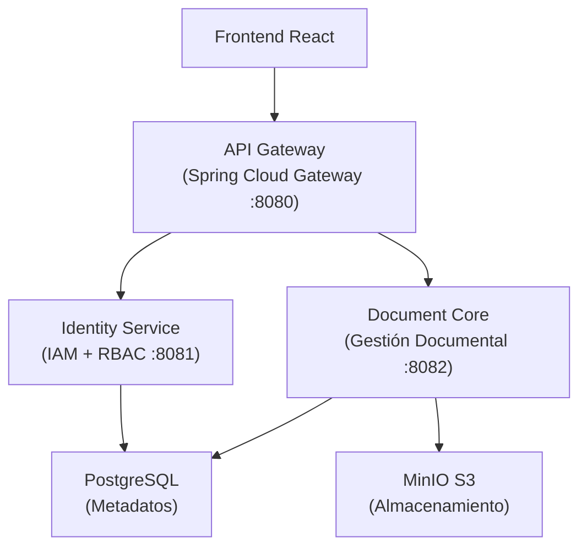
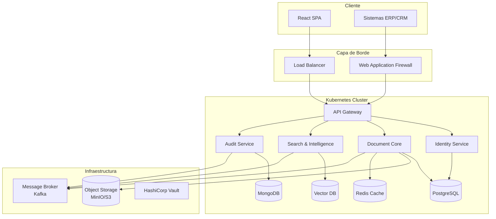
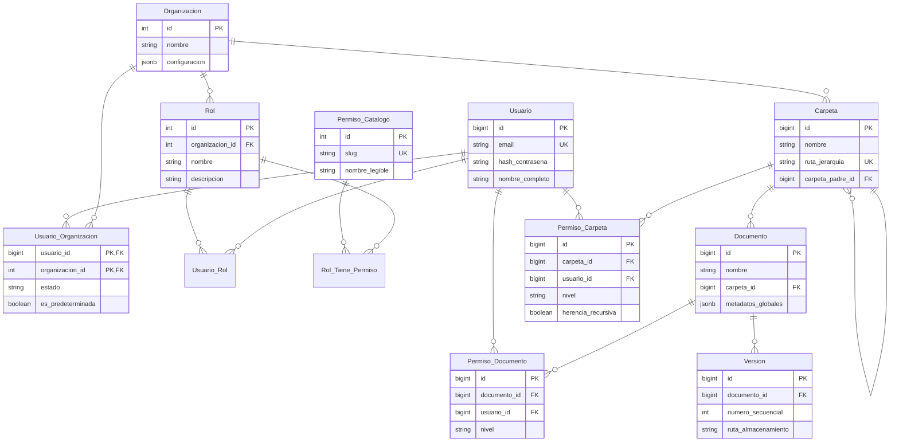

# DocFlow - Sistema de Gestión Documental Inteligente


---

## Índice

0. [Ficha del proyecto](#0-ficha-del-proyecto)
1. [Descripción general del producto](#1-descripción-general-del-producto)
2. [Arquitectura del sistema](#2-arquitectura-del-sistema)
3. [Modelo de datos](#3-modelo-de-datos)
4. [Especificación de la API](#4-especificación-de-la-api)
5. [Historias de usuario](#5-historias-de-usuario)
6. [Tickets de trabajo](#6-tickets-de-trabajo)
7. [Pull requests](#7-pull-requests)

---

## 0. Ficha del Proyecto

### **0.1. Tu nombre completo:**

Eduardo Guardado Ruiz

### **0.2. Nombre del proyecto:**

DocFlow

### **0.3. Descripción breve del proyecto:**

Sistema modular de gestión documental (DMS) con enfoque **API-First**, que combina control de versiones lineal, permisos granulares (RBAC/ACL), autenticación multi-organización y capacidad de integración con sistemas externos (ERP/CRM). Versión MVP: 0.1.0.

### **0.4. URL del proyecto:**

https://docflow.balam.mx

---

## 1. Descripción general del producto

### **1.1. Objetivo:**

DocFlow resuelve la dicotomía entre seguridad básica y facilidad de uso operativa en la gestión documental, permitiendo colaboración eficiente sin sacrificar control de acceso granular ni auditoría forense. 

**Propósito core:** Ser una plataforma escalable de gestión documental que actúe como infraestructura modular para que otros sistemas (ERPs, CRMs, aplicaciones custom) hereden capacidades documentales avanzadas.

**Valor aportado:**
- **Para Administradores:** Control total de permisos, auditoría inmutable y métricas de seguridad
- **Para Desarrolladores:** APIs RESTful documentadas (OpenAPI), webhooks y arquitectura modular
- **Para Usuarios Finales:** Interfaz intuitiva tipo explorador, búsqueda rápida y versionado automático

### **1.2. Características y funcionalidades principales:**

**Core MVP (v0.1.0) - Completado:**
- ✅ **Autenticación multi-organización** - OAuth2/JWT con aislamiento de datos por organización
- ✅ **RBAC Granular** - Roles con asignación de permisos por administrador
- ✅ **ACL Granular por Carpeta/Documento** - Permisos específicos a nivel de objeto (Ver, Editar, Administrar)
- ✅ **Gestión de Carpetas Jerárquica** - Estructura tipo árbol con soft delete y herencia de permisos
- ✅ **Control de Versiones Lineal** - Versionado automático con rollback a versiones anteriores
- ✅ **Almacenamiento Escalable** - Integración con MinIO/S3 para objetos binarios
- ✅ **Audit Trails** - Registro forense inmutable de todas las operaciones críticas
- ✅ **Administración de Usuarios** - CRUD de usuarios, asignación de roles, desactivación sin borrado físico

**Planificado (v2.0):**
- 🔮 **Búsqueda Semántica con IA** - Motor RAG/Vectorial que respeta ACL
- 🔮 **OCR Automático** - Extracción de texto de documentos escaneados
- 🔮 **Webhooks** - Notificaciones push a sistemas terceros
- 🔮 **API Keys Management** - Panel para gestión de integraciones externas
- 🔮 **Infraestructura Cloud** - Despliegue en Kubernetes con múltiples zonas y HA

### **1.3. Diseño y experiencia de usuario:**

**Interfaz de Usuario:**
- **Dashboard Admin:** Gestión centralizada de usuarios, roles y permisos con visualización drag-and-drop
- **Interfaz de Documentos:** Explorador de archivos tipo Windows/Mac con navegación jerárquica
- **Búsqueda:** Búsqueda rápida por nombre, metadatos y propiedades de documento
- **Versionado:** Timeline visual de versiones con vista previa y comparación de cambios

**Flujos principales:**
1. **Login → Selección de Organización → Dashboard Principal**
2. **Navegación jeráquica de carpetas → Visualización/Descarga de documentos**
3. **Subida de documentos → Gestión de permisos → Auditoría de operaciones**

**Experiencia responsive:** Adaptada a navegadores modernos (Chrome, Safari, Firefox)

### **1.4. Instrucciones de instalación:**

#### Requisitos previos:
- **Java 21** (para backend)
- **Maven 3.8+** (para build backend)
- **Node 18+** (para frontend con Vite)
- **Docker** y **Docker Compose**

#### Instalación paso a paso:

```bash
# 1. Clonar variables de entorno y personalizar
cp .env.example .env

# 2. Levantar infraestructura completa (PostgreSQL, MinIO, servicios backend)
docker compose up --build -d

# 3. Verificar estado de servicios
docker compose ps

# 4. Insertar datos de prueba
docker cp db/QueryTest.sql docflow-postgres:/tmp/QueryTest.sql
docker compose exec -T postgres psql -U docflow -d docflow -f /tmp/QueryTest.sql

# 5. Frontend (desarrollo local con Vite)
cd frontend
npm install
npm run dev       # Accesible en http://localhost:5173
```

#### Acceso a la aplicación:

- **Frontend:** `http://localhost:80` (Docker) o `http://localhost:5173` (Vite local)
- **API Gateway:** `http://localhost:8080`
- **MinIO Console:** `http://localhost:9001` (credenciales: admin/admin123)
- **PostgreSQL:** `localhost:5432` (usuario: docflow, contraseña: docflow_secret)
- **Swagger UI (Identity Service):** `http://localhost:8081/swagger-ui.html`
- **Swagger UI (Document Core):** `http://localhost:8082/swagger-ui.html`

#### Credenciales de prueba:

- **Email:** `una-org@test.com`
- **Password:** `password`

#### Base de datos:

- Migraciones automáticas ejecutadas por Spring Boot
- Seeds incluidos en `db/QueryTest.sql` para ambiente de desarrollo
- Tablas principales: `usuario`, `organizacion`, `carpeta`, `documento`, `version`, `permiso_*`, `audit_*`

> **Detalles técnicos de infraestructura:** Ver [README-docker.md](README-docker.md)

---

## 2. Arquitectura del Sistema

### **2.1. Diagrama de arquitectura:**

**MVP Actual (Docker Compose Local):**



**Visión Futura (Kubernetes v2.0):**



**Justificación arquitectónica:**
- **Hexagonal/Ports & Adapters:** Separación clara entre dominio, aplicación e infraestructura
- **Microservicios:** Escalabilidad independiente, despliegue aislado
- **API-First:** Contrato claro, documentación automática (OpenAPI)
- **Event-Driven (v2.0):** Desacoplamiento temporal, facilita auditabilidad

**Beneficios:**
- Modularidad y reutilización
- Testabilidad e independencia
- Escalabilidad horizontal
- Resiliencia de fallos

**Sacrificios:**
- Mayor complejidad operacional
- Latencia por múltiples hops de red
- Eventual consistency en eventos distribuidos

---

### **2.2. Descripción de componentes principales:**

| Componente | Tecnología | Puerto | Responsabilidad |
|-----------|-----------|--------|-----------------|
| **Frontend** | React 19, TypeScript, Vite | 5173/80 | UI responsiva, formularios, navegación |
| **API Gateway** | Spring Cloud Gateway | 8080 | Enrutamiento, autenticación, rate limiting |
| **Identity Service** | Spring Boot 3, Java 21 | 8081 | Autenticación JWT, RBAC, gestión de roles |
| **Document Core** | Spring Boot 3, Java 21 | 8082 | Gestión de documentos, ACL, versionado |
| **PostgreSQL** | PostgreSQL 15+ | 5432 | Datos relacionales, metadatos, índices |
| **MinIO** | S3-compatible | 9000/9001 | Almacenamiento binario de documentos |

---

### **2.3. Descripción de alto nivel del proyecto y estructura de ficheros**

```
docflow/
├── frontend/                          # SPA React + TypeScript (Vite)
│   ├── src/
│   │   ├── features/                 # Módulos funcionales
│   │   ├── common/                   # Componentes compartidos
│   │   ├── core/                     # Servicios globales
│   │   └── App.tsx
│   ├── package.json
│   ├── vite.config.ts
│   └── Dockerfile
│
├── backend/                           # Microservicios Spring Boot
│   ├── gateway/                      # API Gateway
│   ├── identity/                     # Identity Service
│   └── document-core/                # Document Core Service
│
├── db/                               # Scripts SQL
│   ├── QueryTest.sql                # Seeds para desarrollo
│   └── migrations/                  # Migraciones
│
├── docs/                             # Documentación técnica
│   ├── ARCHITECTURE.md
│   ├── DATABASE.md
│   └── API_REFERENCE.md
│
├── ai-specs/                         # Especificaciones y estándares
│   ├── specs/
│   └── changes/
│
├── US/                              # Gestión de historias y tickets
│   ├── Storys.md
│   └── tickets/
│
├── docker-compose.yml               # Orquestación local
├── .env.example                     # Variables de entorno
├── README.md                        # Este archivo
└── README-docker.md                 # Guía de infraestructura
```

---

### **2.4. Infraestructura y despliegue**

**Infraestructura Local (Docker Compose):**
- PostgreSQL 15+ (volumen persistente)
- MinIO S3 (volumen persistente)
- Identity, Document Core, API Gateway (Spring Boot)
- Frontend (Nginx/React SPA)

**Proceso local:**
1. **Build:** `docker compose build --no-cache`
2. **Deploy:** `docker compose up -d`
3. **Verificación:** `docker compose ps`
4. **Datos:** Scripts SQL en `db/`
5. **Acceso:** Frontend en `http://localhost`, API en `http://localhost:8080`

**Despliegue futuro (Kubernetes v2.0):**
- Helm charts
- ArgoCD para GitOps
- Service mesh (Istio/Linkerd)
- Prometheus + Grafana
- Sealed Secrets

---

### **2.5. Seguridad**

**Prácticas implementadas:**

1. **Autenticación JWT:**
   - Claims: usuario_id, organizacion_id, roles
   - Expiration: 1 hora
   - Refresh tokens: v2.0

2. **Aislamiento por organización:**
   - organizacion_id del token (no cliente)
   - Queries filtran automáticamente
   - Imposible accesar datos de otra org

3. **ACL Granular:**
   - Precedencia: Documento > Carpeta
   - Evaluación en cada operación
   - Audit de cambios

4. **Validación de entrada:**
   - Spring Validation decorators
   - Sanitización de paths (LTREE)
   - Prepared statements

5. **Auditoría inmutable:**
   - Tabla AuditLog append-only
   - Registro: usuario, operación, recurso, timestamp, resultado
   - No permite edición/borrado

6. **HTTPS/TLS + Rate limiting**

---

### **2.6. Tests**

**Cobertura: 90%+ en métodos críticos**

**Backend:** JUnit 5, Mockito, TestContainers  
**Frontend:** Vitest, React Testing Library  
**BD:** Validación de constraints, índices, triggers

Ejecutar:
```bash
cd backend/&lt;module&gt; && mvn clean test
cd frontend && npm run test
```

---

## 3. Modelo de Datos

### **3.1. Diagrama del modelo de datos:**



---

### **3.2. Descripción de entidades principales:**

| Entidad | Atributos | Restricciones | Descripción |
|---------|-----------|--------------|------------|
| **Organizacion** | id (PK), nombre, estado | Silo independiente | Contexto de aislamiento de datos |
| **Usuario** | id (PK), email (UK), hash_contrasena | Email único globally | No borrado físico |
| **Usuario_Organizacion** | usuario_id (PK,FK), organizacion_id (PK,FK), es_predeterminada | Membresía M:N | Define pertenencia y org predeterminada |
| **Rol** | id (PK), organizacion_id (FK), nombre | Nombres únicos por org | Conjunto de permisos |
| **Permiso_Catalogo** | id (PK), slug (UK), nombre_legible | Catálogo global | Ej: docs.crear, carpetas.eliminar |
| **Carpeta** | id (PK), ruta_jerarquia (UK,LTREE), carpeta_padre_id (FK) | Estructura jerárquica | Soft delete, auditable |
| **Documento** | id (PK), nombre, carpeta_id (FK), metadatos_globales (JSONB) | Pertenece a carpeta | Versiones inmutables |
| **Version** | id (PK), documento_id (FK), numero_secuencial, ruta_almacenamiento | Append-only | Path: /org/{id}/doc/{id}/v{n} |
| **Permiso_Carpeta** | carpeta_id (FK), usuario_id (FK), nivel, herencia_recursiva | LECTURA\|ESCRITURA\|ADMINISTRACION | Hereda en subcarpetas si recursiva=true |
| **Permiso_Documento** | documento_id (FK), usuario_id (FK), nivel | Sobreescribe carpeta | Precedencia: Documento > Carpeta |

---

## 4. Especificación de la API

### **4.1. Endpoints principales (OpenAPI 3.0)**

#### **Autenticación**

```yaml
POST /auth/login
  Request:
    - email (string)
    - password (string)
  Response (200):
    token: JWT
    usuario_id: number
    organizacion_id: number
    roles: string[]
  Errores:
    - 401: Credenciales inválidas
    - 409: Múltiples orgs sin predeterminada

POST /auth/switch
  Request:
    organizacion_id: number
  Response (200):
    token: JWT_new
```

#### **Gestión de Carpetas**

```yaml
POST /folders
  Request:
    nombre: string
    carpeta_padre_id: number (opcional)
  Response (201)

GET /folders/{folder_id}
  Response (200)

DELETE /folders/{folder_id}
  Response (204)
```

#### **Gestión de Documentos**

```yaml
POST /documents
  Request: multipart/form-data
    file: binary
    nombre: string
    carpeta_id: number
  Response (201)

PUT /documents/{document_id}/versions
  Request: multipart/form-data
  Response (201)

GET /documents/{document_id}/versions
  Response (200)
```

#### **Control de Acceso (ACL)**

```yaml
POST /permissions/folders/{folder_id}
  Request:
    usuario_id: number
    nivel: LECTURA|ESCRITURA|ADMINISTRACION
    herencia_recursiva: boolean
  Response (201)

GET /permissions/folders/{folder_id}
  Response (200)

DELETE /permissions/folders/{folder_id}/{permission_id}
  Response (204)
```

> **OpenAPI completo:** [ai-specs/specs/api-spec.yml](ai-specs/specs/api-spec.yml)

---

## 5. Historias de Usuario

### **Historia 1: Autenticación Multi-Organización (US-AUTH-001)**

**Épica:** P0 - Autenticación | **Puntos:** 13

**Narrativa:**  
Como usuario, quiero iniciar sesión con mis credenciales y acceder automáticamente a mi organización predeterminada, para usar el sistema de forma simple.

**Criterios:**
- ✅ Login exitoso con JWT si org predeterminada
- ✅ Error 409 si múltiples orgs sin predeterminada
- ✅ Error 401 si credenciales inválidas
- ✅ Error 403 si usuario inactivo

---

### **Historia 2: ACL Granular por Carpeta/Documento (US-ACL-002)**

**Épica:** P2 - Permisos ACL | **Puntos:** 21

**Narrativa:**  
Como administrador, quiero conceder permisos granulares (Lectura, Escritura, Administración) a nivel de carpeta y documento, para controlar acceso específico a información sensible.

**Criterios:**
- ✅ Conceder LECTURA/ESCRITURA/ADMINISTRACION
- ✅ Herencia recursiva en subcarpetas
- ✅ Precedencia: Documento > Carpeta
- ✅ Revocar permiso

---

### **Historia 3: Gestión de Carpetas Jerárquica (US-FOLDER-001)**

**Épica:** P3 - Gestión de Carpetas | **Puntos:** 13

**Narrativa:**  
Como usuario con permisos de escritura, quiero crear y organizar carpetas en estructura jerárquica, para clasificar documentos de forma lógica.

**Criterios:**
- ✅ Crear carpeta en raíz
- ✅ Crear subcarpeta con herencia de ruta
- ✅ Navegar jerarquía
- ✅ Soft delete
- ✅ Error 409 si nombre duplicado

---

## 6. Tickets de Trabajo

### **Ticket 1: Backend - Endpoint de Login (TICKET-001)**

**Servicio:** Identity Service | **Prioridad:** P0 | **Puntos:** 13

**Descripción:**  
Implementar `POST /auth/login` con autenticación multi-organización, validación de org predeterminada y emisión de JWT.

**Tareas:**
- [ ] Revisar estándares hexagonal
- [ ] Crear dominio: Usuario, Rol, Permiso
- [ ] Implementar LoginUseCase
- [ ] Crear AutenticacionAdapter (JWT)
- [ ] Tests unitarios (5 scenarios)
- [ ] Tests integración
- [ ] Actualizar OpenAPI

**Definición de Hecho:**
- PR mergeada (2+ aprobaciones)
- Cobertura >= 90%
- Sin warnings SonarQube

---

### **Ticket 2: Frontend - Componente Login (TICKET-002)**

**Aplicación:** Frontend React | **Prioridad:** P0 | **Puntos:** 13

**Descripción:**  
Implementar página de login con formulario email/password, validación, almacenamiento JWT, redirección a dashboard.

**Tareas:**
- [ ] Crear hook useAuth() (Zustand)
- [ ] Crear servicio authService (axios)
- [ ] Componente LoginForm.tsx
- [ ] Componente LoginPage.tsx
- [ ] HOC ProtectedRoute
- [ ] Tests (>= 80%)

**Definición de Hecho:**
- PR mergeada
- Cobertura >= 80%
- Funciona en navegadores modernos

---

### **Ticket 3: Base de Datos - Schema Inicial (TICKET-003)**

**Tipo:** Infraestructura | **Prioridad:** P0 | **Puntos:** 21

**Descripción:**  
Implementar schema PostgreSQL con todas las tablas base, índices, constraints y migraciones Flyway.

**Tareas:**
- [ ] Crear V001__initial_schema.sql
- [ ] Definir PK/FK/UK/constraints
- [ ] Crear índices
- [ ] Crear seeds en db/QueryTest.sql
- [ ] Documentar en DATABASE.md

**Definición de Hecho:**
- Migration en código
- Schema se crea con `docker compose up`
- Seeds ejecutan sin errores

---

## 7. Pull Requests

### **PR #42: JWT Authentication Multi-Org Support ✅**

**Estado:** Merged | **Fecha:** 2026-02-15

Implementa autenticación JWT en Identity Service con soporte multi-organización, validación de org predeterminada, tokens con claims de usuario/org/roles.

**Cambios principales:**
- Domain: Usuario, Rol, Permiso
- Application: LoginUseCase
- Infrastructure: JwtProvider, AuthFilter
- Tests: 90% cobertura

---

### **PR #43: Frontend Login UI and Auth Flow ✅**

**Estado:** Merged | **Fecha:** 2026-02-16

Implementa página de login React con formulario email/password, hook useAuth() con Zustand, JWT en localStorage, rutas protegidas.

**Cambios principales:**
- LoginPage, LoginForm, useAuth hook
- authService con axios interceptors
- ProtectedRoute HOC
- Tests: 85% cobertura

---

### **PR #41: PostgreSQL Schema & Flyway Migrations ✅**

**Estado:** Merged | **Fecha:** 2026-02-14

Crea schema PostgreSQL completo con Flyway: tablas base, índices, constraints, triggers de auditoría.

**Cambios principales:**
- V001__initial_schema.sql (Flyway)
- QueryTest.sql (seeds)
- Índices y constraints
- Documentación DATABASE.md

---

## Enlaces y Referencias

**Documentación técnica:**
- [ARCHITECTURE.md](docs/ARCHITECTURE.md)
- [DATABASE.md](docs/DATABASE.md)
- [API_REFERENCE.md](docs/API_REFERENCE.md)
- [README-docker.md](README-docker.md)

**Estándares:**
- [Backend Standards](ai-specs/specs/backend-standards.md)
- [Frontend Standards](ai-specs/specs/frontend-standards.md)
- [Development Guide](ai-specs/specs/development_guide.md)

**Gestión:**
- [Historias de Usuario](US/Storys.md)
- [Tickets](US/tickets/)

**Reglas:**
- [Backend Rules](.github/rules-backend.md)
- [Frontend Rules](.github/rules-frontend.md)
- [DB Rules](.github/rules-database.md)
- [Infra Rules](.github/rules-infra-docker.md)

---

## Contribución

Proyecto privado con fines educativos. Para contribuir, contacta al propietario.

---

## Licencia

Proyecto privado - Todos los derechos reservados © 2026 Eduardo Guardado Ruiz
