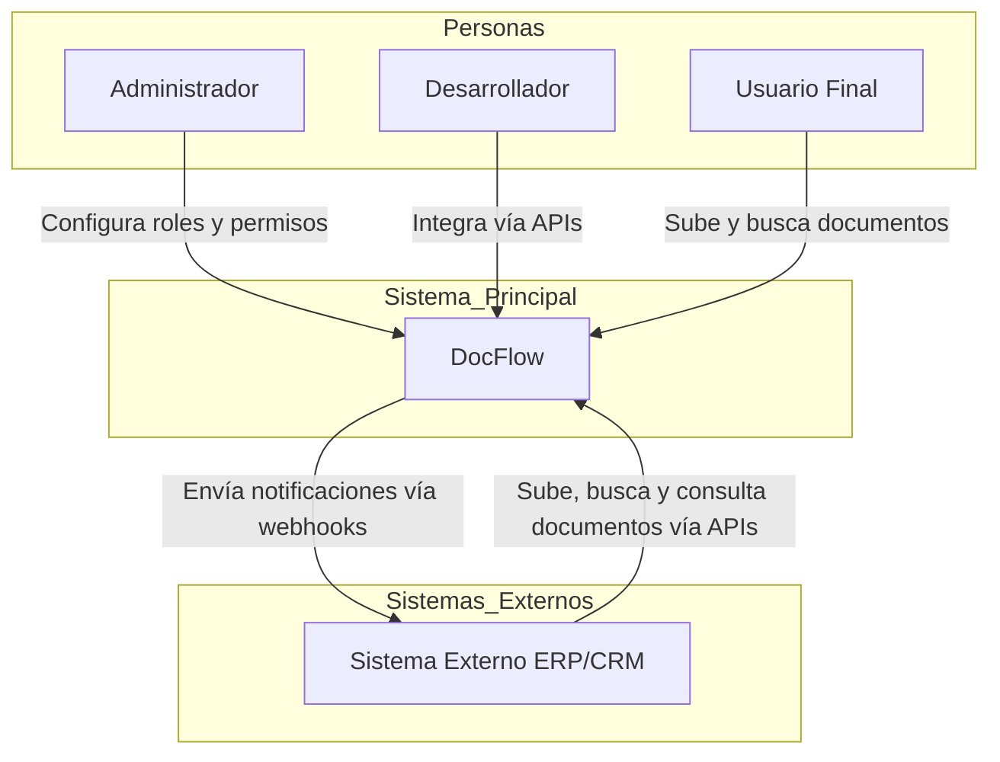
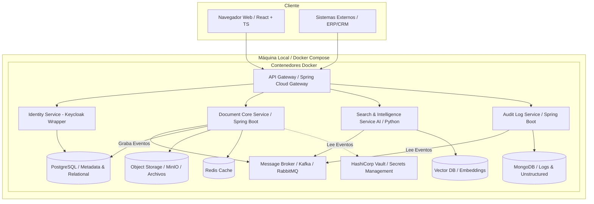
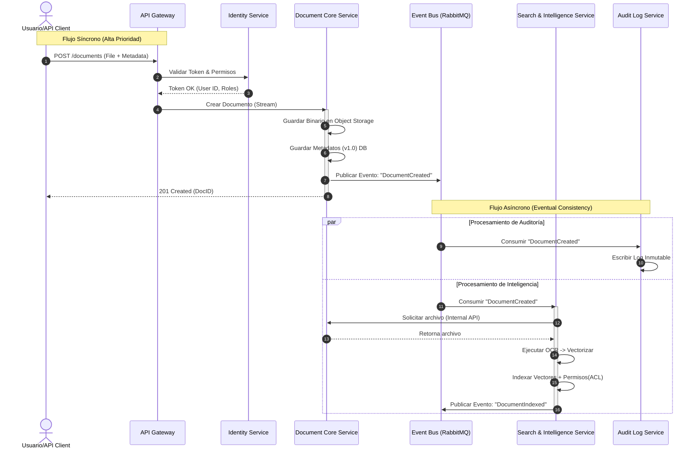
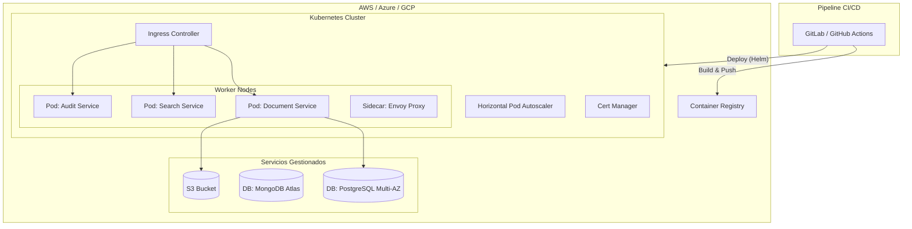
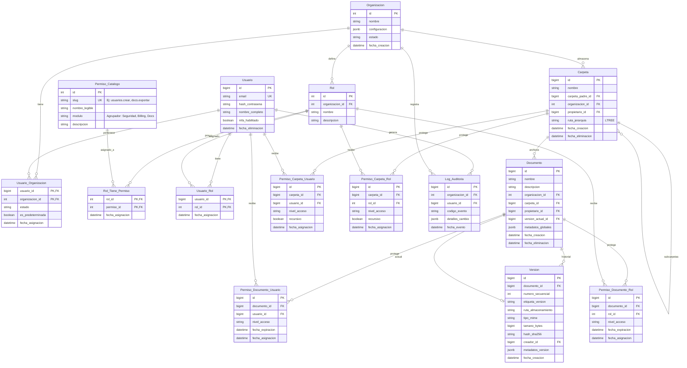

# 📂 Ficha del proyecto
* 📌**Nombre:** Eduardo Guardado Ruiz
* 📌**Nombre del proyecto:** DocFlow
* 📌**Descripción breve:**
Proyecto de software modular de gestión documental (DMS) con enfoque **API-First**, que incluye control de versiones lineal y un motor de búsqueda semántica basado en Inteligencia Artificial como plugin opcional, priorizando usabilidad, integración y accesibilidad para empresas de diversos tamaños.

# Descripción general del producto:
DocFlow es un proyecto de software modular diseñado como una **infraestructura documental inteligente**. Funciona como un repositorio central para gestión documental, actuando como un motor "backend" que permite a otros sistemas heredar capacidades de gestión documental avanzada. Combina una arquitectura **RBAC** (Role-Based Access Control) con accesibilidad programática mediante APIs RESTful, permitiendo la gestión del ciclo de vida del documento desde su creación y versionado hasta su recuperación. El núcleo del producto es un DMS eficiente y escalable, con la IA como un plugin opcional para búsqueda semántica, permitiendo a empresas con recursos limitados operar sin sobrecarga computacional.

## Objetivo del producto

El propósito principal de DocFlow es resolver la dicotomía entre **seguridad básica y facilidad de uso operativa**.

* **Propósito:** Facilitar la colaboración segura y la recuperación rápida mediante IA (opcional), eliminando el "Shadow IT" causado por la complejidad de los sistemas tradicionales.
* **Problema que resuelve:** Permite la colaboración eficiente y la integración fluida entre sistemas aislados con control de acceso granular, ofreciendo un DMS accesible para empresas de cualquier tamaño, con IA como complemento.
* **Segmentos de Usuario:**
    * **Administradores:** Responsables de configuración, roles y monitoreo del sistema.
    * **Desarrolladores o Sistemas:** Integradores que usan APIs para conectar con otros sistemas (ERPs, CRMs).
    * **Usuarios Finales (Ej. RH):** Profesionales operativos que suben, buscan y gestionan documentos diariamente.

## Características y funcionalidades principales

### A. Seguridad y Control de Acceso (Core)
* **RBAC Granular:** Control de acceso basado en roles (Ver, Editar, Descargar, Admin) aplicable a UI y API.
* **Audit Trails Inmutables:** Registro forense inalterable de cada acción (quién, cuándo, qué) sobre un archivo.

### B. Gestión Documental Técnica
* **Control de Versiones Lineal:** Versionado (`v1.0` -> `v1.1`) con capacidad de "Rollback" y bloqueo (Check-in/Check-out) para edición segura.
* **Estructura de Carpetas Dinámica:** Organización jerárquica gestionable vía Web y API.

### C. Inteligencia Artificial y Búsqueda (Plugin)
* **Búsqueda Semántica (RAG/Vectorial):** Motor IA que entiende contexto y significado, no solo palabras clave exactas.
* **OCR Automático:** Extracción de texto de documentos escaneados e imágenes al subir.
* **Filtro de Seguridad en IA:** La IA respeta estrictamente los permisos RBAC; nunca revela datos restringidos en los resultados.

### D. Arquitectura de Integración (API-First)
* **API RESTful Estándar:** Endpoints documentados (OpenAPI/Swagger) para gestión de archivos, carpetas y permisos.
* **Gestión de API Keys:** Panel para creación y revocación de tokens para integraciones externas.
* **Webhooks:** Notificaciones push a sistemas terceros ante eventos (ej. documento firmado/actualizado).

## Diseño y experiencia de usuario

### Perfil: Administradores
* **Entrada:** Dashboard centralizado con métricas de seguridad, consumo y alertas de actividad anómala.
* **Gestión:** Interfaz "Drag & Drop" para asignación de roles y permisos. Panel de control de API Keys con revocación instantánea.

### Perfil: Desarrolladores o Sistemas
* **Onboarding:** Portal de documentación con Swagger UI interactivo.
* **Uso:** Estructuras JSON predecibles y códigos de error estándar para facilitar la integración.

### Perfil: Usuario Final (Operativo)
* **Navegación:** Interfaz limpia similar a exploradores nativos, con indicadores visuales de seguridad (candados, marcas de agua).
* **Interacción Principal:** Búsqueda en lenguaje natural ("contratos de junio") con resultados contextuales y previsualización segura.
* **Alertas:** Avisos claros sobre versiones obsoletas con redirección a la versión vigente.

Esta es una propuesta arquitectónica detallada y profesional para **DocFlow**. Se ha priorizado la modularidad (DMS core con IA opcional), la seguridad (RBAC y auditoría), la escalabilidad (patrones asíncronos) y la mantenibilidad (Clean Architecture).

## Arquitectura del Sistema

### Diagrama de contexto


### Diagrama de Arquitectura Nube (Nivel Alto)
El siguiente diagrama ilustra la interacción entre el cliente (SPA), el Edge (CDN/WAF), el clúster de Kubernetes y los servicios de soporte.


### Diagrama de Arquitectura Local (Docker Compose)

Para entornos de desarrollo y pruebas locales, se utiliza Docker Compose para orquestar los servicios en una máquina local, simplificando la infraestructura.


### Diagrama de Secuencia: Flujo de Carga, Auditoría e Indexación Asíncrona de Documentos


### Estilo Arquitectónico

Se ha seleccionado una **Arquitectura de Microservicios orientada a Eventos (Event-Driven Microservices)**, estructurada internamente con **Arquitectura Hexagonal (Ports & Adapters)**.

### Justificación

1.  **Event-Driven (Asincronía):** El procesamiento de IA (OCR, Vectorización) y la Auditoría inmutable son operaciones costosas. Desacoplarlas mediante un bus de eventos (Kafka) permite que la subida del documento sea rápida para el usuario, mientras el procesamiento pesado ocurre en segundo plano ("Eventual Consistency"). La IA es opcional, permitiendo despliegues ligeros sin este servicio.
2.  **Hexagonal:** Permite aislar la lógica de dominio (reglas de negocio documental) de la infraestructura (frameworks, bases de datos). Esto es crucial para un producto que podría cambiar de proveedor de almacenamiento (AWS S3 a Azure Blob) o de motor de base de datos sin reescribir la lógica core.

### Beneficios vs. Compromisos

  * **Beneficios:** Escalabilidad independiente (escalar solo el servicio de IA con GPUs), tolerancia a fallos (si cae la auditoría, el sistema sigue operando en modo degradado), despliegues independientes.
  * **Compromisos:** Mayor complejidad operativa (requiere observabilidad avanzada), gestión de transacciones distribuidas (Saga Pattern) y latencia de red entre servicios.

## Componentes Principales

### A. Frontend: Single Page Application (SPA)

  * **Tecnología:** React + TypeScript + Vite.
  * **Responsabilidad:** Interfaz de usuario reactiva, gestión de estado del cliente (Zustand/Redux), cifrado parcial en lado cliente (opcional para máxima seguridad) y visualización de documentos.
  * **Justificación:** TypeScript aporta tipado estático, reduciendo errores en tiempo de ejecución, vital para aplicaciones empresariales complejas. React ofrece un ecosistema maduro para componentes ricos (drag & drop, visores PDF).

### B. API Gateway

  * **Tecnología:** Spring Cloud Gateway.
  * **Responsabilidad:** Punto único de entrada, enrutamiento, Rate Limiting, terminación SSL, validación preliminar de tokens JWT.
  * **Patrón:** **Gateway Offloading**. Descarga a los microservicios de tareas transversales como la validación básica de cabeceras de seguridad.

### C. Microservicios Backend (Spring Boot)

Todos los microservicios implementan **Spring Boot** por su robustez, inyección de dependencias y fácil integración con la nube.

#### 1. Identity Service (IAM)

  * **Tecnología:** Spring Boot como wrapper de **Keycloak** (o integración directa).
  * **Datos:** PostgreSQL (Usuarios, Roles, Tenancy).
  * **Responsabilidad:** Autenticación (OIDC/OAuth2), gestión de sesiones y emisión de tokens. Centraliza el RBAC.

#### 2. Document Core Service

  * **Tecnología:** Spring Boot Java.
  * **Datos:** PostgreSQL (Metadatos: nombre, tamaño, carpetas, dueños), S3 (Blobs).
  * **Responsabilidad:** Lógica transaccional fuerte (ACID). Gestiona la jerarquía de carpetas y versiones.
  * **Patrón:** **CQRS (Command side)**.

#### 3. Search & Intelligence Service (Plugin IA)

  * **Tecnología:** Spring Boot (o Python FastAPI si el modelo IA lo requiere, comunicado vía gRPC).
  * **Datos:** Base de datos Vectorial (ej. Milvus o pgvector) y ElasticSearch.
  * **Responsabilidad:** Escucha eventos `DOCUMENT_CREATED`. Descarga el archivo, ejecuta OCR, genera embeddings y los indexa.
  * **Justificación:** Separado porque consume mucha CPU/Memoria y sus patrones de escalado son distintos. Como plugin opcional, permite despliegues sin IA para entornos con recursos limitados.

#### 4. Audit Log Service

  * **Tecnología:** Spring Boot WebFlux (Reactivo).
  * **Datos:** MongoDB (Colecciones Time-Series).
  * **Responsabilidad:** Ingesta masiva de eventos de auditoría. Escritura rápida y sin esquema rígido.
  * **Justificación:** MongoDB maneja mejor grandes volúmenes de datos JSON no estructurados (logs) y permite alta velocidad de escritura.

### D. Message Broker

  * **Tecnología:** Apache Kafka (o RabbitMQ).
  * **Responsabilidad:** Garantizar la entrega de mensajes entre servicios. Desacoplamiento temporal.

## Descripción de Alto Nivel y Estructura de Ficheros

**DocFlow** es una plataforma distribuida modular donde el frontend actúa como un consumidor de APIs REST. El backend no es un monolito, sino un ecosistema de servicios autónomos que colaboran, con la IA como plugin. Se utiliza **Clean Architecture** para garantizar que la lógica de negocio (Dominio) no dependa de frameworks o librerías externas.

### Estructura de Directorios: Frontend (React + TS)

Sigue una estructura basada en "features" o dominios funcionales, en lugar de agrupar por tipo técnico.

```text
/src
  /assets          # Imágenes, fuentes, estilos globales
  /components      # Componentes UI compartidos (Button, Modal, Layout)
    /ui            # Librería de componentes base (Atomic Design)
  /config          # Variables de entorno, configuración de axios
  /features        # Módulos funcionales (DDD en frontend)
    /auth          # Login, Registro, Recuperación
    /documents     # Browser de archivos, Upload, Visor
      /components  # Componentes específicos de documents
      /hooks       # Lógica de estado (useDocumentUpload)
      /services    # Llamadas a API (documentApi.ts)
      /types       # Interfaces TS (Document, Folder)
    /search        # Barra de búsqueda, resultados
    /admin         # Panel de control, usuarios
  /context         # Estado global (AuthContext, ThemeContext)
  /hooks           # Hooks globales (useDebounce, useToggle)
  /lib             # Utilidades, formateadores de fecha, validadores
  /routes          # Definición de rutas (React Router)
```

### Estructura de Directorios: Backend (Spring Boot - Hexagonal)

Cada microservicio tendrá esta estructura interna para proteger el dominio.

```text
/src/main/java/com/docflow/documentservice
  /application              # Casos de Uso (Orquestación)
    /dto                    # Data Transfer Objects (Input/Output)
    /ports                  # Interfaces (Input Ports / Output Ports)
      /input                # Ej: CreateDocumentUseCase.java
      /output               # Ej: DocumentRepositoryPort.java, EventPublisherPort.java
    /services               # Implementación de Casos de Uso
  /domain                   # Lógica de Negocio Pura (Sin Spring)
    /model                  # Entidades (Document, Version, Permission)
    /exceptions             # Excepciones de negocio (DocumentLockedException)
    /service                # Servicios de dominio (reglas complejas)
  /infrastructure           # Adaptadores (Implementación técnica)
    /adapters
      /input
        /rest               # RestControllers (Spring MVC)
        /event_listener     # Kafka Listeners
      /output
        /persistence        # Implementación JPA/Mongo de los Repositorios
          /entity           # Entidades JPA (@Entity)
          /mapper           # Mappers (Entity <-> Domain Model)
        /broker             # Kafka Producers
        /storage            # Cliente S3/MinIO
    /config                 # Configuración de Spring (Beans, Security)
```

## Infraestructura y Despliegue

La infraestructura se basa en contenedores inmutables orquestados por Kubernetes, siguiendo prácticas de **GitOps**.

### Diagrama de Despliegue



### Componentes de Infraestructura

1.  **Orquestación (Kubernetes):** Maneja el ciclo de vida de los contenedores, escalado automático (HPA) basado en CPU/Memoria y recuperación ante fallos (Self-healing).
2.  **API Gateway / Ingress:** Un Ingress Controller (ej. NGINX o Traefik) maneja el tráfico HTTP/S entrante al clúster y lo dirige al API Gateway de aplicación.
3.  **Secret Management (HashiCorp Vault):** **Crítico para DocFlow.** No guardamos contraseñas ni credenciales en variables de entorno planas. Los servicios se autentican con Vault al iniciar para recuperar sus credenciales dinámicamente.
4.  **Observabilidad:**
      * **Logs:** EFK Stack (Elasticsearch, Fluentd, Kibana) para centralizar logs de todos los pods.
      * **Métricas:** Prometheus (recolección) + Grafana (visualización).
      * **Tracing:** Jaeger o Zipkin para seguir una petición a través de los microservicios (Distributed Tracing).

## Seguridad

### Medidas Implementadas

1.  **Autenticación y Autorización:**
      * **Protocolo:** OAuth2 / OpenID Connect (OIDC).
      * **JWT (JSON Web Tokens):** Los tokens son stateless. Contienen los "claims" (roles, tenant\_id).
      * **API Keys:** Para integraciones de terceros, gestionadas con rotación automática y scopes limitados.
2.  **Cifrado (Data Protection):**
      * **En tránsito (Data in Motion):** TLS 1.3 forzado en todas las conexiones externas. mTLS (Mutual TLS) dentro del clúster (vía Service Mesh como Istio/Linkerd) para que los servicios se autentiquen entre sí.
3.  **Seguridad de Aplicación:**
      * **Input Sanitization:** Validación estricta de DTOs en Spring Boot (`@Valid`, `@NotNull`) para prevenir inyecciones.
      * **Scan de Virus:** Los archivos subidos pasan a una zona de cuarentena y son escaneados (ej. ClamAV) antes de ser accesibles.
4.  **Hardening de Infraestructura:**
      * **Contenedores Rootless:** Los contenedores Docker corren con usuarios sin privilegios.
      * **Network Policies:** Por defecto "Deny All". Solo se permite tráfico explícito (ej. `Gateway` -\> `DocService` en puerto 8080).

## Tests

La estrategia de pruebas sigue la **Pirámide de Testing** para asegurar calidad sin sacrificar velocidad de desarrollo.

### Estrategia de Testing

| Tipo de Test | Ámbito | Herramientas | Descripción |
| :--- | :--- | :--- | :--- |
| **Unitarios** | Backend | JUnit 5, Mockito | Pruebas aisladas de lógica de dominio y casos de uso. Cobertura mínima del 80%. |
| **Unitarios** | Frontend | Vitest / Jest, React Testing Library | Verificación de renderizado de componentes y lógica de hooks. |
| **Integración** | Backend | **TestContainers**, Spring Boot Test | Levanta contenedores reales de PostgreSQL/Kafka/Mongo en Docker efímero para probar repositorios y flujo de mensajes. |
| **Contrato** | API | **Pact** | Verifica que los microservicios cumplan el contrato API acordado entre Consumidor (Frontend/Otros servicios) y Proveedor, evitando rupturas en cambios. |
| **End-to-End (E2E)** | Sistema | **Cypress** / Playwright | Simula flujos de usuario completos: "Usuario hace login, sube documento y busca documento". Se ejecutan en el pipeline de CI/CD (Stage/QA). |
| **Seguridad (SAST/DAST)** | Pipeline | SonarQube, OWASP ZAP | Análisis estático de código en busca de vulnerabilidades y escaneo dinámico de la API en ejecución. |

### Ejemplo de Caso de Test de Integración (Backend)

Usando `TestContainers`, al probar el `DocumentService`:

1.  El test arranca un contenedor PostgreSQL limpio y un MinIO (S3 mock).
2.  Llama al método `createDocument()`.
3.  Verifica que el registro existe en PostgreSQL.
4.  Verifica que el archivo binario está en MinIO.
5.  Destruye los contenedores al finalizar.

## Modelo de Datos


## Diccionario de Datos (Especificación Técnica)

### Módulo A: Identidad y Organización (IAM)

#### 1. `Organizacion` (Tenant)
El contenedor raíz. Define el alcance legal y de configuración del cliente.
* **id** (`INT`, PK, Auto-increment): Identificador único.
* **nombre** (`VARCHAR(100)`, Not Null): Nombre comercial de la empresa.
* **configuracion** (`JSONB`, Not Null, Default `{}`): Almacena configuración visual (logo, colores) y técnica (límites de almacenamiento, política de passwords).
    * *Ejemplo:* `{"apariencia": {"logo_url": "..."}, "seguridad": {"mfa_obligatorio": true}}`
* **estado** (`VARCHAR(20)`, Not Null): Enum: `ACTIVO`, `SUSPENDIDO`, `ARCHIVADO`.
* **fecha_creacion** (`TIMESTAMPTZ`, Default NOW()).

#### 2. `Usuario`
El actor autenticado en el sistema.
* **id** (`BIGINT`, PK, Auto-increment): ID global del usuario.
* **email** (`VARCHAR(255)`, Unique): Credencial de acceso global (una identidad puede pertenecer a múltiples organizaciones).
* **hash_contrasena** (`VARCHAR(255)`, Not Null): Hash seguro (Bcrypt/Argon2).
* **nombre_completo** (`VARCHAR(100)`, Not Null).
* **mfa_habilitado** (`BOOLEAN`, Default False): Bandera para 2FA.
* **fecha_eliminacion** (`TIMESTAMPTZ`, Nullable): Para Soft Delete. Si tiene fecha, el usuario está "borrado".

#### 2b. `Usuario_Organizacion` (Membresía multi-tenant)
Define a qué organizaciones pertenece un usuario (incluido un usuario administrador) y resuelve la organización predeterminada usada en el login.
* **usuario_id** (`BIGINT`, PK, FK -> `Usuario`): Usuario miembro.
* **organizacion_id** (`INT`, PK, FK -> `Organizacion`): Organización a la que pertenece.
* **estado** (`VARCHAR(20)`, Not Null): Enum sugerido: `ACTIVO`, `SUSPENDIDO`.
* **es_predeterminada** (`BOOLEAN`, Default False): Indica la organización por defecto al iniciar sesión (si aplica).
* **fecha_asignacion** (`TIMESTAMPTZ`, Default NOW()).
* Debe existir como máximo 1 membresía `es_predeterminada=true` activa por usuario.
* Si un usuario tiene 2 organizaciones activas, debe existir exactamente 1 predeterminada (para que `/auth/login` emita token sin selección).
* Si un usuario tiene más de 2 organizaciones activas, el sistema devuelve error (limitación MVP) y debe corregirse por administración.

Sugerencia de BD (PostgreSQL) para “mejores prácticas”:

```sql
-- Garantiza una sola predeterminada activa por usuario
CREATE UNIQUE INDEX ux_usuario_org_default_activa
ON usuario_organizacion (usuario_id)
WHERE es_predeterminada IS TRUE AND estado = 'ACTIVO';
```

#### 3. `Rol`
Define perfiles funcionales personalizados por la organización.
* **id** (`INT`, PK, Auto-increment).
* **organizacion_id** (`INT`, FK -> `Organizacion`).
* **nombre** (`VARCHAR(50)`, Not Null): Ej. "Administrador Legal", "Auditor Externo".
* **descripcion** (`TEXT`, Nullable).

#### 4. `Permiso_Catalogo`
Lista maestra e inmutable de capacidades del sistema (System Capabilities).
* **id** (`INT`, PK).
* **slug** (`VARCHAR(60)`, Unique): Identificador técnico (ej. `users.create`, `docs.export`, `billing.view`).
* **modulo** (`VARCHAR(50)`): Agrupador lógico para UI (ej. "Seguridad", "Gestión Documental").

#### 5. `Rol_Tiene_Permiso`
Tabla intermedia (Many-to-Many) para asignar capacidades a roles.
* **rol_id** (`INT`, PK, FK -> `Rol`).
* **permiso_id** (`INT`, PK, FK -> `Permiso_Catalogo`).
* **fecha_asignacion** (`TIMESTAMPTZ`, Default NOW()).

#### 5b. `Usuario_Rol` (Asignación de roles por organización)
Asigna roles a un usuario.
* **usuario_id** (`BIGINT`, PK, FK -> `Usuario`).
* **rol_id** (`INT`, PK, FK -> `Rol`).
* **fecha_asignacion** (`TIMESTAMPTZ`, Default NOW()).

Reglas para multi-org (MVP):
* Un rol solo puede asignarse si el usuario tiene membresía activa en `Usuario_Organizacion` para la organización del rol (`Rol.organizacion_id`).

---

### Módulo B: Núcleo Documental (Core)

#### 6. `Carpeta`
Estructura jerárquica para organizar la información.
* **id** (`BIGINT`, PK, Auto-increment).
* **organizacion_id** (`INT`, FK -> `Organizacion`).
* **carpeta_padre_id** (`BIGINT`, FK -> `Carpeta`, Nullable): Si es NULL, es una carpeta raíz.
* **nombre** (`VARCHAR(255)`, Not Null).
* **ruta_jerarquia** (`LTREE` o `VARCHAR`, Indexado): Materialización del path (ej. `1.5.20`) para consultas de árbol optimizadas sin recursividad profunda.
* **propietario_id** (`BIGINT`, FK -> `Usuario`).
* **fecha_eliminacion** (`TIMESTAMPTZ`, Nullable): Soft Delete (Papelera de reciclaje).

#### 7. `Documento`
La entidad lógica. Representa el "sobre" que contiene la historia del archivo.
* **id** (`BIGINT`, PK, Auto-increment).
* **organizacion_id** (`INT`, FK -> `Organizacion`).
* **carpeta_id** (`BIGINT`, FK -> `Carpeta`): Ubicación actual.
* **version_actual_id** (`BIGINT`, FK -> `Version`, Nullable): Puntero de optimización para recuperación rápida.
* **nombre** (`VARCHAR(255)`, Not Null).
* **metadatos_globales** (`JSONB`, Default `{}`): Campos definidos por el usuario (Tags, Cliente, Fecha Vencimiento). Indexado con GIN.
    * *Ejemplo:* `{"cliente": "Acme Corp", "tags": ["urgente", "legal"], "numero_factura": "F-2023-001"}`

#### 8. `Version`
La entidad física. Representa un archivo inmutable en el tiempo.
* **id** (`BIGINT`, PK, Auto-increment).
* **documento_id** (`BIGINT`, FK -> `Documento`).
* **numero_secuencial** (`INT`, Not Null): Contador incremental (1, 2, 3...) por documento.
* **ruta_almacenamiento** (`VARCHAR(500)`, Not Null): Key o Path en el Object Storage (S3/Azure Blob).
* **hash_sha256** (`CHAR(64)`, Not Null, Indexado): Checksum para integridad y deduplicación.
* **tamano_bytes** (`BIGINT`, Not Null).
* **tipo_mime** (`VARCHAR(100)`): Ej. `application/pdf`.
* **metadatos_version** (`JSONB`): Metadatos técnicos extraídos (EXIF, número de páginas, autor del PDF).
    * *Ejemplo:* `{"paginas": 12, "resolucion": "300dpi", "encriptado": false}`
* **creador_id** (`BIGINT`, FK -> `Usuario`): Quién subió esta versión específica.

---

### Módulo C: Seguridad Granular (ACL) y Auditoría

#### 9. `Permiso_Carpeta_Usuario`
Permisos explícitos por carpeta asignados directamente a un usuario.
* **id** (`BIGINT`, PK).
* **carpeta_id** (`BIGINT`, FK -> `Carpeta`).
* **usuario_id** (`BIGINT`, FK -> `Usuario`).
* **nivel_acceso** (`VARCHAR(20)`): Enum: `LECTURA`, `ESCRITURA`, `ADMINISTRACION`.
* **recursivo** (`BOOLEAN`, Default True): Define si aplica a subcarpetas.
* **fecha_asignacion** (`TIMESTAMPTZ`, Default NOW()).

#### 9b. `Permiso_Carpeta_Rol`
Permisos por carpeta asignados a un rol (se heredan por los usuarios que posean ese rol).
* **id** (`BIGINT`, PK).
* **carpeta_id** (`BIGINT`, FK -> `Carpeta`).
* **rol_id** (`INT`, FK -> `Rol`).
* **nivel_acceso** (`VARCHAR(20)`): Enum: `LECTURA`, `ESCRITURA`, `ADMINISTRACION`.
* **recursivo** (`BOOLEAN`, Default True).
* **fecha_asignacion** (`TIMESTAMPTZ`, Default NOW()).

#### 9c. `Permiso_Documento_Usuario`
Permisos explícitos por documento asignados directamente a un usuario.
* **id** (`BIGINT`, PK).
* **documento_id** (`BIGINT`, FK -> `Documento`).
* **usuario_id** (`BIGINT`, FK -> `Usuario`).
* **nivel_acceso** (`VARCHAR(20)`): Enum: `LECTURA`, `ESCRITURA`, `ADMINISTRACION`.
* **fecha_expiracion** (`TIMESTAMPTZ`, Nullable).
* **fecha_asignacion** (`TIMESTAMPTZ`, Default NOW()).

#### 9d. `Permiso_Documento_Rol`
Permisos por documento asignados a un rol.
* **id** (`BIGINT`, PK).
* **documento_id** (`BIGINT`, FK -> `Documento`).
* **rol_id** (`INT`, FK -> `Rol`).
* **nivel_acceso** (`VARCHAR(20)`): Enum: `LECTURA`, `ESCRITURA`, `ADMINISTRACION`.
* **fecha_expiracion** (`TIMESTAMPTZ`, Nullable).
* **fecha_asignacion** (`TIMESTAMPTZ`, Default NOW()).

#### 10. `Log_Auditoria`
Traza histórica inmutable.
* **id** (`BIGINT`, PK, BigSerial).
* **organizacion_id** (`INT`, FK -> `Organizacion`).
* **usuario_id** (`BIGINT`, FK -> `Usuario`, Nullable): `ON DELETE SET NULL` para preservar historia.
* **codigo_evento** (`VARCHAR(50)`, Not Null): Ej. `DOC_CREATED`, `DOC_DELETED`, `ACL_CHANGED`.
* **detalles_cambio** (`JSONB`): Snapshot de los datos. Ej: `{ "antes": { "nombre": "A" }, "despues": { "nombre": "B" } }`.
    * *Ejemplo:* `{"campo": "estado", "valor_anterior": "borrador", "valor_nuevo": "publicado"}`
* **direccion_ip** (`VARCHAR(45)`): IPv4 o IPv6.
* **fecha_evento** (`TIMESTAMPTZ`, Default NOW()).

## Especificación de la API

> Alcance MVP: 4 endpoints críticos (login, cambio de organización, crear carpeta, subir documento).

```yaml
openapi: 3.0.3
info:
    title: DocFlow API (Mini OpenAPI - MVP)
    version: 0.1.0
    description: >
        Especificación mínima (MVP) para DocFlow enfocada en:
        autenticación, creación de carpetas y carga de documentos (v1).

servers:
    - url: https://api.docflow.local
        description: Entorno local/dev (placeholder)

tags:
    - name: autenticacion
        description: Inicio de sesión, cambio de organización y emisión de token
    - name: carpetas
        description: Gestión mínima de carpetas
    - name: documentos
        description: Carga de documentos

paths:
    /auth/login:
        post:
            tags: [autenticacion]
                        summary: Iniciar sesión y obtener token (organización predeterminada)
            description: >
                Autentica credenciales.
                                La organización activa se resuelve por la membresía marcada como `es_predeterminada=true`.
                                Reglas MVP:
                                - Si el usuario tiene 1 organización activa, el sistema emite el token para esa organización.
                                - Si el usuario tiene 2 organizaciones activas, debe existir exactamente 1 membresía
                                    con `es_predeterminada=true` y se emite el token para esa organización.
                                - Si NO hay predeterminada (con 2 activas) o el usuario tiene más de 2 organizaciones activas,
                                    el sistema devuelve error de configuración (409).
            operationId: login
            requestBody:
                required: true
                content:
                    application/json:
                        schema:
                            $ref: '#/components/schemas/LoginRequest'
                        examples:
                            login:
                                value:
                                    email: admin@acme.com
                                    contrasena: PasswordSegura123!
            responses:
                '200':
                    description: Token emitido correctamente
                    content:
                        application/json:
                            schema:
                                $ref: '#/components/schemas/LoginResponse'
                '400':
                    description: Solicitud inválida (campos faltantes/formato inválido)
                    content:
                        application/json:
                            schema:
                                $ref: '#/components/schemas/Error'
                '401':
                    description: Credenciales inválidas
                    content:
                        application/json:
                            schema:
                                $ref: '#/components/schemas/Error'
                '403':
                    description: Usuario sin membresía activa o usuario desactivado
                    content:
                        application/json:
                            schema:
                                $ref: '#/components/schemas/Error'

                '409':
                    description: Configuración de tenancy inválida (sin predeterminada o exceso de organizaciones)
                    content:
                        application/json:
                            schema:
                                $ref: '#/components/schemas/Error'

    /auth/switch:
        post:
            tags: [autenticacion]
            summary: Cambiar organización activa (emite nuevo token)
            description: >
                Emite un nuevo token JWT en el contexto de otra `organizacion_id` a la que el
                usuario autenticado pertenece (membresía activa + organización activa).
                La UI de administración muestra este módulo solo si el usuario tiene más de una
                organización disponible.
            operationId: cambiarOrganizacion
            security:
                - bearerAuth: []
            requestBody:
                required: true
                content:
                    application/json:
                        schema:
                            $ref: '#/components/schemas/SwitchOrgRequest'
                        examples:
                            cambiarAOrg2:
                                value:
                                    organizacion_id: 2
            responses:
                '200':
                    description: Token emitido correctamente
                    content:
                        application/json:
                            schema:
                                $ref: '#/components/schemas/LoginResponse'
                '400':
                    description: Solicitud inválida (campos faltantes/formato inválido)
                    content:
                        application/json:
                            schema:
                                $ref: '#/components/schemas/Error'
                '401':
                    description: No autenticado
                    content:
                        application/json:
                            schema:
                                $ref: '#/components/schemas/Error'
                '403':
                    description: Organización no accesible para el usuario o inactiva
                    content:
                        application/json:
                            schema:
                                $ref: '#/components/schemas/Error'

    /carpetas:
        post:
            tags: [carpetas]
            summary: Crear carpeta
            description: Crea una carpeta (raíz o hija). Requiere autenticación y permisos.
            operationId: crearCarpeta
            security:
                - bearerAuth: []
            requestBody:
                required: true
                content:
                    application/json:
                        schema:
                            $ref: '#/components/schemas/CrearCarpetaRequest'
                        examples:
                            carpetaRaiz:
                                value:
                                    nombre: Legal
                            carpetaHija:
                                value:
                                    nombre: Contratos 2025
                                    carpeta_padre_id: 10
            responses:
                '201':
                    description: Carpeta creada
                    content:
                        application/json:
                            schema:
                                $ref: '#/components/schemas/CarpetaResponse'
                '400':
                    description: Solicitud inválida (validación de campos)
                    content:
                        application/json:
                            schema:
                                $ref: '#/components/schemas/Error'
                '401':
                    description: No autenticado
                    content:
                        application/json:
                            schema:
                                $ref: '#/components/schemas/Error'
                '403':
                    description: Sin permisos para crear carpetas
                    content:
                        application/json:
                            schema:
                                $ref: '#/components/schemas/Error'

    /documentos:
        post:
            tags: [documentos]
            summary: Subir documento (crea documento y versión v1)
            description: >
                Crea un documento en una carpeta y registra su primera versión.
                Requiere autenticación y permisos de escritura en la carpeta.
            operationId: crearDocumento
            security:
                - bearerAuth: []
            requestBody:
                required: true
                content:
                    multipart/form-data:
                        schema:
                            type: object
                            required: [archivo, nombre, carpeta_id]
                            properties:
                                archivo:
                                    type: string
                                    format: binary
                                    description: Archivo a subir.
                                nombre:
                                    type: string
                                    description: Nombre lógico del documento.
                                    example: Contrato_Acme_2025.pdf
                                carpeta_id:
                                    type: integer
                                    format: int64
                                    description: Identificador de la carpeta destino.
                                    example: 10
                                descripcion:
                                    type: string
                                    description: Descripción opcional del documento.
                                    example: Contrato marco con Acme 2025
                                metadatos:
                                    type: string
                                    description: >
                                        JSON serializado con metadatos globales (tags, cliente, etc.).
                                        Se define como string para mantener simple el multipart.
                                    example: '{"cliente":"Acme Corp","tags":["legal","urgente"]}'
            responses:
                '201':
                    description: Documento creado y versión inicial registrada
                    content:
                        application/json:
                            schema:
                                $ref: '#/components/schemas/DocumentoCreadoResponse'
                '400':
                    description: Solicitud inválida (faltan campos o formato no válido)
                    content:
                        application/json:
                            schema:
                                $ref: '#/components/schemas/Error'
                '401':
                    description: No autenticado
                    content:
                        application/json:
                            schema:
                                $ref: '#/components/schemas/Error'
                '403':
                    description: Sin permisos para escribir en la carpeta
                    content:
                        application/json:
                            schema:
                                $ref: '#/components/schemas/Error'
                '404':
                    description: Carpeta no encontrada
                    content:
                        application/json:
                            schema:
                                $ref: '#/components/schemas/Error'

components:
    securitySchemes:
        bearerAuth:
            type: http
            scheme: bearer
            bearerFormat: JWT

    schemas:
        LoginRequest:
            type: object
            required: [email, contrasena]
            properties:
                email:
                    type: string
                    format: email
                    example: admin@acme.com
                contrasena:
                    type: string
                    format: password
                    example: PasswordSegura123!

        SwitchOrgRequest:
            type: object
            required: [organizacion_id]
            properties:
                organizacion_id:
                    type: integer
                    format: int32
                    description: Identificador de la organización a la que se desea cambiar.
                    example: 2

        OrganizacionDisponible:
            type: object
            required: [organizacion_id, nombre]
            properties:
                organizacion_id:
                    type: integer
                    format: int32
                    example: 1
                nombre:
                    type: string
                    example: Acme Corp

        LoginResponse:
            type: object
            required: [token, tipo_token, expira_en, organizaciones]
            properties:
                token:
                    type: string
                    description: Token para usar en Authorization: Bearer <token>
                tipo_token:
                    type: string
                    example: Bearer
                expira_en:
                    type: integer
                    format: int32
                    description: Segundos hasta expiración del token.
                    example: 3600
                organizaciones:
                    type: array
                    description: Organizaciones a las que pertenece el usuario (membresías activas).
                    items:
                        $ref: '#/components/schemas/OrganizacionDisponible'

        CrearCarpetaRequest:
            type: object
            required: [nombre]
            properties:
                nombre:
                    type: string
                    minLength: 1
                    example: Legal
                carpeta_padre_id:
                    type: integer
                    format: int64
                    nullable: true
                    description: Si es null, la carpeta es raíz.
                    example: 10

        CarpetaResponse:
            type: object
            required: [carpeta_id, nombre, carpeta_padre_id, creado_en]
            properties:
                carpeta_id:
                    type: integer
                    format: int64
                    example: 10
                nombre:
                    type: string
                    example: Legal
                carpeta_padre_id:
                    type: integer
                    format: int64
                    nullable: true
                    example: null
                creado_en:
                    type: string
                    format: date-time
                    example: 2025-12-16T10:15:30Z

        DocumentoCreadoResponse:
            type: object
            required: [documento_id, nombre, carpeta_id, version_actual, creado_en]
            properties:
                documento_id:
                    type: integer
                    format: int64
                    example: 987
                nombre:
                    type: string
                    example: Contrato_Acme_2025.pdf
                carpeta_id:
                    type: integer
                    format: int64
                    example: 10
                version_actual:
                    type: object
                    required: [version_id, numero_secuencial, etiqueta_version]
                    properties:
                        version_id:
                            type: integer
                            format: int64
                            example: 5551
                        numero_secuencial:
                            type: integer
                            format: int32
                            example: 1
                        etiqueta_version:
                            type: string
                            example: v1.0
                creado_en:
                    type: string
                    format: date-time
                    example: 2025-12-16T10:15:30Z

        Error:
            type: object
            required: [codigo, mensaje]
            properties:
                codigo:
                    type: string
                    example: ERROR_VALIDACION
                mensaje:
                    type: string
                    example: El campo 'nombre' es obligatorio.
                detalle:
                    type: object
                    additionalProperties: true
                    description: Datos adicionales opcionales.
```
### Ejemplo de Uso (POST /auth/login)

Request (application/json):

```json
{
    "email": "admin@acme.com",
    "contrasena": "PasswordSegura123!"
}
```

Response 200 (application/json) — usuario con múltiples organizaciones (usa `es_predeterminada`):

```json
{
    "token": "eyJhbGciOiJIUzI1NiIsInR5cCI6IkpXVCJ9...",
    "tipo_token": "Bearer",
    "expira_en": 3600,
    "organizaciones": [
        {"organizacion_id": 1, "nombre": "Acme Corp"},
        {"organizacion_id": 2, "nombre": "Contoso Ltd"}
    ]
}
```

Response 403 (application/json) — usuario sin organizaciones activas:

```json
{
    "codigo": "SIN_ORGANIZACION",
    "mensaje": "El usuario no pertenece a ninguna organización activa."
}
```

Response 409 (application/json) — configuración inválida (sin predeterminada o > 2 organizaciones activas):

```json
{
    "codigo": "TENANCY_CONFIG_INVALIDA",
    "mensaje": "No es posible resolver la organización predeterminada para el login (falta predeterminada o exceso de organizaciones)."
}
```

### Ejemplo de Uso (POST /auth/switch)

Request (application/json) — cambio de organización con token actual:

```json
{
    "organizacion_id": 2
}
```

Response 200 (application/json):

```json
{
    "token": "eyJhbGciOiJIUzI1NiIsInR5cCI6IkpXVCJ9...",
    "tipo_token": "Bearer",
    "expira_en": 3600,
    "organizaciones": [
        {"organizacion_id": 1, "nombre": "Acme Corp"},
        {"organizacion_id": 2, "nombre": "Contoso Ltd"}
    ]
}
```

### Ejemplo de Uso (POST /carpetas)

Request (application/json):

```json
{
    "nombre": "Contratos 2025",
    "carpeta_padre_id": 10
}
```

Response 201 (application/json):

```json
{
    "carpeta_id": 22,
    "nombre": "Contratos 2025",
    "carpeta_padre_id": 10,
    "creado_en": "2025-12-16T10:15:30Z"
}
```

### Ejemplo de Uso (POST /documentos)

Request (multipart/form-data):

```bash
curl -X POST "https://api.docflow.local/documentos" \
  -H "Authorization: Bearer <TOKEN>" \
  -F "archivo=@Contrato_Acme_2025.pdf" \
  -F "nombre=Contrato_Acme_2025.pdf" \
  -F "carpeta_id=10" \
  -F "descripcion=Contrato marco con Acme 2025" \
  -F "metadatos={\"cliente\":\"Acme Corp\",\"tags\":[\"legal\",\"urgente\"]}"
```

Response 201 (application/json):

```json
{
    "documento_id": 987,
    "nombre": "Contrato_Acme_2025.pdf",
    "carpeta_id": 10,
    "version_actual": {
        "version_id": 5551,
        "numero_secuencial": 1,
        "etiqueta_version": "v1.0"
    },
    "creado_en": "2025-12-16T10:15:30Z"
}
```


## Historias de Usuario

### Épicas priorizadas (MVP)

1. **P0 — Autenticación + Tenancy (multi-tenant)**
    - Alcance: login, token con claims, aislamiento de datos por organización y manejo de sesión.
2. **P1 — Administración (UI mínima Admin/Usuario)**
    - Alcance: UI mínima para administrar usuarios/roles dentro de una organización.
3. **P2 — Permisos granulares (ACL) por carpeta/documento**
    - Alcance: permisos por objeto, herencia (si aplica) y enforcement en API/UI.
4. **P3 — Gestión de carpetas (API + UI mínima)**
    - Alcance: crear/navegar jerarquía de carpetas por tenant.
5. **P4 — Documentos + versionado lineal (API + UI mínima)**
    - Alcance: subir documentos, crear nuevas versiones y consultar versión actual.
6. **P5 — Auditoría (logs inmutables + vista Admin mínima)**
    - Alcance: registrar eventos críticos y permitir consulta básica.
7. **P6 — Búsqueda básica (sin IA, respetando permisos)**
    - Alcance: búsqueda por nombre/metadatos con control de acceso.

---

### P0 — Historias de Usuario (Autenticación + Tenancy)

**[US-AUTH-001] Login multi-tenant (organización predeterminada)**
- **Narrativa:** Como usuario, quiero iniciar sesión y que el sistema use mi organización predeterminada, para que el acceso sea simple y consistente.
- **Criterios de Aceptación:**
    - *Scenario 1:* Dado un usuario válido con exactamente una organización activa, Cuando envío `POST /auth/login` con credenciales válidas, Entonces recibo `200` con un token.
    - *Scenario 1b:* Dado un usuario válido perteneciente a múltiples organizaciones activas y con una organización marcada como predeterminada, Cuando envío `POST /auth/login` con credenciales válidas, Entonces recibo `200` con un token emitido para la organización predeterminada.
    - *Scenario 2:* Dado un usuario válido perteneciente a 2 organizaciones activas y sin una organización predeterminada, Cuando envío `POST /auth/login`, Entonces recibo `409` indicando configuración inválida.
    - *Scenario 2b:* Dado un usuario válido perteneciente a más de 2 organizaciones activas, Cuando envío `POST /auth/login`, Entonces recibo `409` indicando que el caso no está soportado en el MVP.
    - *Scenario 2c:* Dado un usuario autenticado con múltiples organizaciones activas, Cuando envío `POST /auth/switch` indicando otra `organizacion_id` válida, Entonces recibo `200` con un nuevo token en el contexto de esa organización.
    - *Scenario 3:* Dado credenciales inválidas, Cuando envío `POST /auth/login`, Entonces recibo `401`.
    - *Scenario 4:* Dado un usuario válido sin organizaciones activas, Cuando envío `POST /auth/login`, Entonces recibo `403` con un error indicando que no pertenece a ninguna organización activa.
- **Notas Técnicas/Datos:** `organizacion_id` debe validarse contra pertenencia del usuario (y contra organización activa) en `POST /auth/switch`.

**[US-AUTH-002] Token con claims de tenant y roles**
- **Narrativa:** Como sistema, quiero emitir un token con `usuario_id`, `organizacion_id` y roles/permisos, para que la autorización sea consistente en toda la plataforma.
- **Criterios de Aceptación:**
  - *Scenario 1:* Dado un login exitoso, Cuando se emite el token, Entonces incluye `usuario_id` y `organizacion_id` y al menos un rol.
- **Notas Técnicas/Datos:** Definir claim estándar (por ejemplo `org_id`, `roles`).

**[US-AUTH-003] Middleware de autenticación para endpoints protegidos**
- **Narrativa:** Como sistema, quiero validar el token en cada request protegida, para que solo usuarios autenticados accedan a recursos.
- **Criterios de Aceptación:**
  - *Scenario 1:* Dado un request sin token a un endpoint protegido, Cuando se procesa, Entonces recibo `401`.
  - *Scenario 2:* Dado un token inválido/alterado, Cuando se procesa, Entonces recibo `401`.

**[US-AUTH-004] Aislamiento de datos por organización (tenant isolation)**
- **Narrativa:** Como organización, quiero que los datos estén aislados entre tenants, para garantizar seguridad y cumplimiento.
- **Criterios de Aceptación:**
  - *Scenario 1:* Dado un token del tenant A, Cuando intento acceder/crear recursos en el tenant B, Entonces recibo `404` (o `403`) sin filtrar datos.
- **Notas Técnicas/Datos:** En queries/escrituras, `organizacion_id` debe venir del token (no del cliente).

**[US-AUTH-005] UI mínima de Login (Admin/Usuario)**
- **Narrativa:** Como usuario, quiero una pantalla de login simple, para acceder al sistema sin usar herramientas externas.
- **Criterios de Aceptación:**
  - *Scenario 1:* Dado credenciales válidas, Cuando inicio sesión desde la UI, Entonces se almacena el token y accedo a la pantalla principal.
    - *Scenario 1b:* Dado credenciales válidas y múltiples organizaciones, Cuando inicio sesión, Entonces el sistema usa la organización predeterminada y accedo a la pantalla principal (o veo un error claro si falta predeterminada o hay >2 organizaciones activas).
  - *Scenario 2:* Dado credenciales inválidas, Cuando inicio sesión, Entonces veo un mensaje de error y permanezco en login.

**[US-AUTH-006] Manejo de sesión expirada**
- **Narrativa:** Como usuario, quiero que el sistema detecte la expiración de mi sesión, para reautenticarme de forma clara.
- **Criterios de Aceptación:**
  - *Scenario 1:* Dado un token expirado, Cuando hago una petición protegida desde la UI, Entonces se redirige a login con un mensaje “sesión expirada”.

---

### P1 — Historias de Usuario (Administración: UI mínima Admin/Usuario)

**[US-ADMIN-001] Crear usuario (API) dentro del tenant**
- **Narrativa:** Como administrador, quiero crear un usuario en mi organización, para habilitar su acceso a DocFlow.
- **Criterios de Aceptación:**
    - *Scenario 1:* Dado un administrador autenticado del tenant A, Cuando creo un usuario con email válido, Entonces recibo `201` y el usuario pertenece al tenant A.
    - *Scenario 2:* Dado un email ya existente, Cuando intento crear el usuario, Entonces recibo `400/409` por duplicidad (email global).
- **Notas Técnicas/Datos:** Para multi-org, el “pertenece al tenant A” se implementa creando un registro en `Usuario_Organizacion` (membresía). Unicidad por `email`.

**[US-ADMIN-002] Asignar rol a usuario (API) en el tenant**
- **Narrativa:** Como administrador, quiero asignar un rol a un usuario, para controlar sus capacidades.
- **Criterios de Aceptación:**
    - *Scenario 1:* Dado un usuario del tenant A, Cuando asigno un rol válido del tenant A, Entonces recibo `200` y el rol queda efectivo.
    - *Scenario 2:* Dado un usuario de otro tenant, Cuando intento asignar roles, Entonces recibo `404` (o `403`) sin exponer datos.

**[US-ADMIN-003] Listar usuarios (API) del tenant con roles**
- **Narrativa:** Como administrador, quiero listar los usuarios de mi organización con sus roles, para administrar accesos.
- **Criterios de Aceptación:**
    - *Scenario 1:* Dado un administrador autenticado, Cuando solicito la lista, Entonces solo veo usuarios del tenant actual.

**[US-ADMIN-004] Desactivar usuario (API) sin borrado**
- **Narrativa:** Como administrador, quiero desactivar un usuario, para revocar acceso manteniendo historial.
- **Criterios de Aceptación:**
    - *Scenario 1:* Dado un usuario desactivado, Cuando intenta iniciar sesión, Entonces recibe `403`.
    - *Scenario 2:* Dado un usuario desactivado, Cuando intento usar endpoints con token previo (si existiera), Entonces recibe `401/403`.

**[US-ADMIN-005] UI mínima de gestión de usuarios**
- **Narrativa:** Como administrador, quiero una pantalla simple para crear/listar/desactivar usuarios, para operar el sistema sin scripts.
- **Criterios de Aceptación:**
    - *Scenario 1:* Dado un administrador, Cuando navego a “Usuarios”, Entonces veo una tabla simple con email, estado y roles.

---

### P2 — Historias de Usuario (Permisos granulares: ACL por carpeta/documento)

**[US-ACL-001] Definir niveles de acceso estándar (catálogo mínimo)**
- **Narrativa:** Como sistema, quiero un conjunto mínimo y consistente de niveles de acceso, para evaluar permisos de forma uniforme.
- **Criterios de Aceptación:**
    - *Scenario 1:* Dado el sistema inicializado, Cuando se consultan niveles, Entonces existen al menos `LECTURA`, `ESCRITURA`, `ADMINISTRACION`.
- **Notas Técnicas/Datos:** El nivel controla acciones (ver/listar/descargar vs. subir/modificar vs. administrar permisos).

**[US-ACL-002] Conceder permiso de carpeta a usuario (crear ACL)**
- **Narrativa:** Como administrador, quiero conceder un permiso sobre una carpeta a un usuario, para controlar acceso por área.
- **Criterios de Aceptación:**
    - *Scenario 1:* Dado un admin del tenant A, Cuando asigno `LECTURA` a un usuario del tenant A sobre una carpeta, Entonces el usuario puede listar/ver esa carpeta.
    - *Scenario 2:* Dado un usuario/carpeta de otro tenant, Cuando intento asignar permisos, Entonces recibo `404/403` sin filtrar información.

**[US-ACL-003] Revocar permiso de carpeta (eliminar ACL)**
- **Narrativa:** Como administrador, quiero revocar un permiso sobre una carpeta, para retirar accesos.
- **Criterios de Aceptación:**
    - *Scenario 1:* Dado un usuario con acceso por ACL, Cuando revoco el permiso, Entonces el usuario deja de poder acceder (`403`).

**[US-ACL-004] Permiso recursivo en carpeta (herencia simple)**
- **Narrativa:** Como administrador, quiero que un permiso de carpeta pueda aplicarse a subcarpetas, para evitar configuraciones repetitivas.
- **Criterios de Aceptación:**
    - *Scenario 1:* Dado un permiso con `recursivo=true` en una carpeta padre, Cuando el usuario accede a una subcarpeta, Entonces el permiso aplica.
    - *Scenario 2:* Dado `recursivo=false`, Cuando accede a una subcarpeta, Entonces no aplica.

**[US-ACL-005] Conceder permiso explícito a documento**
- **Narrativa:** Como administrador, quiero asignar un permiso directamente a un documento, para manejar excepciones de acceso.
- **Criterios de Aceptación:**
    - *Scenario 1:* Dado un documento en una carpeta, Cuando asigno `LECTURA` explícita a un usuario, Entonces el usuario puede acceder a ese documento.

**[US-ACL-006] Regla de precedencia de permisos (Documento > Carpeta)**
- **Narrativa:** Como sistema, quiero una regla clara de precedencia, para resolver conflictos de permisos.
- **Criterios de Aceptación:**
    - *Scenario 1:* Dado un permiso explícito de documento para un usuario, Cuando se evalúa el acceso al documento, Entonces ese permiso explícito se usa como fuente de verdad.
    - *Scenario 2:* Dado que NO existe permiso explícito de documento, Cuando se evalúa el acceso, Entonces se usa el permiso de carpeta (incluyendo herencia si aplica).
- **Notas Técnicas/Datos:** Regla simple para MVP: `Permiso_Documento` (si existe) > `Permiso_Carpeta`.

**[US-ACL-007] Enforzar permisos de lectura en endpoints de consulta/descarga**
- **Narrativa:** Como sistema, quiero bloquear lecturas sin permiso, para proteger información.
- **Criterios de Aceptación:**
    - *Scenario 1:* Dado un usuario sin `LECTURA`, Cuando lista una carpeta o descarga un documento, Entonces recibe `403`.

**[US-ACL-008] Enforzar permisos de escritura en endpoints de creación/actualización**
- **Narrativa:** Como sistema, quiero bloquear escrituras sin permiso, para evitar cambios no autorizados.
- **Criterios de Aceptación:**
    - *Scenario 1:* Dado un usuario sin `ESCRITURA`, Cuando intenta subir documento o crear subcarpeta, Entonces recibe `403`.

**[US-ACL-009] UI muestra capacidades (acciones habilitadas) por carpeta/documento**
- **Narrativa:** Como usuario, quiero que la UI habilite o deshabilite acciones según mis permisos, para evitar errores.
- **Criterios de Aceptación:**
    - *Scenario 1:* Dado un usuario con solo `LECTURA`, Cuando navega una carpeta, Entonces la UI deshabilita “Subir” y “Administrar permisos”.

---

### P3 — Historias de Usuario (Gestión de carpetas: API + UI mínima)

**[US-FOLDER-001] Crear carpeta (API) en el tenant actual**
- **Narrativa:** Como usuario con permisos, quiero crear una carpeta en mi organización, para organizar documentos.
- **Criterios de Aceptación:**
    - *Scenario 1:* Dado un usuario con `ESCRITURA` (o `ADMINISTRACION`) en la carpeta padre, Cuando crea una carpeta, Entonces recibe `201` y la carpeta pertenece al tenant del token.
    - *Scenario 2:* Dado un usuario sin permiso en la carpeta padre, Cuando crea una carpeta, Entonces recibe `403`.

**[US-FOLDER-002] Listar contenido de carpeta (API) con visibilidad por permisos**
- **Narrativa:** Como usuario, quiero listar subcarpetas y documentos visibles, para navegar la estructura documental.
- **Criterios de Aceptación:**
    - *Scenario 1:* Dado un usuario con `LECTURA`, Cuando lista una carpeta, Entonces solo ve elementos permitidos.
    - *Scenario 2:* Dado un usuario sin `LECTURA`, Cuando lista una carpeta, Entonces recibe `403`.

**[US-FOLDER-003] Mover documento a otra carpeta (API)**
- **Narrativa:** Como usuario con permisos, quiero mover un documento entre carpetas, para mantener orden.
- **Criterios de Aceptación:**
    - *Scenario 1:* Dado `ESCRITURA` en carpeta origen y destino, Cuando muevo un documento, Entonces su `carpeta_id` se actualiza y la acción queda auditada.
    - *Scenario 2:* Dado falta de permiso en origen o destino, Cuando muevo un documento, Entonces recibo `403`.

**[US-FOLDER-004] Eliminar carpeta vacía (soft delete) (API)**
- **Narrativa:** Como administrador, quiero eliminar una carpeta vacía, para mantener higiene sin perder trazabilidad.
- **Criterios de Aceptación:**
    - *Scenario 1:* Dado una carpeta sin hijos ni documentos, Cuando la elimino, Entonces queda marcada con `fecha_eliminacion`.
    - *Scenario 2:* Dado una carpeta con contenido, Cuando la elimino, Entonces recibo `409` (o `400`) indicando que debe vaciarse primero.

**[US-FOLDER-005] UI mínima de navegación por carpetas**
- **Narrativa:** Como usuario, quiero una vista tipo explorador para entrar/salir de carpetas, para encontrar mis documentos.
- **Criterios de Aceptación:**
    - *Scenario 1:* Dado un usuario autenticado, Cuando entra a una carpeta desde la UI, Entonces ve su contenido y puede navegar a subcarpetas.

---

### P4 — Historias de Usuario (Documentos + versionado lineal: API + UI mínima)

**[US-DOC-001] Subir documento (API) crea documento + versión 1**
- **Narrativa:** Como usuario con permisos, quiero subir un documento a una carpeta, para centralizarlo y compartirlo.
- **Criterios de Aceptación:**
    - *Scenario 1:* Dado `ESCRITURA` en la carpeta, Cuando subo un archivo, Entonces recibo `201` con `documento_id` y `version_actual` con `numero_secuencial=1`.
    - *Scenario 2:* Dado sin permisos, Cuando subo, Entonces recibo `403`.

**[US-DOC-002] Descargar versión actual (API)**
- **Narrativa:** Como usuario con `LECTURA`, quiero descargar la versión actual, para usar el documento.
- **Criterios de Aceptación:**
    - *Scenario 1:* Dado `LECTURA`, Cuando descargo, Entonces recibo `200` con el binario.
    - *Scenario 2:* Dado sin `LECTURA`, Cuando descargo, Entonces recibo `403`.

**[US-DOC-003] Subir nueva versión (API) incrementa secuencia**
- **Narrativa:** Como usuario con permisos, quiero subir una nueva versión, para mantener historial sin sobrescribir.
- **Criterios de Aceptación:**
    - *Scenario 1:* Dado un documento existente y `ESCRITURA`, Cuando subo una nueva versión, Entonces se crea una nueva versión con `numero_secuencial` incrementado y pasa a ser `version_actual`.

**[US-DOC-004] Listar versiones (API) ordenadas**
- **Narrativa:** Como usuario, quiero listar el historial de versiones, para entender la evolución del documento.
- **Criterios de Aceptación:**
    - *Scenario 1:* Dado un documento, Cuando consulto versiones, Entonces recibo una lista ordenada ascendente por `numero_secuencial`.

**[US-DOC-005] Cambiar versión actual (API) (rollback)**
- **Narrativa:** Como usuario autorizado, quiero marcar una versión anterior como actual, para revertir cambios.
- **Criterios de Aceptación:**
    - *Scenario 1:* Dado un documento con múltiples versiones y permiso requerido, Cuando selecciono una versión anterior, Entonces `version_actual_id` cambia y se registra auditoría.

**[US-DOC-006] UI mínima de carga y ver historial**
- **Narrativa:** Como usuario, quiero subir documentos y ver su historial desde la UI, para operar sin herramientas externas.
- **Criterios de Aceptación:**
    - *Scenario 1:* Dado permisos, Cuando subo desde la UI, Entonces el documento aparece en la carpeta.
    - *Scenario 2:* Dado un documento con versiones, Cuando abro “Versiones”, Entonces veo el listado y cuál es la actual.

---

### P5 — Historias de Usuario (Auditoría: logs inmutables + UI mínima)

**[US-AUDIT-001] Emitir evento de auditoría en acciones críticas**
- **Narrativa:** Como sistema, quiero emitir un evento/auditoría por cada acción crítica, para tener trazabilidad.
- **Criterios de Aceptación:**
    - *Scenario 1:* Dado la acción “crear carpeta”, Cuando se completa, Entonces se genera un evento con `codigo_evento`, `organizacion_id` y `usuario_id`.
    - *Scenario 2:* Dado la acción “subir documento”, Cuando se completa, Entonces se genera un evento similar.

**[US-AUDIT-002] Persistir auditoría como registro inmutable**
- **Narrativa:** Como administrador, quiero que la auditoría sea inmutable, para confiar en su integridad.
- **Criterios de Aceptación:**
    - *Scenario 1:* Dado un evento generado, Cuando se persiste, Entonces queda almacenado con timestamp y no puede editarse por endpoints del MVP.

**[US-AUDIT-003] Consultar auditoría (API) con paginación y fechas**
- **Narrativa:** Como administrador, quiero consultar la auditoría por rango de fechas, para investigar actividad.
- **Criterios de Aceptación:**
    - *Scenario 1:* Dado un admin del tenant A, Cuando consulta auditoría con `desde/hasta`, Entonces recibe solo eventos del tenant A.
    - *Scenario 2:* Dado paginación, Cuando solicita página siguiente, Entonces recibe resultados consistentes.

**[US-AUDIT-004] UI mínima de auditoría**
- **Narrativa:** Como administrador, quiero una vista simple de auditoría, para revisar eventos sin herramientas externas.
- **Criterios de Aceptación:**
    - *Scenario 1:* Dado un administrador autenticado, Cuando abre “Auditoría”, Entonces ve una lista/tabla con `codigo_evento`, usuario, fecha y entidad afectada.

---

### P6 — Historias de Usuario (Búsqueda básica sin IA)

**[US-SEARCH-001] Buscar documentos (API) por texto**
- **Narrativa:** Como usuario, quiero buscar documentos por texto (nombre/metadatos), para encontrarlos rápidamente.
- **Criterios de Aceptación:**
    - *Scenario 1:* Dado un término de búsqueda, Cuando consulto, Entonces recibo una lista de documentos del tenant actual.

**[US-SEARCH-002] La búsqueda respeta permisos y no filtra existencia**
- **Narrativa:** Como organización, quiero que la búsqueda no devuelva documentos no autorizados, para evitar filtraciones.
- **Criterios de Aceptación:**
    - *Scenario 1:* Dado un usuario sin `LECTURA` sobre un documento, Cuando busca términos que coinciden, Entonces el documento no aparece en resultados.

**[US-SEARCH-003] UI mínima de búsqueda**
- **Narrativa:** Como usuario, quiero una barra de búsqueda y resultados clicables, para abrir documentos sin navegar carpetas.
- **Criterios de Aceptación:**
    - *Scenario 1:* Dado un término, Cuando busco desde la UI, Entonces veo resultados y puedo abrir el documento si tengo permisos.

## Tickets de Trabajo

### P0 — Autenticación + Tenancy

#### [US-AUTH-001] Login multi-tenant (organización predeterminada)

###### Base de datos

**Título:** Crear modelo de membresía usuario–organización para login
**Objetivo:** Persistir pertenencias y predeterminada para resolver el tenant al autenticar.
**Tipo:** Tarea
**Descripción corta:** Implementa (o ajusta) tablas/columnas mínimas para `Usuario`, `Organizacion` y `Usuario_Organizacion` con `estado` y `es_predeterminada`. Debe permitir consultar “organizaciones activas” por usuario y su predeterminada.
**Entregables:**
- Migración SQL con `Usuario_Organizacion( usuario_id, organizacion_id, estado, es_predeterminada, fecha_asignacion )`.
- Definición de “ACTIVO” para membresía (y organización, si aplica).

**Título:** Garantizar unicidad de organización predeterminada activa por usuario
**Objetivo:** Evitar configuraciones inválidas (múltiples predeterminadas activas).
**Tipo:** Tarea
**Descripción corta:** Agrega la restricción/índice único parcial para asegurar como máximo 1 membresía activa marcada como predeterminada por usuario.
**Entregables:**
- Índice único parcial `ux_usuario_org_default_activa` (o equivalente en tu tecnología de migraciones).
- Nota breve en doc técnica de la regla que hace cumplir.

**Título:** Datos semilla para probar escenarios de tenancy (0,1,2,>2 organizaciones)
**Objetivo:** Facilitar QA y pruebas automatizadas reproduciendo escenarios del criterio de aceptación.
**Tipo:** Tarea
**Descripción corta:** Crea datos de ejemplo: usuario sin orgs activas, usuario con 1 org activa, usuario con 2 orgs activas con y sin predeterminada, y usuario con >2 orgs activas.
**Entregables:**
- Script de seed (SQL o fixture) para los 5 escenarios.
- Documentación de credenciales/datos de prueba (solo entorno local).

###### Backend

**Título:** Implementar servicio de validación de credenciales
**Objetivo:** Autenticar usuario por email/contraseña para habilitar `POST /auth/login`.
**Tipo:** Tarea
**Descripción corta:** Implementa lookup por email y verificación segura de contraseña. Debe devolver “credenciales inválidas” sin filtrar detalles.
**Entregables:**
- Método/servicio `authenticate(email, contrasena)`.
- Mapeo de error a `401` para credenciales inválidas.

**Título:** Implementar resolución de organización en login (reglas MVP)
**Objetivo:** Seleccionar el `organizacion_id` correcto según membresías activas y predeterminada.
**Tipo:** Tarea
**Descripción corta:** Dado `usuario_id`, obtiene membresías activas y aplica reglas: 0→403, 1→ok, 2→requiere predeterminada, >2→409. No debe depender de input del cliente.
**Entregables:**
- Función/servicio `resolveLoginOrganization(usuario_id)`.
- Errores normalizados: `SIN_ORGANIZACION` (403) y `TENANCY_CONFIG_INVALIDA` (409).

**Título:** Emitir token en contexto de organización
**Objetivo:** Generar token “emitido para la organización” seleccionada.
**Tipo:** Tarea
**Descripción corta:** Implementa emisión de token incluyendo, como mínimo, `usuario_id` y `organizacion_id` (claim acordado). La expiración debe ser consistente con `expira_en`.
**Entregables:**
- Servicio `issueToken({ usuario_id, organizacion_id })`.
- Configuración de expiración y secreto/llave (por entorno).

**Título:** Implementar endpoint `POST /auth/login` con contrato de respuesta
**Objetivo:** Cumplir escenarios 1, 1b, 2, 2b, 3 y 4.
**Tipo:** Historia
**Descripción corta:** Endpoint que valida credenciales, resuelve organización, emite token y devuelve estructura de respuesta. Debe devolver `401/403/409` según corresponda.
**Entregables:**
- Ruta/controlador `POST /auth/login`.
- Respuesta 200 con `token` (y, si aplica por contrato, `tipo_token`, `expira_en`, `organizaciones`).

**Título:** Implementar autorización mínima para `POST /auth/switch`
**Objetivo:** Requerir sesión válida para cambiar de organización.
**Tipo:** Tarea
**Descripción corta:** Protege el endpoint con verificación de token (mínima para este caso) y extrae `usuario_id` desde el token para validar membresía.
**Entregables:**
- Middleware/guard mínimo para token en `/auth/switch`.
- Extracción de `usuario_id` y `organizacion_id` desde claims.

**Título:** Implementar endpoint `POST /auth/switch` con validación de membresía
**Objetivo:** Cumplir escenario 2c (cambio de tenant emitiendo nuevo token).
**Tipo:** Historia
**Descripción corta:** Valida que `organizacion_id` solicitada pertenece al usuario y está activa. Emite un nuevo token en ese contexto y devuelve `200`.
**Entregables:**
- Ruta/controlador `POST /auth/switch`.
- Validación de pertenencia activa + manejo de errores (`403` o `404` según convención definida).

**Título:** Normalizar errores y códigos de negocio para autenticación/tenancy
**Objetivo:** Hacer verificables y consistentes las respuestas de error.
**Tipo:** Tarea
**Descripción corta:** Centraliza el shape de error (`codigo`, `mensaje`) y asegura que `/auth/login` use `SIN_ORGANIZACION` (403) y `TENANCY_CONFIG_INVALIDA` (409), y credenciales inválidas usen `401`.
**Entregables:**
- Mapper/handler de errores para auth.
- Casos de prueba de serialización de error.

**Título:** Pruebas unitarias de resolución de organización (0/1/2/>2)
**Objetivo:** Asegurar reglas MVP y prevenir regresiones.
**Tipo:** QA
**Descripción corta:** Tests puros sobre `resolveLoginOrganization` cubriendo todos los escenarios de aceptación y bordes (p. ej. 2 activas con 2 predeterminadas → invalida).
**Entregables:**
- Suite de unit tests con 5 escenarios mínimos.
- Reporte de cobertura (si existe en el stack).

**Título:** Pruebas de integración de `POST /auth/login` (200/401/403/409)
**Objetivo:** Verificar endpoint y contrato HTTP extremo a extremo.
**Tipo:** QA
**Descripción corta:** Ejecuta requests reales contra el servidor con datos seed, validando status codes y campos requeridos de la respuesta.
**Entregables:**
- Tests de integración para escenarios 1, 1b, 2, 2b, 3, 4.
- Validación del shape de respuesta 200.

**Título:** Pruebas de integración de `POST /auth/switch` (200 + validación de pertenencia)
**Objetivo:** Verificar que el cambio de organización solo funciona con membresía activa.
**Tipo:** QA
**Descripción corta:** Con token inicial, solicita cambio a otra org válida y verifica nuevo token; intenta cambiar a org no perteneciente/inactiva y verifica rechazo.
**Entregables:**
- Tests de integración para escenario 2c y negativos.
- Verificación de que el nuevo token refleja el `organizacion_id` solicitado.

###### Frontend

**Título:** Sin cambios de UI para US-AUTH-001
**Objetivo:** Aclarar alcance: esta historia define comportamiento de API, no pantalla.
**Tipo:** Tarea
**Descripción corta:** No se implementa UI en esta historia. La pantalla de login corresponde a `US-AUTH-005`.
**Entregables:**
- Confirmación de “no aplica” en planning.
- (Opcional) Colección de requests para probar la API (Postman/HTTP) si el equipo la usa.