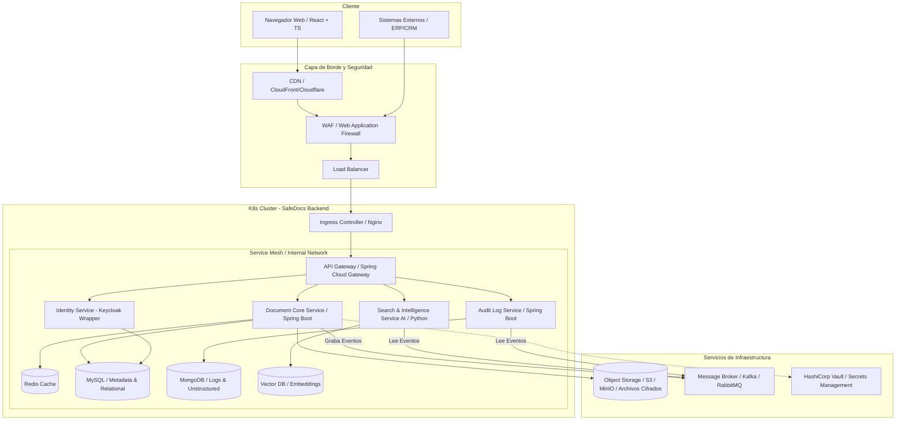
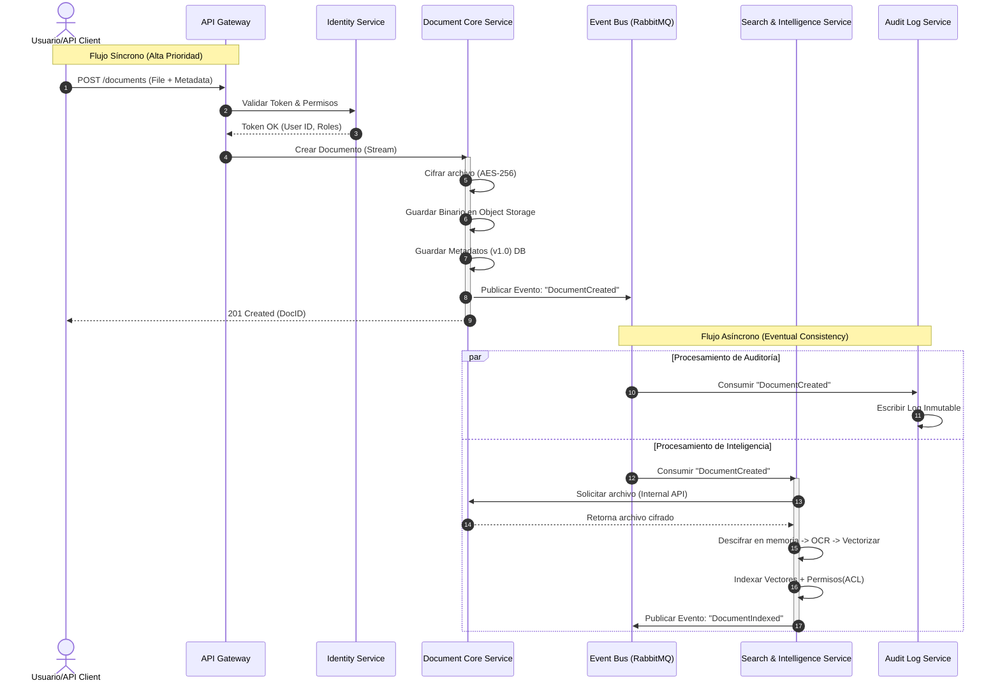

# 📂 Ficha del proyecto
## Nombre: Eduardo Guardado Ruiz
### 📌 Nombre del proyecto:
**SafeDocs Manager** (Document Management Security)

### 📌 Descripción breve:
Plataforma de gestión documental de alta seguridad con enfoque **API-First**, que integra cifrado, control de versiones lineal y un motor de búsqueda semántica basado en Inteligencia Artificial.

### 📌 Descripción general del producto:
SafeDocs Manager es una solución SaaS B2B diseñada como una **infraestructura documental inteligente**. No solo funciona como un repositorio seguro para sectores regulados (Legal, Fintech, Salud, RRHH), sino que actúa como un motor "backend" que permite a otros sistemas (ERPs, CRMs) heredar capacidades de seguridad avanzada. Combina una arquitectura **Zero-Trust** con accesibilidad programática mediante APIs RESTful, permitiendo la gestión del ciclo de vida del documento desde su creación y versionado hasta su recuperación mediante IA.

## Objetivo del producto

El propósito principal de SafeDocs Manager DMS es resolver la dicotomía entre **seguridad extrema y facilidad de uso operativa**.

* **Propósito:** Mitigar el riesgo de fugas de información (Data Leaks) y eliminar el "Shadow IT" (uso de herramientas no autorizadas) causado por la complejidad de los sistemas tradicionales.
* **Problema que resuelve:** Permite la colaboración segura y la integración fluida entre sistemas aislados sin comprometer el cumplimiento normativo.
* **Segmentos de Usuario:**
    * **Administradores/CISO:** Responsables de seguridad y cumplimiento.
    * **Desarrolladores:** Integradores de sistemas terceros.
    * **Usuarios Finales (Ej. Abogados, RRHH):** Profesionales que requieren acceso rápido y fiable.
* **Valor Estratégico:** Provee seguridad de nivel gubernamental "invisible" para el usuario, potenciada por IA para la productividad y trazabilidad forense inmutable.

## Características y funcionalidades principales

### A. Seguridad y Control de Acceso (Core)
* **Cifrado E2E & Zero-Trust:** Cifrado AES-256 de extremo a extremo; el sistema asume "cero confianza" por defecto.
* **RBAC Granular:** Control de acceso basado en roles (Ver, Editar, Descargar, Admin) aplicable a UI y API.
* **Audit Trails Inmutables:** Registro forense inalterable de cada acción (quién, cuándo, qué) sobre un archivo.
* **Marcas de Agua Dinámicas:** Inserción automática de identidad del usuario y fecha al visualizar documentos para prevenir fugas visuales.

### B. Gestión Documental Técnica
* **Control de Versiones Lineal:** Versionado (`v1.0` -> `v1.1`) con capacidad de "Rollback" y bloqueo (Check-in/Check-out) para edición segura.
* **Estructura de Carpetas Dinámica:** Organización jerárquica gestionable vía Web y API.

### C. Inteligencia Artificial y Búsqueda
* **Búsqueda Semántica (RAG/Vectorial):** Motor IA que entiende contexto y significado, no solo palabras clave exactas.
* **OCR Automático:** Extracción de texto de documentos escaneados e imágenes al subir.
* **Filtro de Seguridad en IA:** La IA respeta estrictamente los permisos RBAC; nunca revela datos restringidos en los resultados.

### D. Arquitectura de Integración (API-First)
* **API RESTful Estándar:** Endpoints documentados (OpenAPI/Swagger) para gestión de archivos, carpetas y permisos.
* **Gestión de API Keys:** Panel para creación y revocación de tokens para integraciones externas.
* **Webhooks:** Notificaciones push a sistemas terceros ante eventos (ej. documento firmado/actualizado).

## Diseño y experiencia de usuario

### Perfil: Administrador / CISO
* **Entrada:** Dashboard centralizado con métricas de seguridad, consumo y alertas de actividad anómala.
* **Gestión:** Interfaz "Drag & Drop" para asignación de roles y permisos. Panel de control de API Keys con revocación instantánea.

### Perfil: Desarrollador
* **Onboarding:** Portal de documentación con Swagger UI interactivo.
* **Uso:** Estructuras JSON predecibles y códigos de error estándar para facilitar la integración.

### Perfil: Usuario Final (Operativo)
* **Navegación:** Interfaz limpia similar a exploradores nativos, con indicadores visuales de seguridad (candados, marcas de agua).
* **Interacción Principal:** Búsqueda en lenguaje natural ("contratos de junio") con resultados contextuales y previsualización segura.
* **Alertas:** Avisos claros sobre versiones obsoletas con redirección a la versión vigente.

Esta es una propuesta arquitectónica detallada y profesional para **SafeDocs Manager**, diseñada por un Arquitecto de Soluciones Senior. Se ha priorizado la seguridad (Zero-Trust), la escalabilidad (patrones asíncronos para IA) y la mantenibilidad (Clean Architecture).

## Arquitectura del Sistema
### Diagrama de Arquitectura (Nivel Alto)
El siguiente diagrama ilustra la interacción entre el cliente (SPA), el Edge (CDN/WAF), el clúster de Kubernetes y los servicios de soporte.


### Diagrama de Secuencia: Flujo de Carga, Cifrado, Auditoría e Indexación Asíncrona de Documentos


### Estilo Arquitectónico

Se ha seleccionado una **Arquitectura de Microservicios orientada a Eventos (Event-Driven Microservices)**, estructurada internamente con **Arquitectura Hexagonal (Ports & Adapters)**.

### Justificación

1.  **Event-Driven (Asincronía):** El procesamiento de IA (OCR, Vectorización) y la Auditoría inmutable son operaciones costosas. Desacoplarlas mediante un bus de eventos (Kafka) permite que la subida del documento sea rápida para el usuario, mientras el procesamiento pesado ocurre en segundo plano ("Eventual Consistency").
2.  **Hexagonal:** Permite aislar la lógica de dominio (reglas de negocio documental) de la infraestructura (frameworks, bases de datos). Esto es crucial para un producto que podría cambiar de proveedor de almacenamiento (AWS S3 a Azure Blob) o de motor de base de datos sin reescribir la lógica core.
3.  **Seguridad Zero-Trust:** La separación física de servicios permite aplicar políticas de red estrictas (Network Policies en K8s). Si el servicio de "Búsqueda" (que procesa inputs externos) es comprometido, no tiene acceso directo a las llaves de cifrado gestionadas por el "Document Core".

### Beneficios vs. Compromisos

  * **Beneficios:** Escalabilidad independiente (escalar solo el servicio de IA con GPUs), tolerancia a fallos (si cae la auditoría, el sistema sigue operando en modo degradado), despliegues independientes.
  * **Compromisos:** Mayor complejidad operativa (requiere observabilidad avanzada), gestión de transacciones distribuidas (Saga Pattern) y latencia de red entre servicios.

## Componentes Principales

### A. Frontend: Single Page Application (SPA)

  * **Tecnología:** React + TypeScript + Vite.
  * **Responsabilidad:** Interfaz de usuario reactiva, gestión de estado del cliente (Zustand/Redux), cifrado parcial en lado cliente (opcional para máxima seguridad) y visualización de documentos.
  * **Justificación:** TypeScript aporta tipado estático, reduciendo errores en tiempo de ejecución, vital para aplicaciones empresariales complejas. React ofrece un ecosistema maduro para componentes ricos (drag & drop, visores PDF).

### B. API Gateway

  * **Tecnología:** Spring Cloud Gateway.
  * **Responsabilidad:** Punto único de entrada, enrutamiento, Rate Limiting, terminación SSL, validación preliminar de tokens JWT.
  * **Patrón:** **Gateway Offloading**. Descarga a los microservicios de tareas transversales como la validación básica de cabeceras de seguridad.

### C. Microservicios Backend (Spring Boot)

Todos los microservicios implementan **Spring Boot** por su robustez, inyección de dependencias y fácil integración con la nube.

#### 1. Identity Service (IAM)

  * **Tecnología:** Spring Boot como wrapper de **Keycloak** (o integración directa).
  * **Datos:** MySQL (Usuarios, Roles, Tenancy).
  * **Responsabilidad:** Autenticación (OIDC/OAuth2), gestión de sesiones y emisión de tokens. Centraliza el RBAC.

#### 2. Document Core Service

  * **Tecnología:** Spring Boot Java.
  * **Datos:** MySQL (Metadatos: nombre, tamaño, carpetas, dueños), S3 (Blobs cifrados).
  * **Responsabilidad:** Lógica transaccional fuerte (ACID). Gestiona la jerarquía de carpetas y versiones. Orquesta el cifrado: solicita llaves a Vault, cifra el stream y lo envía a S3.
  * **Patrón:** **CQRS (Command side)**.

#### 3. Search & Intelligence Service

  * **Tecnología:** Spring Boot (o Python FastAPI si el modelo IA lo requiere, comunicado vía gRPC).
  * **Datos:** Base de datos Vectorial (ej. Milvus o pgvector) y ElasticSearch.
  * **Responsabilidad:** Escucha eventos `DOCUMENT_CREATED`. Descarga el archivo, ejecuta OCR, genera embeddings y los indexa.
  * **Justificación:** Separado porque consume mucha CPU/Memoria y sus patrones de escalado son distintos.

#### 4. Audit Log Service

  * **Tecnología:** Spring Boot WebFlux (Reactivo).
  * **Datos:** MongoDB (Colecciones Time-Series).
  * **Responsabilidad:** Ingesta masiva de eventos de auditoría. Escritura rápida y sin esquema rígido.
  * **Justificación:** MongoDB maneja mejor grandes volúmenes de datos JSON no estructurados (logs) y permite alta velocidad de escritura.

### D. Message Broker

  * **Tecnología:** Apache Kafka (o RabbitMQ).
  * **Responsabilidad:** Garantizar la entrega de mensajes entre servicios. Desacoplamiento temporal.

## Descripción de Alto Nivel y Estructura de Ficheros

**SafeDocs Manager** es una plataforma distribuida donde el frontend actúa como un consumidor de APIs REST. El backend no es un monolito, sino un ecosistema de servicios autónomos que colaboran. Se utiliza **Clean Architecture** para garantizar que la lógica de negocio (Dominio) no dependa de frameworks o librerías externas.

### Estructura de Directorios: Frontend (React + TS)

Sigue una estructura basada en "features" o dominios funcionales, en lugar de agrupar por tipo técnico.

```text
/src
  /assets          # Imágenes, fuentes, estilos globales
  /components      # Componentes UI compartidos (Button, Modal, Layout)
    /ui            # Librería de componentes base (Atomic Design)
  /config          # Variables de entorno, configuración de axios
  /features        # Módulos funcionales (DDD en frontend)
    /auth          # Login, Registro, Recuperación
    /documents     # Browser de archivos, Upload, Visor
      /components  # Componentes específicos de documents
      /hooks       # Lógica de estado (useDocumentUpload)
      /services    # Llamadas a API (documentApi.ts)
      /types       # Interfaces TS (Document, Folder)
    /search        # Barra de búsqueda, resultados
    /admin         # Panel de control, usuarios
  /context         # Estado global (AuthContext, ThemeContext)
  /hooks           # Hooks globales (useDebounce, useToggle)
  /lib             # Utilidades, formateadores de fecha, validadores
  /routes          # Definición de rutas (React Router)
```

### Estructura de Directorios: Backend (Spring Boot - Hexagonal)

Cada microservicio tendrá esta estructura interna para proteger el dominio.

```text
/src/main/java/com/safedocs/documentservice
  /application              # Casos de Uso (Orquestación)
    /dto                    # Data Transfer Objects (Input/Output)
    /ports                  # Interfaces (Input Ports / Output Ports)
      /input                # Ej: CreateDocumentUseCase.java
      /output               # Ej: DocumentRepositoryPort.java, EventPublisherPort.java
    /services               # Implementación de Casos de Uso
  /domain                   # Lógica de Negocio Pura (Sin Spring)
    /model                  # Entidades (Document, Version, Permission)
    /exceptions             # Excepciones de negocio (DocumentLockedException)
    /service                # Servicios de dominio (reglas complejas)
  /infrastructure           # Adaptadores (Implementación técnica)
    /adapters
      /input
        /rest               # RestControllers (Spring MVC)
        /event_listener     # Kafka Listeners
      /output
        /persistence        # Implementación JPA/Mongo de los Repositorios
          /entity           # Entidades JPA (@Entity)
          /mapper           # Mappers (Entity <-> Domain Model)
        /broker             # Kafka Producers
        /storage            # Cliente S3/MinIO
    /config                 # Configuración de Spring (Beans, Security)
```

## Infraestructura y Despliegue

La infraestructura se basa en contenedores inmutables orquestados por Kubernetes, siguiendo prácticas de **GitOps**.

### Diagrama de Despliegue


### Componentes de Infraestructura

1.  **Orquestación (Kubernetes):** Maneja el ciclo de vida de los contenedores, escalado automático (HPA) basado en CPU/Memoria y recuperación ante fallos (Self-healing).
2.  **API Gateway / Ingress:** Un Ingress Controller (ej. NGINX o Traefik) maneja el tráfico HTTP/S entrante al clúster y lo dirige al API Gateway de aplicación.
3.  **Secret Management (HashiCorp Vault):** **Crítico para SafeDocs.** No guardamos contraseñas ni llaves de cifrado en variables de entorno planas. Los servicios se autentican con Vault al iniciar para recuperar sus credenciales dinámicamente.
4.  **Observabilidad:**
      * **Logs:** EFK Stack (Elasticsearch, Fluentd, Kibana) para centralizar logs de todos los pods.
      * **Métricas:** Prometheus (recolección) + Grafana (visualización).
      * **Tracing:** Jaeger o Zipkin para seguir una petición a través de los microservicios (Distributed Tracing).

## Seguridad

Dado que es un sistema "SafeDocs", la seguridad no es un añadido, es el núcleo.

### Medidas Implementadas

1.  **Autenticación y Autorización:**
      * **Protocolo:** OAuth2 / OpenID Connect (OIDC).
      * **JWT (JSON Web Tokens):** Los tokens son stateless. Contienen los "claims" (roles, tenant\_id).
      * **API Keys:** Para integraciones de terceros, gestionadas con rotación automática y scopes limitados.
2.  **Cifrado (Data Protection):**
      * **En tránsito (Data in Motion):** TLS 1.3 forzado en todas las conexiones externas. mTLS (Mutual TLS) dentro del clúster (vía Service Mesh como Istio/Linkerd) para que los servicios se autentiquen entre sí.
      * **En reposo (Data at Rest):** Bases de datos cifradas a nivel de volumen. Archivos en S3 cifrados con **Envelope Encryption** (una llave única por archivo, cifrada a su vez por una Master Key en Vault/KMS).
3.  **Seguridad de Aplicación:**
      * **Input Sanitization:** Validación estricta de DTOs en Spring Boot (`@Valid`, `@NotNull`) para prevenir inyecciones.
      * **Scan de Virus:** Los archivos subidos pasan a una zona de cuarentena y son escaneados (ej. ClamAV) antes de ser accesibles.
4.  **Hardening de Infraestructura:**
      * **Contenedores Rootless:** Los contenedores Docker corren con usuarios sin privilegios.
      * **Network Policies:** Por defecto "Deny All". Solo se permite tráfico explícito (ej. `Gateway` -\> `DocService` en puerto 8080).

## Tests

La estrategia de pruebas sigue la **Pirámide de Testing** para asegurar calidad sin sacrificar velocidad de desarrollo.

### Estrategia de Testing

| Tipo de Test | Ámbito | Herramientas | Descripción |
| :--- | :--- | :--- | :--- |
| **Unitarios** | Backend | JUnit 5, Mockito | Pruebas aisladas de lógica de dominio y casos de uso. Cobertura mínima del 80%. |
| **Unitarios** | Frontend | Vitest / Jest, React Testing Library | Verificación de renderizado de componentes y lógica de hooks. |
| **Integración** | Backend | **TestContainers**, Spring Boot Test | Levanta contenedores reales de MySQL/Kafka/Mongo en Docker efímero para probar repositorios y flujo de mensajes. |
| **Contrato** | API | **Pact** | Verifica que los microservicios cumplan el contrato API acordado entre Consumidor (Frontend/Otros servicios) y Proveedor, evitando rupturas en cambios. |
| **End-to-End (E2E)** | Sistema | **Cypress** / Playwright | Simula flujos de usuario completos: "Usuario hace login, sube documento y busca documento". Se ejecutan en el pipeline de CI/CD (Stage/QA). |
| **Seguridad (SAST/DAST)** | Pipeline | SonarQube, OWASP ZAP | Análisis estático de código en busca de vulnerabilidades y escaneo dinámico de la API en ejecución. |

### Ejemplo de Caso de Test de Integración (Backend)

Usando `TestContainers`, al probar el `DocumentService`:

1.  El test arranca un contenedor MySQL limpio y un MinIO (S3 mock).
2.  Llama al método `createDocument()`.
3.  Verifica que el registro existe en MySQL.
4.  Verifica que el archivo binario está en MinIO.
5.  Destruye los contenedores al finalizar.