## Índice
- [Ficha del proyecto](#-ficha-del-proyecto)
- [Descripción general del producto](#descripción-general-del-producto)
- [Arquitectura del Sistema](#arquitectura-del-sistema)
- [Modelo de Datos](#modelo-de-datos)
- [Especificación de la API](#especificación-de-la-api)
- [Historias de Usuario](#historias-de-usuario)
- [Tickets de Trabajo](#tickets-de-trabajo)
- [Reglas de desarrollo](#reglas-de-desarrollo)

# 📂 Ficha del proyecto
* 📌**Nombre:** Eduardo Guardado Ruiz
* 📌**Nombre del proyecto:** DocFlow
* 📌**Descripción breve:**
Proyecto de software modular de gestión documental (DMS) con enfoque **API-First**, que incluye control de versiones lineal y un motor de búsqueda semántica basado en Inteligencia Artificial como plugin opcional, priorizando usabilidad, integración y accesibilidad para empresas de diversos tamaños.

# Descripción general del producto
DocFlow es un proyecto de software modular diseñado como una **infraestructura documental inteligente**. Funciona como un repositorio central para gestión documental, actuando como un motor "backend" que permite a otros sistemas heredar capacidades de gestión documental avanzada. Combina una arquitectura **RBAC** (Role-Based Access Control) con accesibilidad programática mediante APIs RESTful, permitiendo la gestión del ciclo de vida del documento desde su creación y versionado hasta su recuperación. El núcleo del producto es un DMS eficiente y escalable, con la IA como un plugin opcional para búsqueda semántica, permitiendo a empresas con recursos limitados operar sin sobrecarga computacional.

## Objetivo del producto

El propósito principal de DocFlow es resolver la dicotomía entre **seguridad básica y facilidad de uso operativa**.

* **Propósito:** Facilitar la colaboración segura y la recuperación rápida mediante IA (opcional), eliminando el "Shadow IT" causado por la complejidad de los sistemas tradicionales.
* **Problema que resuelve:** Permite la colaboración eficiente y la integración fluida entre sistemas aislados con control de acceso granular, ofreciendo un DMS accesible para empresas de cualquier tamaño, con IA como complemento.
* **Segmentos de Usuario:**
    * **Administradores:** Responsables de configuración, roles y monitoreo del sistema.
    * **Desarrolladores o Sistemas:** Integradores que usan APIs para conectar con otros sistemas (ERPs, CRMs).
    * **Usuarios Finales (Ej. RH):** Profesionales operativos que suben, buscan y gestionan documentos diariamente.

## Características y funcionalidades principales

### A. Seguridad y Control de Acceso (Core)
* **RBAC Granular:** Control de acceso basado en roles (Ver, Editar, Descargar, Admin) aplicable a UI y API.
* **Audit Trails Inmutables:** Registro forense inalterable de cada acción (quién, cuándo, qué) sobre un archivo.

### B. Gestión Documental Técnica
* **Control de Versiones Lineal:** Versionado (`v1.0` -> `v1.1`) con capacidad de "Rollback" y bloqueo (Check-in/Check-out) para edición segura.
* **Estructura de Carpetas Dinámica:** Organización jerárquica gestionable vía Web y API.

### C. Inteligencia Artificial y Búsqueda (Plugin)
* **Búsqueda Semántica (RAG/Vectorial):** Motor IA que entiende contexto y significado, no solo palabras clave exactas.
* **OCR Automático:** Extracción de texto de documentos escaneados e imágenes al subir.
* **Filtro de Seguridad en IA:** La IA respeta estrictamente los permisos RBAC; nunca revela datos restringidos en los resultados.

### D. Arquitectura de Integración (API-First)
* **API RESTful Estándar:** Endpoints documentados (OpenAPI/Swagger) para gestión de archivos, carpetas y permisos.
* **Gestión de API Keys:** Panel para creación y revocación de tokens para integraciones externas.
* **Webhooks:** Notificaciones push a sistemas terceros ante eventos (ej. documento firmado/actualizado).

## Diseño y experiencia de usuario

### Perfil: Administradores
* **Entrada:** Dashboard centralizado con métricas de seguridad, consumo y alertas de actividad anómala.
* **Gestión:** Interfaz "Drag & Drop" para asignación de roles y permisos. Panel de control de API Keys con revocación instantánea.

### Perfil: Desarrolladores o Sistemas
* **Onboarding:** Portal de documentación con Swagger UI interactivo.
* **Uso:** Estructuras JSON predecibles y códigos de error estándar para facilitar la integración.

### Perfil: Usuario Final (Operativo)
* **Navegación:** Interfaz limpia similar a exploradores nativos, con indicadores visuales de seguridad (candados, marcas de agua).
* **Interacción Principal:** Búsqueda en lenguaje natural ("contratos de junio") con resultados contextuales y previsualización segura.
* **Alertas:** Avisos claros sobre versiones obsoletas con redirección a la versión vigente.

Esta es una propuesta arquitectónica detallada y profesional para **DocFlow**. Se ha priorizado la modularidad (DMS core con IA opcional), la seguridad (RBAC y auditoría), la escalabilidad (patrones asíncronos) y la mantenibilidad (Clean Architecture).

## Reglas de desarrollo

Las reglas de desarrollo para backend, frontend, base de datos e infraestructura están centralizadas en el índice de reglas del proyecto:

- Ver [.github/RULES.md](.github/RULES.md)

# Arquitectura del Sistema

## Diagrama de contexto

```mermaid
flowchart TD
    subgraph Personas
        Admin[Administrador]
        Dev[Desarrollador]
        User[Usuario Final]
    end

    subgraph Sistema_Principal
        DocFlow[DocFlow]
    end

    subgraph Sistemas_Externos
        ExtSys[Sistema Externo ERP/CRM]
    end

    Admin -->|Configura roles y permisos| DocFlow
    Dev -->|Integra vía APIs| DocFlow
    User -->|Sube y busca documentos| DocFlow
    DocFlow -->|Envía notificaciones vía webhooks| ExtSys
    ExtSys -->|Sube, busca y consulta documentos vía APIs| DocFlow
```


### Diagrama de Arquitectura Nube (Nivel Alto)
El siguiente diagrama ilustra la interacción entre el cliente (SPA), el Edge (CDN/WAF), el clúster de Kubernetes y los servicios de soporte.


### Diagrama de Arquitectura Local (Docker Compose)

Para entornos de desarrollo y pruebas locales, se utiliza Docker Compose para orquestar los servicios en una máquina local, simplificando la infraestructura.


### Diagrama de Secuencia: Flujo de Carga, Auditoría e Indexación Asíncrona de Documentos


### Estilo Arquitectónico

Se ha seleccionado una **Arquitectura de Microservicios orientada a Eventos (Event-Driven Microservices)**, estructurada internamente con **Arquitectura Hexagonal (Ports & Adapters)**.

### Justificación

1.  **Event-Driven (Asincronía):** El procesamiento de IA (OCR, Vectorización) y la Auditoría inmutable son operaciones costosas. Desacoplarlas mediante un bus de eventos (Kafka) permite que la subida del documento sea rápida para el usuario, mientras el procesamiento pesado ocurre en segundo plano ("Eventual Consistency"). La IA es opcional, permitiendo despliegues ligeros sin este servicio.
2.  **Hexagonal:** Permite aislar la lógica de dominio (reglas de negocio documental) de la infraestructura (frameworks, bases de datos). Esto es crucial para un producto que podría cambiar de proveedor de almacenamiento (AWS S3 a Azure Blob) o de motor de base de datos sin reescribir la lógica core.

### Beneficios vs. Compromisos

  * **Beneficios:** Escalabilidad independiente (escalar solo el servicio de IA con GPUs), tolerancia a fallos (si cae la auditoría, el sistema sigue operando en modo degradado), despliegues independientes.
  * **Compromisos:** Mayor complejidad operativa (requiere observabilidad avanzada), gestión de transacciones distribuidas (Saga Pattern) y latencia de red entre servicios.

## Componentes Principales

### A. Frontend: Single Page Application (SPA)

  * **Tecnología:** React + TypeScript + Vite.
  * **Responsabilidad:** Interfaz de usuario reactiva, gestión de estado del cliente (Zustand/Redux), cifrado parcial en lado cliente (opcional para máxima seguridad) y visualización de documentos.
  * **Justificación:** TypeScript aporta tipado estático, reduciendo errores en tiempo de ejecución, vital para aplicaciones empresariales complejas. React ofrece un ecosistema maduro para componentes ricos (drag & drop, visores PDF).

### B. API Gateway

  * **Tecnología:** Spring Cloud Gateway.
  * **Responsabilidad:** Punto único de entrada, enrutamiento, Rate Limiting, terminación SSL, validación preliminar de tokens JWT.
  * **Patrón:** **Gateway Offloading**. Descarga a los microservicios de tareas transversales como la validación básica de cabeceras de seguridad.

### C. Microservicios Backend (Spring Boot)

Todos los microservicios implementan **Spring Boot** por su robustez, inyección de dependencias y fácil integración con la nube.

#### 1. Identity Service (IAM)

  * **Tecnología:** Spring Boot como wrapper de **Keycloak** (o integración directa).
  * **Datos:** PostgreSQL (Usuarios, Roles, Organizacion).
  * **Responsabilidad:** Autenticación (OIDC/OAuth2), gestión de sesiones y emisión de tokens. Centraliza el RBAC.

#### 2. Document Core Service

  * **Tecnología:** Spring Boot Java.
  * **Datos:** PostgreSQL (Metadatos: nombre, tamaño, carpetas, dueños), S3 (Blobs).
  * **Responsabilidad:** Lógica transaccional fuerte (ACID). Gestiona la jerarquía de carpetas y versiones.
  * **Patrón:** **CQRS (Command side)**.

#### 3. Search & Intelligence Service (Plugin IA)

  * **Tecnología:** Spring Boot (o Python FastAPI si el modelo IA lo requiere, comunicado vía gRPC).
  * **Datos:** Base de datos Vectorial (ej. Milvus o pgvector) y ElasticSearch.
  * **Responsabilidad:** Escucha eventos `DOCUMENT_CREATED`. Descarga el archivo, ejecuta OCR, genera embeddings y los indexa.
  * **Justificación:** Separado porque consume mucha CPU/Memoria y sus patrones de escalado son distintos. Como plugin opcional, permite despliegues sin IA para entornos con recursos limitados.

#### 4. Audit Log Service

  * **Tecnología:** Spring Boot WebFlux (Reactivo).
  * **Datos:** MongoDB (Colecciones Time-Series).
  * **Responsabilidad:** Ingesta masiva de eventos de auditoría. Escritura rápida y sin esquema rígido.
  * **Justificación:** MongoDB maneja mejor grandes volúmenes de datos JSON no estructurados (logs) y permite alta velocidad de escritura.

### D. Message Broker

  * **Tecnología:** Apache Kafka (o RabbitMQ).
  * **Responsabilidad:** Garantizar la entrega de mensajes entre servicios. Desacoplamiento temporal.

## Descripción de Alto Nivel y Estructura de Ficheros

**DocFlow** es una plataforma distribuida modular donde el frontend actúa como un consumidor de APIs REST. El backend no es un monolito, sino un ecosistema de servicios autónomos que colaboran, con la IA como plugin. Se utiliza **Clean Architecture** para garantizar que la lógica de negocio (Dominio) no dependa de frameworks o librerías externas.

### Estructura de Directorios: Frontend (React + TS)

Sigue una estructura basada en "features" o dominios funcionales, en lugar de agrupar por tipo técnico.

```text
/src
  /assets          # Imágenes, fuentes, estilos globales
  /components      # Componentes UI compartidos (Button, Modal, Layout)
    /ui            # Librería de componentes base (Atomic Design)
  /config          # Variables de entorno, configuración de axios
  /features        # Módulos funcionales (DDD en frontend)
    /auth          # Login, Registro, Recuperación
    /documents     # Browser de archivos, Upload, Visor
      /components  # Componentes específicos de documents
      /hooks       # Lógica de estado (useDocumentUpload)
      /services    # Llamadas a API (documentApi.ts)
      /types       # Interfaces TS (Document, Folder)
    /search        # Barra de búsqueda, resultados
    /admin         # Panel de control, usuarios
  /context         # Estado global (AuthContext, ThemeContext)
  /hooks           # Hooks globales (useDebounce, useToggle)
  /lib             # Utilidades, formateadores de fecha, validadores
  /routes          # Definición de rutas (React Router)
```

### Estructura de Directorios: Backend (Spring Boot - Hexagonal)

Cada microservicio tendrá esta estructura interna para proteger el dominio.

```text
/src/main/java/com/docflow/documentservice
  /application              # Casos de Uso (Orquestación)
    /dto                    # Data Transfer Objects (Input/Output)
    /ports                  # Interfaces (Input Ports / Output Ports)
      /input                # Ej: CreateDocumentUseCase.java
      /output               # Ej: DocumentRepositoryPort.java, EventPublisherPort.java
    /services               # Implementación de Casos de Uso
  /domain                   # Lógica de Negocio Pura (Sin Spring)
    /model                  # Entidades (Document, Version, Permission)
    /exceptions             # Excepciones de negocio (DocumentLockedException)
    /service                # Servicios de dominio (reglas complejas)
  /infrastructure           # Adaptadores (Implementación técnica)
    /adapters
      /input
        /rest               # RestControllers (Spring MVC)
        /event_listener     # Kafka Listeners
      /output
        /persistence        # Implementación JPA/Mongo de los Repositorios
          /entity           # Entidades JPA (@Entity)
          /mapper           # Mappers (Entity <-> Domain Model)
        /broker             # Kafka Producers
        /storage            # Cliente S3/MinIO
    /config                 # Configuración de Spring (Beans, Security)
```

## Infraestructura y Despliegue

La infraestructura se basa en contenedores inmutables orquestados por Kubernetes, siguiendo prácticas de **GitOps**.

### Diagrama de Despliegue


### Componentes de Infraestructura

1.  **Orquestación (Kubernetes):** Maneja el ciclo de vida de los contenedores, escalado automático (HPA) basado en CPU/Memoria y recuperación ante fallos (Self-healing).
2.  **API Gateway / Ingress:** Un Ingress Controller (ej. NGINX o Traefik) maneja el tráfico HTTP/S entrante al clúster y lo dirige al API Gateway de aplicación.
3.  **Secret Management (HashiCorp Vault):** **Crítico para DocFlow.** No guardamos contraseñas ni credenciales en variables de entorno planas. Los servicios se autentican con Vault al iniciar para recuperar sus credenciales dinámicamente.
4.  **Observabilidad:**
      * **Logs:** EFK Stack (Elasticsearch, Fluentd, Kibana) para centralizar logs de todos los pods.
      * **Métricas:** Prometheus (recolección) + Grafana (visualización).
      * **Tracing:** Jaeger o Zipkin para seguir una petición a través de los microservicios (Distributed Tracing).

## Seguridad

### Medidas Implementadas

1.  **Autenticación y Autorización:**
      * **Protocolo:** OAuth2 / OpenID Connect (OIDC).
      * **JWT (JSON Web Tokens):** Los tokens son stateless. Contienen los "claims" (roles, organizacion_id).
      * **API Keys:** Para integraciones de terceros, gestionadas con rotación automática y scopes limitados.
2.  **Cifrado (Data Protection):**
      * **En tránsito (Data in Motion):** TLS 1.3 forzado en todas las conexiones externas. mTLS (Mutual TLS) dentro del clúster (vía Service Mesh como Istio/Linkerd) para que los servicios se autentiquen entre sí.
3.  **Seguridad de Aplicación:**
      * **Input Sanitization:** Validación estricta de DTOs en Spring Boot (`@Valid`, `@NotNull`) para prevenir inyecciones.
      * **Scan de Virus:** Los archivos subidos pasan a una zona de cuarentena y son escaneados (ej. ClamAV) antes de ser accesibles.
4.  **Hardening de Infraestructura:**
      * **Contenedores Rootless:** Los contenedores Docker corren con usuarios sin privilegios.
      * **Network Policies:** Por defecto "Deny All". Solo se permite tráfico explícito (ej. `Gateway` -\> `DocService` en puerto 8080).

## Tests

La estrategia de pruebas sigue la **Pirámide de Testing** para asegurar calidad sin sacrificar velocidad de desarrollo.

### Estrategia de Testing

| Tipo de Test | Ámbito | Herramientas | Descripción |
| :--- | :--- | :--- | :--- |
| **Unitarios** | Backend | JUnit 5, Mockito | Pruebas aisladas de lógica de dominio y casos de uso. Cobertura mínima del 80%. |
| **Unitarios** | Frontend | Vitest / Jest, React Testing Library | Verificación de renderizado de componentes y lógica de hooks. |
| **Integración** | Backend | **TestContainers**, Spring Boot Test | Levanta contenedores reales de PostgreSQL/Kafka/Mongo en Docker efímero para probar repositorios y flujo de mensajes. |
| **Contrato** | API | **Pact** | Verifica que los microservicios cumplan el contrato API acordado entre Consumidor (Frontend/Otros servicios) y Proveedor, evitando rupturas en cambios. |
| **End-to-End (E2E)** | Sistema | **Cypress** / Playwright | Simula flujos de usuario completos: "Usuario hace login, sube documento y busca documento". Se ejecutan en el pipeline de CI/CD (Stage/QA). |
| **Seguridad (SAST/DAST)** | Pipeline | SonarQube, OWASP ZAP | Análisis estático de código en busca de vulnerabilidades y escaneo dinámico de la API en ejecución. |

### Ejemplo de Caso de Test de Integración (Backend)

Usando `TestContainers`, al probar el `DocumentService`:

1.  El test arranca un contenedor PostgreSQL limpio y un MinIO (S3 mock).
2.  Llama al método `createDocument()`.
3.  Verifica que el registro existe en PostgreSQL.
4.  Verifica que el archivo binario está en MinIO.
5.  Destruye los contenedores al finalizar.

# Modelo de Datos

```mermaid
erDiagram
    %% --- GESTIÓN DE ORGANIZACIÓN ---
    Organizacion {
        int id PK
        string nombre
        jsonb configuracion
        string estado
        datetime fecha_creacion
    }

    %% --- IAM Y ROLES (MODELO REFACTORIZADO) ---
    Usuario {
        bigint id PK
        string email UK
        string hash_contrasena
        string nombre_completo
        boolean mfa_habilitado
        datetime fecha_eliminacion
        datetime fecha_creacion
        datetime fecha_actualizacion
    }

    Usuario_Organizacion {
        bigint usuario_id PK, FK
        int organizacion_id PK, FK
        string estado
        boolean es_predeterminada
        datetime fecha_asignacion
    }

    Rol {
        int id PK
        int organizacion_id FK
        string nombre
        string descripcion
        datetime fecha_creacion
        %% JSONB eliminado aquí a favor de relación estricta
    }

    Permiso_Catalogo {
        int id PK
        string slug UK "Ej: usuarios.crear, docs.exportar"
        string nombre_legible
        string modulo "Agrupador: Seguridad, Billing, Docs"
        string descripcion
        datetime fecha_creacion
    }

    Rol_Tiene_Permiso {
        int rol_id PK, FK
        int permiso_id PK, FK
        datetime fecha_asignacion
    }

    Usuario_Rol {
        bigint usuario_id PK, FK
        int rol_id PK, FK
        datetime fecha_asignacion
    }

    %% --- ESTRUCTURA DOCUMENTAL ---
    Carpeta {
        bigint id PK
        string nombre
        bigint carpeta_padre_id FK
        int organizacion_id FK
        bigint propietario_id FK
        string ruta_jerarquia "LTREE"
        datetime fecha_creacion
        datetime fecha_eliminacion
        datetime fecha_actualizacion
    }

    Documento {
        bigint id PK
        string nombre
        string descripcion
        int organizacion_id FK
        bigint carpeta_id FK
        bigint propietario_id FK
        bigint version_actual_id FK
        jsonb metadatos_globales
        datetime fecha_creacion
        datetime fecha_eliminacion
        datetime fecha_actualizacion
    }

    Version {
        bigint id PK
        bigint documento_id FK
        int numero_secuencial
        string etiqueta_version
        string ruta_almacenamiento
        string tipo_mime
        bigint tamano_bytes
        string hash_sha256
        bigint creador_id FK
        jsonb metadatos_version
        datetime fecha_creacion
    }

    %% --- ACL (Permisos sobre objetos) ---
    %% Separado por sujeto (Usuario vs Rol) para evitar NULLs y ambigüedad
    Permiso_Carpeta_Usuario {
        bigint id PK
        bigint carpeta_id FK
        bigint usuario_id FK
        string nivel_acceso
        boolean recursivo
        datetime fecha_asignacion
    }

    Permiso_Carpeta_Rol {
        bigint id PK
        bigint carpeta_id FK
        int rol_id FK
        string nivel_acceso
        boolean recursivo
        datetime fecha_asignacion
    }

    Permiso_Documento_Usuario {
        bigint id PK
        bigint documento_id FK
        bigint usuario_id FK
        string nivel_acceso
        datetime fecha_expiracion
        datetime fecha_asignacion
    }

    Permiso_Documento_Rol {
        bigint id PK
        bigint documento_id FK
        int rol_id FK
        string nivel_acceso
        datetime fecha_expiracion
        datetime fecha_asignacion
    }

    %% --- AUDITORÍA ---
    Log_Auditoria {
        bigint id PK
        int organizacion_id FK
        bigint usuario_id FK
        string codigo_evento
        jsonb detalles_cambio
        string direccion_ip
        datetime fecha_evento
    }

    %% RELACIONES
    Organizacion ||--o{ Usuario_Organizacion : tiene
    Usuario ||--o{ Usuario_Organizacion : pertenece
    Organizacion ||--o{ Rol : define
    
    %% Relación de Seguridad Refactorizada
    Rol ||--o{ Rol_Tiene_Permiso : posee
    Permiso_Catalogo ||--o{ Rol_Tiene_Permiso : asignado_a
    
    Usuario ||--o{ Usuario_Rol : tiene
    Rol ||--o{ Usuario_Rol : asignado
    
    Organizacion ||--o{ Carpeta : almacena
    Carpeta ||--o{ Carpeta : subcarpetas
    Carpeta ||--o{ Documento : archivos
    
    Documento ||--o{ Version : historial
    Documento ||--o| Version : actual
    
    Carpeta ||--o{ Permiso_Carpeta_Usuario : protege
    Carpeta ||--o{ Permiso_Carpeta_Rol : protege
    Documento ||--o{ Permiso_Documento_Usuario : protege
    Documento ||--o{ Permiso_Documento_Rol : protege

    Usuario ||--o{ Permiso_Carpeta_Usuario : recibe
    Rol ||--o{ Permiso_Carpeta_Rol : recibe
    Usuario ||--o{ Permiso_Documento_Usuario : recibe
    Rol ||--o{ Permiso_Documento_Rol : recibe
    
    Usuario ||--o{ Log_Auditoria : genera
    Organizacion ||--o{ Log_Auditoria : registra
```


## Diccionario de Datos (Especificación Técnica)

### Módulo A: Identidad y Organización (IAM)

#### 1. `Organizacion`
El contenedor raíz. Define el alcance legal y de configuración del cliente.
* **id** (`INT`, PK, Auto-increment): Identificador único.
* **nombre** (`VARCHAR(100)`, Not Null): Nombre comercial de la empresa.
* **configuracion** (`JSONB`, Not Null, Default `{}`): Almacena configuración visual (logo, colores) y técnica (límites de almacenamiento, política de passwords).
    * *Ejemplo:* `{"apariencia": {"logo_url": "..."}, "seguridad": {"mfa_obligatorio": true}}`
* **estado** (`VARCHAR(20)`, Not Null): Enum: `ACTIVO`, `SUSPENDIDO`, `ARCHIVADO`.
* **fecha_creacion** (`TIMESTAMPTZ`, Default NOW()).

#### 2. `Usuario`
El actor autenticado en el sistema.
* **id** (`BIGINT`, PK, Auto-increment): ID global del usuario.
* **email** (`VARCHAR(255)`, Unique): Credencial de acceso global (una identidad puede pertenecer a múltiples organizaciones).
* **hash_contrasena** (`VARCHAR(255)`, Not Null): Hash seguro (Bcrypt/Argon2).
* **nombre_completo** (`VARCHAR(100)`, Not Null).
* **mfa_habilitado** (`BOOLEAN`, Default False): Bandera para 2FA.
* **fecha_eliminacion** (`TIMESTAMPTZ`, Nullable): Para Soft Delete. Si tiene fecha, el usuario está "borrado".
* **fecha_creacion** (`TIMESTAMPTZ`, Not Null, Default NOW()): Fecha de creación del registro.
* **fecha_actualizacion** (`TIMESTAMPTZ`, Not Null, Default NOW()): Fecha de última actualización. Se actualiza automáticamente vía trigger.

#### 3. `Usuario_Organizacion` (Membresía multi-organizacion)
Define a qué organizaciones pertenece un usuario (incluido un usuario administrador) y resuelve la organización predeterminada usada en el login.
* **usuario_id** (`BIGINT`, PK, FK -> `Usuario`): Usuario miembro.
* **organizacion_id** (`INT`, PK, FK -> `Organizacion`): Organización a la que pertenece.
* **estado** (`VARCHAR(20)`, Not Null): Enum sugerido: `ACTIVO`, `SUSPENDIDO`.
* **es_predeterminada** (`BOOLEAN`, Default False): Indica la organización por defecto al iniciar sesión (si aplica).
* **fecha_asignacion** (`TIMESTAMPTZ`, Default NOW()).
* Debe existir como máximo 1 membresía `es_predeterminada=true` activa por usuario.
* Si un usuario tiene 2 organizaciones activas, debe existir exactamente 1 predeterminada (para que `/auth/login` emita token sin selección).
* Si un usuario tiene más de 2 organizaciones activas, el sistema devuelve error (limitación MVP) y debe corregirse por administración.

#### 4. `Rol`
Define perfiles funcionales personalizados por la organización.
* **id** (`INT`, PK, Auto-increment).
* **organizacion_id** (`INT`, FK -> `Organizacion`).
* **nombre** (`VARCHAR(50)`, Not Null): Ej. "Administrador Legal", "Auditor Externo".
* **descripcion** (`TEXT`, Nullable).
* **fecha_creacion** (`TIMESTAMPTZ`, Default NOW()): Fecha de creación del rol.

#### 5. `Permiso_Catalogo`
Lista maestra e inmutable de capacidades del sistema (System Capabilities).
* **id** (`INT`, PK).
* **slug** (`VARCHAR(60)`, Unique): Identificador técnico (ej. `users.create`, `docs.export`, `billing.view`).
* **modulo** (`VARCHAR(50)`): Agrupador lógico para UI (ej. "Seguridad", "Gestión Documental").
* **fecha_creacion** (`TIMESTAMPTZ`, Default NOW()): Fecha de registro del permiso en el catálogo.

#### 6. `Rol_Tiene_Permiso`
Tabla intermedia (Many-to-Many) para asignar capacidades a roles.
* **rol_id** (`INT`, PK, FK -> `Rol`).
* **permiso_id** (`INT`, PK, FK -> `Permiso_Catalogo`).
* **fecha_asignacion** (`TIMESTAMPTZ`, Default NOW()).

#### 7. `Usuario_Rol` (Asignación de roles por organización)
Asigna roles a un usuario.
* **usuario_id** (`BIGINT`, PK, FK -> `Usuario`).
* **rol_id** (`INT`, PK, FK -> `Rol`).
* **fecha_asignacion** (`TIMESTAMPTZ`, Default NOW()).

---

### Módulo B: Núcleo Documental (Core)

#### 8. `Carpeta`
Estructura jerárquica para organizar la información.
* **id** (`BIGINT`, PK, Auto-increment).
* **organizacion_id** (`INT`, FK -> `Organizacion`).
* **carpeta_padre_id** (`BIGINT`, FK -> `Carpeta`, Nullable): Si es NULL, es una carpeta raíz.
* **nombre** (`VARCHAR(255)`, Not Null).
* **ruta_jerarquia** (`LTREE` o `VARCHAR`, Indexado): Materialización del path (ej. `1.5.20`) para consultas de árbol optimizadas sin recursividad profunda.
* **propietario_id** (`BIGINT`, FK -> `Usuario`).
* **fecha_creacion** (`TIMESTAMPTZ`, Default NOW()): Fecha de creación de la carpeta.
* **fecha_eliminacion** (`TIMESTAMPTZ`, Nullable): Soft Delete (Papelera de reciclaje).
* **fecha_actualizacion** (`TIMESTAMPTZ`, Default NOW()): Fecha de última modificación (renombre, movimiento).

#### 9. `Documento`
La entidad lógica. Representa el "sobre" que contiene la historia del archivo.
* **id** (`BIGINT`, PK, Auto-increment).
* **organizacion_id** (`INT`, FK -> `Organizacion`).
* **carpeta_id** (`BIGINT`, FK -> `Carpeta`): Ubicación actual.
* **version_actual_id** (`BIGINT`, FK -> `Version`, Nullable): Puntero de optimización para recuperación rápida.
* **nombre** (`VARCHAR(255)`, Not Null).
* **metadatos_globales** (`JSONB`, Default `{}`): Campos definidos por el usuario (Tags, Cliente, Fecha Vencimiento). Indexado con GIN.
    * *Ejemplo:* `{"cliente": "Acme Corp", "tags": ["urgente", "legal"], "numero_factura": "F-2023-001"}`
* **fecha_creacion** (`TIMESTAMPTZ`, Default NOW()): Fecha de creación del documento.
* **fecha_eliminacion** (`TIMESTAMPTZ`, Nullable): Soft Delete (Papelera de reciclaje).
* **fecha_actualizacion** (`TIMESTAMPTZ`, Default NOW()): Fecha de última modificación de metadatos.

#### 10. `Version`
La entidad física. Representa un archivo inmutable en el tiempo.
* **id** (`BIGINT`, PK, Auto-increment).
* **documento_id** (`BIGINT`, FK -> `Documento`).
* **numero_secuencial** (`INT`, Not Null): Contador incremental (1, 2, 3...) por documento.
* **ruta_almacenamiento** (`VARCHAR(500)`, Not Null): Key o Path en el Object Storage (S3/Azure Blob).
* **hash_sha256** (`CHAR(64)`, Not Null, Indexado): Checksum para integridad y deduplicación.
* **tamano_bytes** (`BIGINT`, Not Null).
* **tipo_mime** (`VARCHAR(100)`): Ej. `application/pdf`.
* **metadatos_version** (`JSONB`): Metadatos técnicos extraídos (EXIF, número de páginas, autor del PDF).
    * *Ejemplo:* `{"paginas": 12, "resolucion": "300dpi", "encriptado": false}`
* **creador_id** (`BIGINT`, FK -> `Usuario`): Quién subió esta versión específica.

---

### Módulo C: Seguridad Granular (ACL) y Auditoría

#### 11. `Permiso_Carpeta_Usuario`
Permisos explícitos por carpeta asignados directamente a un usuario.
* **id** (`BIGINT`, PK).
* **carpeta_id** (`BIGINT`, FK -> `Carpeta`).
* **usuario_id** (`BIGINT`, FK -> `Usuario`).
* **nivel_acceso** (`VARCHAR(20)`): Enum: `LECTURA`, `ESCRITURA`, `ADMINISTRACION`.
* **recursivo** (`BOOLEAN`, Default True): Define si aplica a subcarpetas.
* **fecha_asignacion** (`TIMESTAMPTZ`, Default NOW()).

#### 12. `Permiso_Carpeta_Rol`
Permisos por carpeta asignados a un rol (se heredan por los usuarios que posean ese rol).
* **id** (`BIGINT`, PK).
* **carpeta_id** (`BIGINT`, FK -> `Carpeta`).
* **rol_id** (`INT`, FK -> `Rol`).
* **nivel_acceso** (`VARCHAR(20)`): Enum: `LECTURA`, `ESCRITURA`, `ADMINISTRACION`.
* **recursivo** (`BOOLEAN`, Default True).
* **fecha_asignacion** (`TIMESTAMPTZ`, Default NOW()).

#### 13. `Permiso_Documento_Usuario`
Permisos explícitos por documento asignados directamente a un usuario.
* **id** (`BIGINT`, PK).
* **documento_id** (`BIGINT`, FK -> `Documento`).
* **usuario_id** (`BIGINT`, FK -> `Usuario`).
* **nivel_acceso** (`VARCHAR(20)`): Enum: `LECTURA`, `ESCRITURA`, `ADMINISTRACION`.
* **fecha_expiracion** (`TIMESTAMPTZ`, Nullable).
* **fecha_asignacion** (`TIMESTAMPTZ`, Default NOW()).

#### 14. `Permiso_Documento_Rol`
Permisos por documento asignados a un rol.
* **id** (`BIGINT`, PK).
* **documento_id** (`BIGINT`, FK -> `Documento`).
* **rol_id** (`INT`, FK -> `Rol`).
* **nivel_acceso** (`VARCHAR(20)`): Enum: `LECTURA`, `ESCRITURA`, `ADMINISTRACION`.
* **fecha_expiracion** (`TIMESTAMPTZ`, Nullable).
* **fecha_asignacion** (`TIMESTAMPTZ`, Default NOW()).

#### 15. `Log_Auditoria`
Traza histórica inmutable.
* **id** (`BIGINT`, PK, BigSerial).
* **organizacion_id** (`INT`, FK -> `Organizacion`).
* **usuario_id** (`BIGINT`, FK -> `Usuario`, Nullable): `ON DELETE SET NULL` para preservar historia.
* **codigo_evento** (`VARCHAR(50)`, Not Null): Ej. `DOC_CREATED`, `DOC_DELETED`, `ACL_CHANGED`.
* **detalles_cambio** (`JSONB`): Snapshot de los datos. Ej: `{ "antes": { "nombre": "A" }, "despues": { "nombre": "B" } }`.
    * *Ejemplo:* `{"campo": "estado", "valor_anterior": "borrador", "valor_nuevo": "publicado"}`
* **direccion_ip** (`VARCHAR(45)`, Nullable): IPv4 o IPv6 del cliente que realizó la acción.
* **fecha_evento** (`TIMESTAMPTZ`, Default NOW()).

# Especificación de la API

```yaml
openapi: 3.0.3
info:
    title: DocFlow API (Mini OpenAPI - MVP)
    version: 0.1.0
    description: >
        Especificación mínima (MVP) para DocFlow enfocada en:
        autenticación, creación de carpetas y carga de documentos (v1).

servers:
    - url: https://api.docflow.local
        description: Entorno local/dev (placeholder)

tags:
    - name: autenticacion
        description: Inicio de sesión, cambio de organización y emisión de token
    - name: carpetas
        description: Gestión mínima de carpetas
    - name: documentos
        description: Carga de documentos

paths:
    /auth/login:
        post:
            tags: [autenticacion]
                        summary: Iniciar sesión y obtener token (organización predeterminada)
            description: >
                Autentica credenciales.
                                La organización activa se resuelve por la membresía marcada como `es_predeterminada=true`.
                                Reglas MVP:
                                - Si el usuario tiene 1 organización activa, el sistema emite el token para esa organización.
                                - Si el usuario tiene 2 organizaciones activas, debe existir exactamente 1 membresía
                                    con `es_predeterminada=true` y se emite el token para esa organización.
                                - Si NO hay predeterminada (con 2 activas) o el usuario tiene más de 2 organizaciones activas,
                                    el sistema devuelve error de configuración (409).
            operationId: login
            requestBody:
                required: true
                content:
                    application/json:
                        schema:
                            $ref: '#/components/schemas/LoginRequest'
                        examples:
                            login:
                                value:
                                    email: admin@acme.com
                                    contrasena: PasswordSegura123!
            responses:
                '200':
                    description: Token emitido correctamente
                    content:
                        application/json:
                            schema:
                                $ref: '#/components/schemas/LoginResponse'
                '400':
                    description: Solicitud inválida (campos faltantes/formato inválido)
                    content:
                        application/json:
                            schema:
                                $ref: '#/components/schemas/Error'
                '401':
                    description: Credenciales inválidas
                    content:
                        application/json:
                            schema:
                                $ref: '#/components/schemas/Error'
                '403':
                    description: Usuario sin membresía activa o usuario desactivado
                    content:
                        application/json:
                            schema:
                                $ref: '#/components/schemas/Error'

                '409':
                    description: Configuración de Organizacion inválida (sin predeterminada o exceso de organizaciones)
                    content:
                        application/json:
                            schema:
                                $ref: '#/components/schemas/Error'

    /auth/switch:
        post:
            tags: [autenticacion]
            summary: Cambiar organización activa (emite nuevo token)
            description: >
                Emite un nuevo token JWT en el contexto de otra `organizacion_id` a la que el
                usuario autenticado pertenece (membresía activa + organización activa).
                La UI de administración muestra este módulo solo si el usuario tiene más de una
                organización disponible.
            operationId: cambiarOrganizacion
            security:
                - bearerAuth: []
            requestBody:
                required: true
                content:
                    application/json:
                        schema:
                            $ref: '#/components/schemas/SwitchOrgRequest'
                        examples:
                            cambiarAOrg2:
                                value:
                                    organizacion_id: 2
            responses:
                '200':
                    description: Token emitido correctamente
                    content:
                        application/json:
                            schema:
                                $ref: '#/components/schemas/LoginResponse'
                '400':
                    description: Solicitud inválida (campos faltantes/formato inválido)
                    content:
                        application/json:
                            schema:
                                $ref: '#/components/schemas/Error'
                '401':
                    description: No autenticado
                    content:
                        application/json:
                            schema:
                                $ref: '#/components/schemas/Error'
                '403':
                    description: Organización no accesible para el usuario o inactiva
                    content:
                        application/json:
                            schema:
                                $ref: '#/components/schemas/Error'

    /carpetas:
        post:
            tags: [carpetas]
            summary: Crear carpeta
            description: Crea una carpeta (raíz o hija). Requiere autenticación y permisos.
            operationId: crearCarpeta
            security:
                - bearerAuth: []
            requestBody:
                required: true
                content:
                    application/json:
                        schema:
                            $ref: '#/components/schemas/CrearCarpetaRequest'
                        examples:
                            carpetaRaiz:
                                value:
                                    nombre: Legal
                            carpetaHija:
                                value:
                                    nombre: Contratos 2025
                                    carpeta_padre_id: 10
            responses:
                '201':
                    description: Carpeta creada
                    content:
                        application/json:
                            schema:
                                $ref: '#/components/schemas/CarpetaResponse'
                '400':
                    description: Solicitud inválida (validación de campos)
                    content:
                        application/json:
                            schema:
                                $ref: '#/components/schemas/Error'
                '401':
                    description: No autenticado
                    content:
                        application/json:
                            schema:
                                $ref: '#/components/schemas/Error'
                '403':
                    description: Sin permisos para crear carpetas
                    content:
                        application/json:
                            schema:
                                $ref: '#/components/schemas/Error'

    /documentos:
        post:
            tags: [documentos]
            summary: Subir documento (crea documento y versión v1)
            description: >
                Crea un documento en una carpeta y registra su primera versión.
                Requiere autenticación y permisos de escritura en la carpeta.
            operationId: crearDocumento
            security:
                - bearerAuth: []
            requestBody:
                required: true
                content:
                    multipart/form-data:
                        schema:
                            type: object
                            required: [archivo, nombre, carpeta_id]
                            properties:
                                archivo:
                                    type: string
                                    format: binary
                                    description: Archivo a subir.
                                nombre:
                                    type: string
                                    description: Nombre lógico del documento.
                                    example: Contrato_Acme_2025.pdf
                                carpeta_id:
                                    type: integer
                                    format: int64
                                    description: Identificador de la carpeta destino.
                                    example: 10
                                descripcion:
                                    type: string
                                    description: Descripción opcional del documento.
                                    example: Contrato marco con Acme 2025
                                metadatos:
                                    type: string
                                    description: >
                                        JSON serializado con metadatos globales (tags, cliente, etc.).
                                        Se define como string para mantener simple el multipart.
                                    example: '{"cliente":"Acme Corp","tags":["legal","urgente"]}'
            responses:
                '201':
                    description: Documento creado y versión inicial registrada
                    content:
                        application/json:
                            schema:
                                $ref: '#/components/schemas/DocumentoCreadoResponse'
                '400':
                    description: Solicitud inválida (faltan campos o formato no válido)
                    content:
                        application/json:
                            schema:
                                $ref: '#/components/schemas/Error'
                '401':
                    description: No autenticado
                    content:
                        application/json:
                            schema:
                                $ref: '#/components/schemas/Error'
                '403':
                    description: Sin permisos para escribir en la carpeta
                    content:
                        application/json:
                            schema:
                                $ref: '#/components/schemas/Error'
                '404':
                    description: Carpeta no encontrada
                    content:
                        application/json:
                            schema:
                                $ref: '#/components/schemas/Error'

components:
    securitySchemes:
        bearerAuth:
            type: http
            scheme: bearer
            bearerFormat: JWT

    schemas:
        LoginRequest:
            type: object
            required: [email, contrasena]
            properties:
                email:
                    type: string
                    format: email
                    example: admin@acme.com
                contrasena:
                    type: string
                    format: password
                    example: PasswordSegura123!

        SwitchOrgRequest:
            type: object
            required: [organizacion_id]
            properties:
                organizacion_id:
                    type: integer
                    format: int32
                    description: Identificador de la organización a la que se desea cambiar.
                    example: 2

        OrganizacionDisponible:
            type: object
            required: [organizacion_id, nombre]
            properties:
                organizacion_id:
                    type: integer
                    format: int32
                    example: 1
                nombre:
                    type: string
                    example: Acme Corp

        LoginResponse:
            type: object
            required: [token, tipo_token, expira_en, organizaciones]
            properties:
                token:
                    type: string
                    description: Token para usar en Authorization: Bearer <token>
                tipo_token:
                    type: string
                    example: Bearer
                expira_en:
                    type: integer
                    format: int32
                    description: Segundos hasta expiración del token.
                    example: 3600
                organizaciones:
                    type: array
                    description: Organizaciones a las que pertenece el usuario (membresías activas).
                    items:
                        $ref: '#/components/schemas/OrganizacionDisponible'

        CrearCarpetaRequest:
            type: object
            required: [nombre]
            properties:
                nombre:
                    type: string
                    minLength: 1
                    example: Legal
                carpeta_padre_id:
                    type: integer
                    format: int64
                    nullable: true
                    description: Si es null, la carpeta es raíz.
                    example: 10

        CarpetaResponse:
            type: object
            required: [carpeta_id, nombre, carpeta_padre_id, creado_en]
            properties:
                carpeta_id:
                    type: integer
                    format: int64
                    example: 10
                nombre:
                    type: string
                    example: Legal
                carpeta_padre_id:
                    type: integer
                    format: int64
                    nullable: true
                    example: null
                creado_en:
                    type: string
                    format: date-time
                    example: 2025-12-16T10:15:30Z

        DocumentoCreadoResponse:
            type: object
            required: [documento_id, nombre, carpeta_id, version_actual, creado_en]
            properties:
                documento_id:
                    type: integer
                    format: int64
                    example: 987
                nombre:
                    type: string
                    example: Contrato_Acme_2025.pdf
                carpeta_id:
                    type: integer
                    format: int64
                    example: 10
                version_actual:
                    type: object
                    required: [version_id, numero_secuencial, etiqueta_version]
                    properties:
                        version_id:
                            type: integer
                            format: int64
                            example: 5551
                        numero_secuencial:
                            type: integer
                            format: int32
                            example: 1
                        etiqueta_version:
                            type: string
                            example: v1.0
                creado_en:
                    type: string
                    format: date-time
                    example: 2025-12-16T10:15:30Z

        Error:
            type: object
            required: [codigo, mensaje]
            properties:
                codigo:
                    type: string
                    example: ERROR_VALIDACION
                mensaje:
                    type: string
                    example: El campo 'nombre' es obligatorio.
                detalle:
                    type: object
                    additionalProperties: true
                    description: Datos adicionales opcionales.
```
## Ejemplo de Uso (POST /auth/login)

Request (application/json):

```json
{
    "email": "admin@acme.com",
    "contrasena": "PasswordSegura123!"
}
```

Response 200 (application/json) — usuario con múltiples organizaciones (usa `es_predeterminada`):

```json
{
    "token": "eyJhbGciOiJIUzI1NiIsInR5cCI6IkpXVCJ9...",
    "tipo_token": "Bearer",
    "expira_en": 3600,
    "organizaciones": [
        {"organizacion_id": 1, "nombre": "Acme Corp"},
        {"organizacion_id": 2, "nombre": "Contoso Ltd"}
    ]
}
```

Response 403 (application/json) — usuario sin organizaciones activas:

```json
{
    "codigo": "SIN_ORGANIZACION",
    "mensaje": "El usuario no pertenece a ninguna organización activa."
}
```

Response 409 (application/json) — configuración inválida (sin predeterminada o > 2 organizaciones activas):

```json
{
    "codigo": "Organizacion_CONFIG_INVALIDA",
    "mensaje": "No es posible resolver la organización predeterminada para el login (falta predeterminada o exceso de organizaciones)."
}
```

## Ejemplo de Uso (POST /auth/switch)

Request (application/json) — cambio de organización con token actual:

```json
{
    "organizacion_id": 2
}
```

Response 200 (application/json):

```json
{
    "token": "eyJhbGciOiJIUzI1NiIsInR5cCI6IkpXVCJ9...",
    "tipo_token": "Bearer",
    "expira_en": 3600,
    "organizaciones": [
        {"organizacion_id": 1, "nombre": "Acme Corp"},
        {"organizacion_id": 2, "nombre": "Contoso Ltd"}
    ]
}
```

## Ejemplo de Uso (POST /carpetas)

Request (application/json):

```json
{
    "nombre": "Contratos 2025",
    "carpeta_padre_id": 10
}
```

Response 201 (application/json):

```json
{
    "carpeta_id": 22,
    "nombre": "Contratos 2025",
    "carpeta_padre_id": 10,
    "creado_en": "2025-12-16T10:15:30Z"
}
```

## Ejemplo de Uso (POST /documentos)

Request (multipart/form-data):

```bash
curl -X POST "https://api.docflow.local/documentos" \
  -H "Authorization: Bearer <TOKEN>" \
  -F "archivo=@Contrato_Acme_2025.pdf" \
  -F "nombre=Contrato_Acme_2025.pdf" \
  -F "carpeta_id=10" \
  -F "descripcion=Contrato marco con Acme 2025" \
  -F "metadatos={\"cliente\":\"Acme Corp\",\"tags\":[\"legal\",\"urgente\"]}"
```

Response 201 (application/json):

```json
{
    "documento_id": 987,
    "nombre": "Contrato_Acme_2025.pdf",
    "carpeta_id": 10,
    "version_actual": {
        "version_id": 5551,
        "numero_secuencial": 1,
        "etiqueta_version": "v1.0"
    },
    "creado_en": "2025-12-16T10:15:30Z"
}
```