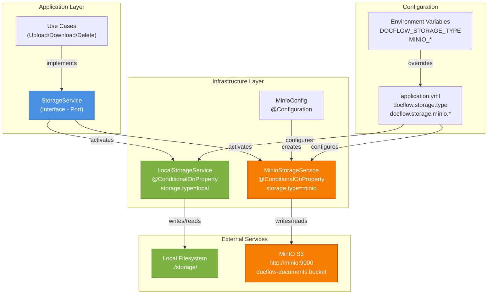

# MinIO Storage Implementation - US-DOC-001

## Resumen de Cambios

Se ha implementado la integración con **MinIO** como solución de almacenamiento de objetos (S3-compatible) para reemplazar el almacenamiento local en producción.

## Cambios Realizados

### 1. **pom.xml** - Dependencias Maven
- ✅ Agregada dependencia de MinIO v8.5.10:
  ```xml
  <dependency>
      <groupId>io.minio</groupId>
      <artifactId>minio</artifactId>
      <version>8.5.10</version>
  </dependency>
  ```

### 2. **Configuración**

#### Nuevos archivos creados:
- ✅ `infrastructure/config/MinioConfig.java` - Configuración del cliente MinIO
  - Inicializa cliente MinIO
  - Verifica y crea bucket automáticamente si no existe
  - Maneja errores de conexión

#### Archivos modificados:
- ✅ `application/service/LocalStorageService.java`
  - Agregada anotación `@ConditionalOnProperty` para activación condicional
  - Activo cuando `docflow.storage.type=local` o por defecto

- ✅ `application.yml` - Propiedades de aplicación
  - Agregada propiedad `docflow.storage.type` para elegir tipo de almacenamiento
  - Agregada configuración de MinIO (endpoint, credenciales, bucket)
  - Usa variables de entorno (DOCFLOW_STORAGE_TYPE, MINIO_ENDPOINT, etc.)

### 3. **Nuevos Servicios**

#### MinioStorageService.java - Implementación MinIO
```java
@Service
@ConditionalOnProperty(name = "docflow.storage.type", havingValue = "minio", matchIfMissing = false)
public class MinioStorageService implements StorageService
```

**Características:**
- ✅ Cumple interfaz `StorageService` (puerto hexagonal)
- ✅ Operaciones soportadas:
  - `upload()` - Sube archivos a MinIO
  - `download()` - Descarga archivos de MinIO
  - `delete()` - Elimina archivos de MinIO
  - `exists()` - Verifica existencia de archivos
- ✅ Estructura de ruta consistente: `org_{id}/carpeta_{id}/doc_{id}/version_{num}/file`
- ✅ Manejo robusto de errores (NoSuchKey, etc.)
- ✅ Logging detallado para auditoría

### 4. **.env.example** - Actualización
```dotenv
# Tipo de almacenamiento
DOCFLOW_STORAGE_TYPE=minio

# Configuración de MinIO
MINIO_ENDPOINT=http://minio:9000
MINIO_ROOT_USER=minioadmin
MINIO_ROOT_PASSWORD=minioadmin123
MINIO_BUCKET_NAME=docflow-documents
```

## Cómo Usar

### Almacenamiento por Defecto: MinIO
Por defecto, el sistema usa **MinIO** para almacenamiento de archivos. Asegúrate de que MinIO esté disponible:

```bash
# Con Docker Compose (infraestructura)
docker compose up -d

# O configura manualmente
DOCFLOW_STORAGE_TYPE=minio
MINIO_ENDPOINT=http://minio:9000
MINIO_ROOT_USER=minioadmin
MINIO_ROOT_PASSWORD=minioadmin123
MINIO_BUCKET_NAME=docflow-documents
```

### Desarrollo Local (Almacenamiento Local - Opcional)
Para usar almacenamiento en sistema de archivos local:

```bash
# En .env o variable de entorno
DOCFLOW_STORAGE_TYPE=local
DOCFLOW_STORAGE_PATH=./storage  # Ruta donde se almacenan archivos
```

## Stack de Almacenamiento

| Tipo | Caso de Uso | Estado | Bean Activo | Propiedades |
|------|-----------|-------|-----------|-----------|
| **local** | Desarrollo local | Opcional | `LocalStorageService` | `docflow.storage.local.path` |
| **minio** | Producción / Default | ✅ Predeterminado | `MinioStorageService` | `docflow.storage.minio.*` |

## Arquitectura Hexagonal

Ambas implementaciones siguen el patrón Hexagonal:
- **Puerto:** `StorageService` (interfaz)
- **Adaptadores:**
  - `LocalStorageService` - Adaptador para filesystem local (se activa con `DOCFLOW_STORAGE_TYPE=local`)
  - `MinioStorageService` - Adaptador para MinIO (S3-compatible) - **PREDETERMINADO**
- **Activación:** Mediante `@ConditionalOnProperty` basada en configuración
  - Si `DOCFLOW_STORAGE_TYPE` no está definido → MinIO
  - Si `DOCFLOW_STORAGE_TYPE=minio` → MinIO
  - Si `DOCFLOW_STORAGE_TYPE=local` → Local storage

## Validación

✅ **Compilación:** `mvn clean compile -DskipTests` - SUCCESS
✅ **Estructura de rutas:** Consistente entre ambas implementaciones
✅ **Información sensible:** Segura mediante variables de entorno
✅ **Manejo de errores:** Robusto con excepciones específicas

## Próximos Pasos (Opcional)

1. Mover adaptadores a `infrastructure/adapter/storage/` siguiendo estructura hexagonal
2. Agregar tests unitarios/integración para MinioStorageService
3. Implementar políticas de retención/lifecycle en MinIO
4. Agregar monitoreo de uso de almacenamiento
5. Implementar compresión de objetos antiguos

## Referencias

- [Documentación MinIO Java SDK](https://docs.min.io/minio/baremetal/sdk/java/API.html)
- [Docker Compose Configuration](../../README-docker.md) - MinIO service
- [StorageService Interface](StorageService.java)

