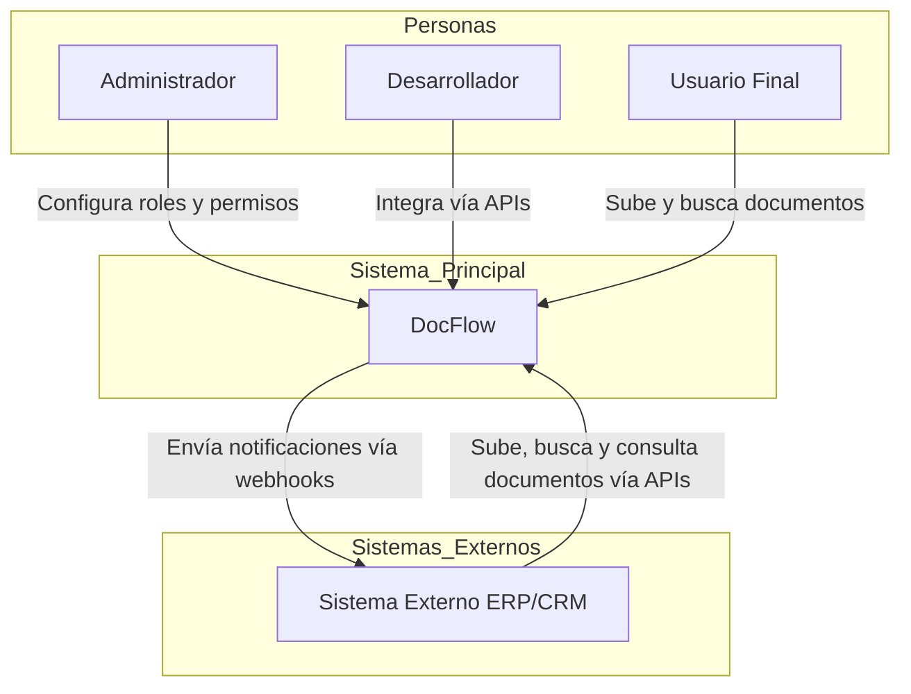
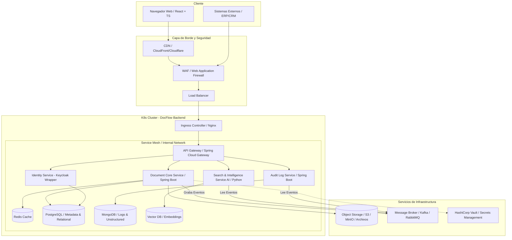
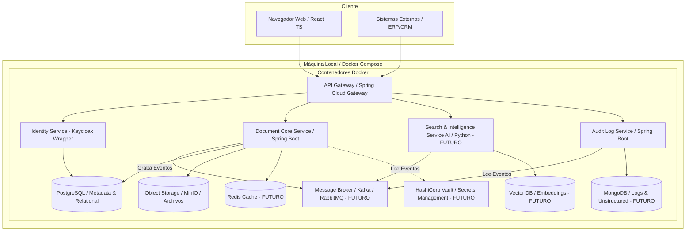
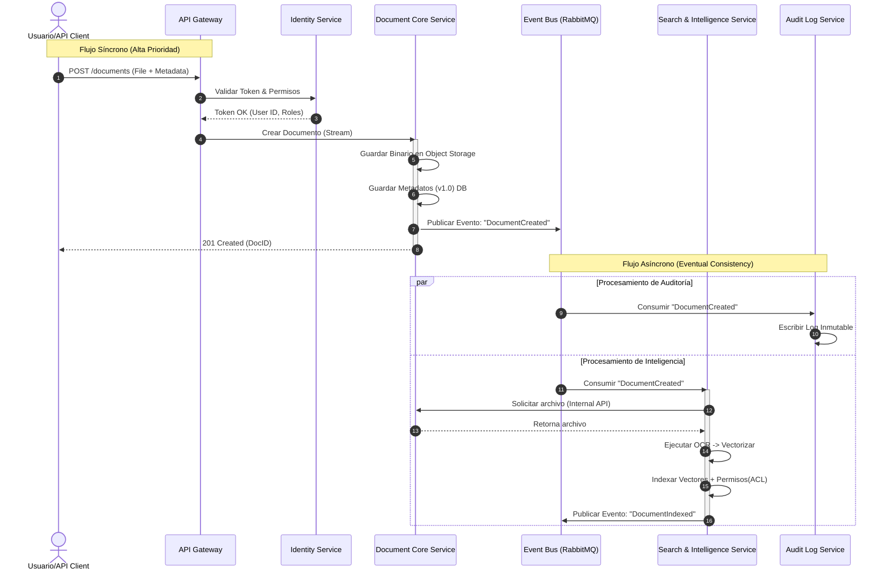
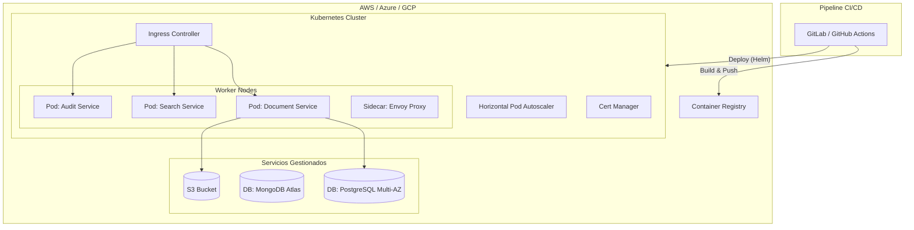

# Arquitectura Detallada - DocFlow

Este documento describe en profundidad la arquitectura del sistema DocFlow, incluyendo diagramas de componentes, patrones de diseño y decisiones arquitectónicas.

## Diagrama de Contexto



## Diagrama de Arquitectura Nube (Visión Futura v2.0)

El siguiente diagrama ilustra la visión futura con Kubernetes. **⚠️ NOTA**: El MVP actual utiliza Docker Compose local (ver [README-docker.md](../README-docker.md)).



## Diagrama de Arquitectura Local (Docker Compose - MVP Actual)

Para entornos de desarrollo y pruebas locales, se utiliza Docker Compose para orquestar los servicios en una máquina local, simplificando la infraestructura.



**Leyenda MVP Actual**:
- ✅ **Implementado**: API Gateway, Identity Service, Document Core, PostgreSQL, MinIO
- 🔮 **Planificado v2.0**: Redis, MongoDB, VectorDB, Kafka, Vault, Search & Intelligence Service

## Diagrama de Secuencia: Flujo de Carga, Auditoría e Indexación Asíncrona



## Estilo Arquitectónico

Se ha seleccionado una **Arquitectura de Microservicios orientada a Eventos (Event-Driven Microservices)**, estructurada internamente con **Arquitectura Hexagonal (Ports & Adapters)**.

### Justificación

1. **Event-Driven (Asincronía):** El procesamiento de IA (OCR, Vectorización) y la Auditoría inmutable son operaciones costosas. Desacoplarlas mediante un bus de eventos (Kafka) permite que la subida del documento sea rápida para el usuario, mientras el procesamiento pesado ocurre en segundo plano ("Eventual Consistency"). La IA es opcional, permitiendo despliegues ligeros sin este servicio.

2. **Hexagonal:** Permite aislar la lógica de dominio (reglas de negocio documental) de la infraestructura (frameworks, bases de datos). Esto es crucial para un producto que podría cambiar de proveedor de almacenamiento (AWS S3 a Azure Blob) o de motor de base de datos sin reescribir la lógica core.

### Beneficios vs. Compromisos

**Beneficios:**
- Escalabilidad independiente (escalar solo el servicio de IA con GPUs)
- Tolerancia a fallos (si cae la auditoría, el sistema sigue operando en modo degradado)
- Despliegues independientes

**Compromisos:**
- Mayor complejidad operativa (requiere observabilidad avanzada)
- Gestión de transacciones distribuidas (Saga Pattern)
- Latencia de red entre servicios

## Componentes Principales

### A. Frontend: Single Page Application (SPA)

- **Tecnología:** React 19 + TypeScript + Vite
- **Responsabilidad:** Interfaz de usuario reactiva, gestión de estado del cliente (Zustand), visualización de documentos
- **Justificación:** TypeScript aporta tipado estático, reduciendo errores en tiempo de ejecución, vital para aplicaciones empresariales complejas

### B. API Gateway

- **Tecnología:** Spring Cloud Gateway
- **Responsabilidad:** Punto único de entrada, enrutamiento, Rate Limiting, terminación SSL, validación preliminar de tokens JWT
- **Patrón:** Gateway Offloading - Descarga a los microservicios de tareas transversales

### C. Microservicios Backend (Spring Boot)

#### 1. Identity Service (IAM)

- **Tecnología:** Spring Boot Java 21
- **Datos:** PostgreSQL (Usuarios, Roles, Organización)
- **Responsabilidad:** Autenticación (OAuth2), gestión de sesiones y emisión de tokens, centraliza el RBAC

#### 2. Document Core Service

- **Tecnología:** Spring Boot Java 21
- **Datos:** PostgreSQL (Metadatos), MinIO/S3 (Blobs)
- **Responsabilidad:** Lógica transaccional fuerte (ACID), gestiona jerarquía de carpetas y versiones
- **Patrón:** CQRS (Command side)

#### 3. Search & Intelligence Service (Plugin IA - Futuro)

- **Tecnología:** Python FastAPI (o Spring Boot)
- **Datos:** Base de datos Vectorial (pgvector), ElasticSearch
- **Responsabilidad:** Escucha eventos `DOCUMENT_CREATED`, ejecuta OCR, genera embeddings
- **Justificación:** Separado porque consume mucha CPU/Memoria y sus patrones de escalado son distintos

#### 4. Audit Log Service

- **Tecnología:** Spring Boot WebFlux (Reactivo)
- **Datos:** MongoDB (Colecciones Time-Series)
- **Responsabilidad:** Ingesta masiva de eventos de auditoría, escritura rápida
- **Justificación:** MongoDB maneja mejor grandes volúmenes de datos JSON no estructurados

### D. Message Broker (Planificado v2.0)

- **Tecnología:** Apache Kafka / RabbitMQ
- **Responsabilidad:** Garantizar la entrega de mensajes entre servicios, desacoplamiento temporal

## Estructura de Directorios

### Frontend (React + TS)

Sigue una estructura basada en "features" o dominios funcionales:

```text
/src
  /assets          # Imágenes, fuentes, estilos globales
  /common          # Componentes UI compartidos (Button, Modal, Layout)
  /core            # Configuración, servicios核心
  /features        # Módulos funcionales (DDD en frontend)
    /auth          # Login, Registro, Recuperación
      /components  # Componentes específicos
      /hooks       # Lógica de estado
      /services    # Llamadas a API
      /types       # Interfaces TS
    /conceptos     # Vista de conceptos/entidades
    /dashboard     # Panel principal
    /folders       # Gestión de carpetas
    /documents     # Gestión de documentos
```

### Backend (Spring Boot - Hexagonal)

Cada microservicio sigue esta estructura interna:

```text
/src/main/java/com/docflow/{service}
  /application              # Casos de Uso (Orquestación)
    /dto                    # Data Transfer Objects
    /ports                  # Interfaces (Input/Output Ports)
    /services               # Implementación de Casos de Uso
  /domain                   # Lógica de Negocio Pura
    /model                  # Entidades
    /exceptions             # Excepciones de negocio
    /service                # Servicios de dominio
  /infrastructure           # Adaptadores
    /adapters
        /rest               # RestControllers (Spring MVC)
        /event_listener     # Kafka Listeners
        /broker             # Kafka Producers
        /storage            # Cliente S3/MinIO
    /config                 # Configuración de Spring
```

## Infraestructura y Despliegue (Visión v2.0)

La infraestructura se basa en contenedores inmutables orquestados por Kubernetes, siguiendo prácticas de GitOps.

### Diagrama de Despliegue



### Componentes de Infraestructura

1. **Orquestación (Kubernetes):** Maneja el ciclo de vida de los contenedores, escalado automático (HPA) y recuperación ante fallos
2. **API Gateway / Ingress:** NGINX o Traefik maneja el tráfico HTTP/S entrante
3. **Secret Management (HashiCorp Vault):** Gestión dinámica de credenciales
4. **Observabilidad:**
   - **Logs:** EFK Stack (Elasticsearch, Fluentd, Kibana)
   - **Métricas:** Prometheus + Grafana
   - **Tracing:** Jaeger o Zipkin

## Seguridad

### Medidas Implementadas

1. **Autenticación y Autorización:**
   - Protocolo: OAuth2 / OpenID Connect (OIDC)
   - JWT (JSON Web Tokens) stateless
   - API Keys para integraciones terceras

2. **Cifrado (Data Protection):**
   - En tránsito: TLS 1.3 forzado
   - mTLS dentro del clúster (Service Mesh)

3. **Seguridad de Aplicación:**
   - Input Sanitization (validación estricta de DTOs)
   - Scan de virus (ClamAV) antes de acceso
   - CORS configurado estrictamente (no permite `*`)

4. **Hardening de Infraestructura:**
   - Contenedores Rootless
   - Network Policies (Deny All por defecto)

## Tests

La estrategia de pruebas sigue la **Pirámide de Testing**:

| Tipo de Test | Ámbito | Herramientas | Cobertura |
|--------------|--------|--------------|-----------|
| **Unitarios** | Backend | JUnit 5, Mockito | Mínimo 90% |
| **Integración** | API/DB | Spring Boot Test, Testcontainers | Crítico |
| **Contrato** | API | Pact (opcional) | API pública |
| **E2E** | Sistema | Cypress / Playwright | Flujos críticos |

---

Para más información sobre el modelo de datos, ver [DATABASE.md](DATABASE.md).

Para detalles de la API, ver [API_REFERENCE.md](API_REFERENCE.md).
