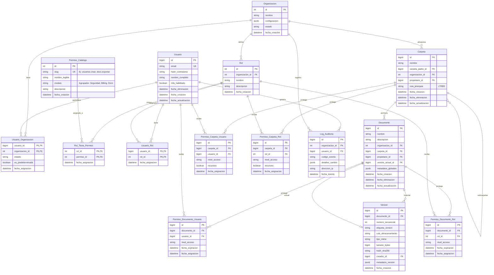

# Modelo de Datos - DocFlow

Este documento describe el modelo de datos completo de DocFlow, incluyendo el diagrama entidad-relación y el diccionario detallado de cada tabla.

## Diagrama Entidad-Relación



## Diccionario de Datos (Especificación Técnica)

### Módulo A: Identidad y Organización (IAM)

#### 1. `Organizacion`

El contenedor raíz. Define el alcance legal y de configuración del cliente.

| Campo | Tipo | Restricciones | Descripción |
|-------|------|---------------|-------------|
| **id** | `INT` | PK, Auto-increment | Identificador único |
| **nombre** | `VARCHAR(100)` | Not Null | Nombre comercial de la empresa |
| **configuracion** | `JSONB` | Not Null, Default `{}` | Configuración visual (logo, colores) y técnica (límites, políticas) |
| **estado** | `VARCHAR(20)` | Not Null | Enum: `ACTIVO`, `SUSPENDIDO`, `ARCHIVADO` |
| **fecha_creacion** | `TIMESTAMPTZ` | Default NOW() | Fecha de creación del registro |

**Ejemplo de `configuracion`:**
```json
{
  "apariencia": {"logo_url": "https://..."},
  "seguridad": {"mfa_obligatorio": true},
  "limites": {"almacenamiento_gb": 100}
}
```

#### 2. `Usuario`

El actor autenticado en el sistema.

| Campo | Tipo | Restricciones | Descripción |
|-------|------|---------------|-------------|
| **id** | `BIGINT` | PK, Auto-increment | ID global del usuario |
| **email** | `VARCHAR(255)` | Unique | Credencial de acceso global (puede pertenecer a múltiples organizaciones) |
| **hash_contrasena** | `VARCHAR(255)` | Not Null | Hash seguro (Bcrypt/Argon2) |
| **nombre_completo** | `VARCHAR(100)` | Not Null | Nombre completo del usuario |
| **mfa_habilitado** | `BOOLEAN` | Default False | Bandera para autenticación de dos factores |
| **fecha_eliminacion** | `TIMESTAMPTZ` | Nullable | Soft Delete - Si tiene fecha, el usuario está "borrado" |
| **fecha_creacion** | `TIMESTAMPTZ` | Not Null, Default NOW() | Fecha de creación del registro |
| **fecha_actualizacion** | `TIMESTAMPTZ` | Not Null, Default NOW() | Fecha de última actualización (actualiza vía trigger) |

#### 3. `Usuario_Organizacion` (Membresía multi-organización)

Define a qué organizaciones pertenece un usuario y la organización predeterminada.

| Campo | Tipo | Restricciones | Descripción |
|-------|------|---------------|-------------|
| **usuario_id** | `BIGINT` | PK, FK → Usuario | Usuario miembro |
| **organizacion_id** | `INT` | PK, FK → Organizacion | Organización a la que pertenece |
| **estado** | `VARCHAR(20)` | Not Null | Enum: `ACTIVO`, `SUSPENDIDO` |
| **es_predeterminada** | `BOOLEAN` | Default False | Indica la organización por defecto al iniciar sesión |
| **fecha_asignacion** | `TIMESTAMPTZ` | Default NOW() | Fecha de asignación a la organización |

**Reglas de negocio:**
- Debe existir como máximo 1 membresía `es_predeterminada=true` activa por usuario
- Si un usuario tiene 2 organizaciones activas, debe existir exactamente 1 predeterminada
- Si un usuario tiene más de 2 organizaciones activas, el sistema devuelve error (limitación MVP)

#### 4. `Rol`

Define perfiles funcionales personalizados por la organización.

| Campo | Tipo | Restricciones | Descripción |
|-------|------|---------------|-------------|
| **id** | `INT` | PK, Auto-increment | Identificador único |
| **organizacion_id** | `INT` | FK → Organizacion | Organización propietaria del rol |
| **nombre** | `VARCHAR(50)` | Not Null | Ej. "Administrador Legal", "Auditor Externo" |
| **descripcion** | `TEXT` | Nullable | Descripción del rol |
| **fecha_creacion** | `TIMESTAMPTZ` | Default NOW() | Fecha de creación del rol |

#### 5. `Permiso_Catalogo`

Lista maestra e inmutable de capacidades del sistema (System Capabilities).

| Campo | Tipo | Restricciones | Descripción |
|-------|------|---------------|-------------|
| **id** | `INT` | PK | Identificador único |
| **slug** | `VARCHAR(60)` | Unique | Identificador técnico (ej. `users.create`, `docs.export`) |
| **nombre_legible** | `VARCHAR(100)` | Not Null | Nombre amigable para UI |
| **modulo** | `VARCHAR(50)` | Not Null | Agrupador lógico (ej. "Seguridad", "Documentos") |
| **descripcion** | `TEXT` | Nullable | Descripción detallada del permiso |
| **fecha_creacion** | `TIMESTAMPTZ` | Default NOW() | Fecha de registro en el catálogo |

#### 6. `Rol_Tiene_Permiso`

Tabla intermedia (Many-to-Many) para asignar capacidades a roles.

| Campo | Tipo | Restricciones | Descripción |
|-------|------|---------------|-------------|
| **rol_id** | `INT` | PK, FK → Rol | Rol que recibe el permiso |
| **permiso_id** | `INT` | PK, FK → Permiso_Catalogo | Permiso asignado |
| **fecha_asignacion** | `TIMESTAMPTZ` | Default NOW() | Fecha de asignación |

#### 7. `Usuario_Rol` (Asignación de roles)

Asigna roles a un usuario dentro de una organización.

| Campo | Tipo | Restricciones | Descripción |
|-------|------|---------------|-------------|
| **usuario_id** | `BIGINT` | PK, FK → Usuario | Usuario que recibe el rol |
| **rol_id** | `INT` | PK, FK → Rol | Rol asignado |
| **fecha_asignacion** | `TIMESTAMPTZ` | Default NOW() | Fecha de asignación |

---

### Módulo B: Núcleo Documental (Core)

#### 8. `Carpeta`

Estructura jerárquica para organizar la información.

| Campo | Tipo | Restricciones | Descripción |
|-------|------|---------------|-------------|
| **id** | `BIGINT` | PK, Auto-increment | Identificador único |
| **organizacion_id** | `INT` | FK → Organizacion | Organización propietaria |
| **carpeta_padre_id** | `BIGINT` | FK → Carpeta, Nullable | Si es NULL, es carpeta raíz |
| **nombre** | `VARCHAR(255)` | Not Null | Nombre de la carpeta |
| **ruta_jerarquia** | `LTREE` o `VARCHAR` | Indexado | Path materializado (ej. `1.5.20`) para consultas optimizadas |
| **propietario_id** | `BIGINT` | FK → Usuario | Creador de la carpeta |
| **fecha_creacion** | `TIMESTAMPTZ` | Default NOW() | Fecha de creación |
| **fecha_eliminacion** | `TIMESTAMPTZ` | Nullable | Soft Delete (Papelera) |
| **fecha_actualizacion** | `TIMESTAMPTZ` | Default NOW() | Fecha de última modificación |

#### 9. `Documento`

La entidad lógica. Representa el "sobre" que contiene la historia del archivo.

| Campo | Tipo | Restricciones | Descripción |
|-------|------|---------------|-------------|
| **id** | `BIGINT` | PK, Auto-increment | Identificador único |
| **organizacion_id** | `INT` | FK → Organizacion | Organización propietaria |
| **carpeta_id** | `BIGINT` | FK → Carpeta | Ubicación actual |
| **version_actual_id** | `BIGINT` | FK → Version, Nullable | Puntero a la versión actual para optimización |
| **nombre** | `VARCHAR(255)` | Not Null | Nombre lógico del documento |
| **descripcion** | `TEXT` | Nullable | Descripción del documento |
| **propietario_id** | `BIGINT` | FK → Usuario | Creador del documento |
| **metadatos_globales** | `JSONB` | Default `{}` | Campos definidos por usuario (Tags, Cliente, etc.) |
| **fecha_creacion** | `TIMESTAMPTZ` | Default NOW() | Fecha de creación |
| **fecha_eliminacion** | `TIMESTAMPTZ` | Nullable | Soft Delete |
| **fecha_actualizacion** | `TIMESTAMPTZ` | Default NOW() | Fecha de última modificación |

**Ejemplo de `metadatos_globales`:**
```json
{
  "cliente": "Acme Corp",
  "tags": ["urgente", "legal"],
  "numero_factura": "F-2023-001",
  "fecha_vencimiento": "2023-12-31"
}
```

#### 10. `Version`

La entidad física. Representa un archivo inmutable en el tiempo.

| Campo | Tipo | Restricciones | Descripción |
|-------|------|---------------|-------------|
| **id** | `BIGINT` | PK, Auto-increment | Identificador único |
| **documento_id** | `BIGINT` | FK → Documento | Documento al que pertenece |
| **numero_secuencial** | `INT` | Not Null | Contador incremental (1, 2, 3...) por documento |
| **etiqueta_version** | `VARCHAR(20)` | Not Null | Ej. `v1.0`, `v1.1` |
| **ruta_almacenamiento** | `VARCHAR(500)` | Not Null | Key o Path en Object Storage (S3/MinIO) |
| **hash_sha256** | `CHAR(64)` | Not Null, Indexado | Checksum para integridad y deduplicación |
| **tamano_bytes** | `BIGINT` | Not Null | Tamaño del archivo |
| **tipo_mime** | `VARCHAR(100)` | Not Null | Ej. `application/pdf` |
| **creador_id** | `BIGINT` | FK → Usuario | Quién subió esta versión |
| **metadatos_version** | `JSONB` | Default `{}` | Metadatos técnicos extraídos (EXIF, páginas, etc.) |
| **fecha_creacion** | `TIMESTAMPTZ` | Default NOW() | Fecha de creación de la versión |

**Ejemplo de `metadatos_version`:**
```json
{
  "paginas": 12,
  "resolucion": "300dpi",
  "encriptado": false,
  "autor_pdf": "John Doe"
}
```

---

### Módulo C: Seguridad Granular (ACL) y Auditoría

#### 11. `Permiso_Carpeta_Usuario`

Permisos explícitos por carpeta asignados directamente a un usuario.

| Campo | Tipo | Restricciones | Descripción |
|-------|------|---------------|-------------|
| **id** | `BIGINT` | PK | Identificador único |
| **carpeta_id** | `BIGINT` | FK → Carpeta | Carpeta protegida |
| **usuario_id** | `BIGINT` | FK → Usuario | Usuario que recibe el permiso |
| **nivel_acceso** | `VARCHAR(20)` | Not Null | Enum: `LECTURA`, `ESCRITURA`, `ADMINISTRACION` |
| **recursivo** | `BOOLEAN` | Default True | Aplica a subcarpetas |
| **fecha_asignacion** | `TIMESTAMPTZ` | Default NOW() | Fecha de asignación |

#### 12. `Permiso_Carpeta_Rol`

Permisos por carpeta asignados a un rol.

| Campo | Tipo | Restricciones | Descripción |
|-------|------|---------------|-------------|
| **id** | `BIGINT` | PK | Identificador único |
| **carpeta_id** | `BIGINT` | FK → Carpeta | Carpeta protegida |
| **rol_id** | `INT` | FK → Rol | Rol que recibe el permiso |
| **nivel_acceso** | `VARCHAR(20)` | Not Null | Enum: `LECTURA`, `ESCRITURA`, `ADMINISTRACION` |
| **recursivo** | `BOOLEAN` | Default True | Aplica a subcarpetas |
| **fecha_asignacion** | `TIMESTAMPTZ` | Default NOW() | Fecha de asignación |

#### 13. `Permiso_Documento_Usuario`

Permisos explícitos por documento asignados directamente a un usuario.

| Campo | Tipo | Restricciones | Descripción |
|-------|------|---------------|-------------|
| **id** | `BIGINT` | PK | Identificador único |
| **documento_id** | `BIGINT` | FK → Documento | Documento protegido |
| **usuario_id** | `BIGINT` | FK → Usuario | Usuario que recibe el permiso |
| **nivel_acceso** | `VARCHAR(20)` | Not Null | Enum: `LECTURA`, `ESCRITURA`, `ADMINISTRACION` |
| **fecha_expiracion** | `TIMESTAMPTZ` | Nullable | Fecha de expiración del permiso temporal |
| **fecha_asignacion** | `TIMESTAMPTZ` | Default NOW() | Fecha de asignación |

#### 14. `Permiso_Documento_Rol`

Permisos por documento asignados a un rol.

| Campo | Tipo | Restricciones | Descripción |
|-------|------|---------------|-------------|
| **id** | `BIGINT` | PK | Identificador único |
| **documento_id** | `BIGINT` | FK → Documento | Documento protegido |
| **rol_id** | `INT` | FK → Rol | Rol que recibe el permiso |
| **nivel_acceso** | `VARCHAR(20)` | Not Null | Enum: `LECTURA`, `ESCRITURA`, `ADMINISTRACION` |
| **fecha_expiracion** | `TIMESTAMPTZ` | Nullable | Fecha de expiración del permiso temporal |
| **fecha_asignacion** | `TIMESTAMPTZ` | Default NOW() | Fecha de asignación |

#### 15. `Log_Auditoria`

Traza histórica inmutable de todas las acciones en el sistema.

| Campo | Tipo | Restricciones | Descripción |
|-------|------|---------------|-------------|
| **id** | `BIGINT` | PK, BigSerial | Identificador único |
| **organizacion_id** | `INT` | FK → Organizacion | Organización en la que ocurrió el evento |
| **usuario_id** | `BIGINT` | FK → Usuario, Nullable | Usuario que ejecutó la acción (ON DELETE SET NULL) |
| **codigo_evento** | `VARCHAR(50)` | Not Null | Ej. `DOC_CREATED`, `DOC_DELETED`, `ACL_CHANGED` |
| **detalles_cambio** | `JSONB` | Not Null | Snapshot de datos antes/después |
| **direccion_ip** | `VARCHAR(45)` | Nullable | IPv4 o IPv6 del cliente |
| **fecha_evento** | `TIMESTAMPTZ` | Default NOW() | Fecha y hora del evento |

**Ejemplo de `detalles_cambio`:**
```json
{
  "campo": "estado",
  "valor_anterior": "borrador",
  "valor_nuevo": "publicado",
  "documento_id": 123
}
```

---

## Índices Recomendados

Para optimizar el rendimiento del sistema, se recomiendan los siguientes índices adicionales:

```sql
-- Índices para búsquedas frecuentes
CREATE INDEX idx_usuario_email ON Usuario(email);
CREATE INDEX idx_usuario_org_usuario ON Usuario_Organizacion(usuario_id);
CREATE INDEX idx_carpeta_org ON Carpeta(organizacion_id);
CREATE INDEX idx_carpeta_padre ON Carpeta(carpeta_padre_id);
CREATE INDEX idx_documento_carpeta ON Documento(carpeta_id);
CREATE INDEX idx_version_documento ON Version(documento_id);
CREATE INDEX idx_version_hash ON Version(hash_sha256);

-- Índices GIN para JSONB
CREATE INDEX idx_documento_metadatos ON Documento USING GIN (metadatos_globales);
CREATE INDEX idx_version_metadatos ON Version USING GIN (metadatos_version);

-- Índice para auditoría por fecha
CREATE INDEX idx_auditoria_fecha ON Log_Auditoria(fecha_evento DESC);
CREATE INDEX idx_auditoria_org_fecha ON Log_Auditoria(organizacion_id, fecha_evento DESC);
```

---

Para información sobre la arquitectura del sistema, ver [ARCHITECTURE.md](ARCHITECTURE.md).

Para detalles de la API, ver [API_REFERENCE.md](API_REFERENCE.md).
