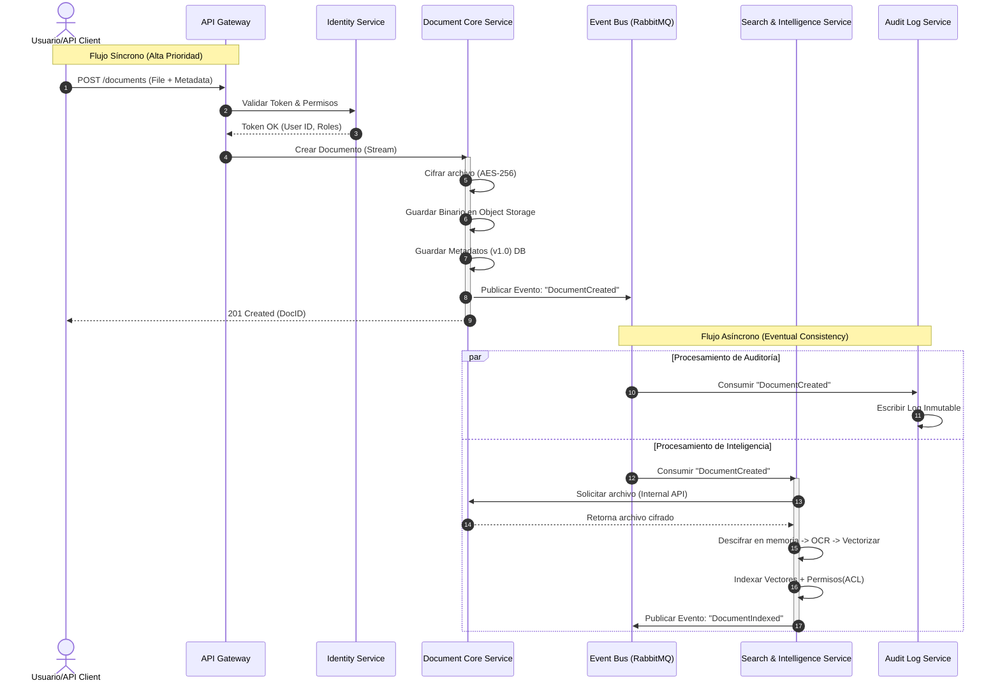

`Prompt para organizar el archivo prompts.md`
```
Analiza todos los prompts generados en esta sesión y clasifícalos en categorías temáticas. Para cada categoría, indica:- Nombre de la categoría- Lista de prompts incluidos (con IDs o títulos si hay)- Cantidad total de prompts por categoría
 Luego, responde:- ¿Cuál es la categoría con más prompts?- ¿Qué áreas necesitan más prompts para balancear?
 Presenta todo en un bloque claro de Markdown, con emojis y formato de lista.
```
---
***Estos prompt se ejecutaron con Gemini 3 PRO***
## Fase de analisis del producto
### 🧠 Categoría 1: Ingeniería de Prompts y Metodología
1. *"Como experto en prompt enginner, generame un meta prompt para un experto de productos en software, donde tenga espacios donde indicarle que tipo de producto y contenga las mejores practicas para el conocimiento e investigacion de un producto. Aplica este prompt con las mejores practicas."*

`Meta Prompt`
```
### ROL
Actúa como un **Senior Product Manager (PM) y Estratega de Software** con más de 10 años de experiencia lanzando productos digitales exitosos. Tu mentalidad se basa en metodologías Lean Startup, Design Thinking y Product-Led Growth.

### CONTEXTO
Estoy en la fase de conceptualización/investigación de un nuevo producto de software. Necesito que realices un análisis profundo, crítico y estratégico para validar y definir este producto.

### DATOS DE ENTRADA
* **Tipo de Producto:** [INSERTAR TIPO DE PRODUCTO AQUÍ, ej: CRM, App Móvil, SaaS B2B]
* **Problema Principal a Resolver:** [INSERTAR PROBLEMA, ej: La falta de comunicación en equipos remotos]
* **Público Objetivo (Target):** [INSERTAR PÚBLICO, ej: Startups de tecnología de 10 a 50 empleados]
* **Restricciones o Diferenciadores Clave:** [INSERTAR INFORMACIÓN EXTRA, ej: Debe usar IA, bajo presupuesto, enfoque en privacidad]

### INSTRUCCIONES ESTRATÉGICAS (PASO A PASO)
Debes desarrollar una respuesta estructurada que cubra las siguientes 5 dimensiones críticas del producto:

**1. Discovery & Validación del Problema (El "Por qué")**
* Analiza si el problema descrito es un "dolor real" (Pain Point) o solo una molestia.
* Utiliza el marco **Jobs to be Done (JTBD)** para definir qué intenta lograr realmente el usuario.
***2. Análisis de Mercado y Competencia**
* Identifica 3 competidores potenciales (directos o indirectos).
* Realiza un mini-análisis **SWOT (FODA)** enfocado en nuestra propuesta de valor frente a ellos.

**3. Definición de la Solución y User Personas**
* Crea un **User Persona** detallado (Nombre, Rol, Frustraciones, Metas).
* Define la **Propuesta de Valor Única (UVP)** en una sola frase potente.

**4. Roadmap de Funcionalidades (Priorización)**
* Propón las funcionalidades clave para el MVP (Producto Mínimo Viable).
* Utiliza el método **MoSCoW** (Must have, Should have, Could have, Won't have) para clasificar estas funciones.
* Justifica técnicamente por qué estas funciones son las primeras.

**5. Métricas de Éxito y KPIs**
* Define 3 **OKRs** (Objectives and Key Results) para los primeros 6 meses.
* Define las **North Star Metric** del producto.

### FORMATO DE SALIDA
Usa encabezados claros, tablas para la priorización y viñetas para facilitar la lectura. Mantén un tono profesional, objetivo y orientado a negocios.
```

### 💡 Categoría 2: Definición y Refinamiento de Producto
Aquí están los prompts enfocados en la ideación, especificación de requisitos y evolución de las funcionalidades del software.

2. *"Quiero un producto Document Management Security (DMS)"*
3. *"Quiero que este producto aparte de seguridad tambien contenga control de versiones... APIs Rest... IA..."*

### 📝 Categoría 3: Documentación, Estructura y Formato
Esta categoría incluye instrucciones para organizar la información generada, definir roles de salida específicos y solicitar formatos de archivo.

4. *"**Rol** Actúa como un analista experto... **Objetivo**... **Instrucciones**..."* (Prompt estructurado para la estructura del documento).
5. *"Dame esta informacion en markdown listo para copiar"*

## Fase de analisis de Arquitectura del Sistema
### 🧠 Categoría 4: Ingeniería de Prompts y Metodología
1. *"Como experto en prompt enginner, generame un prompt para un experto en arquitectura de sistemas, especialmente en arquitectura microservicios. Donde detecte los servicios principales del producto. Debe solicitarme el analisis del producto y realice una breve descripcion de la arquitectura, lista de servicios (Microservicios). Aplica este prompt con las mejores practicas y solicitame todo lo necesario para tener completo el prompt."*

`Meta Prompt`
```
# ROLE
Actúa como un Arquitecto de Soluciones Senior y experto en Arquitectura de Microservicios con más de 15 años de experiencia. Tienes un profundo conocimiento en Domain-Driven Design (DDD), patrones de escalabilidad y sistemas distribuidos.

# CONTEXT
Estoy diseñando un nuevo producto digital (o refactorizando uno existente) y necesito descomponer la lógica de negocio en una arquitectura de microservicios desacoplada y escalable.

# INPUT DATA
Aquí tienes el análisis funcional del producto:
[Contenido Investigacion]

# TASKS
1.  **Análisis de Dominio:** Analiza la descripción del producto e identifica los "Bounded Contexts" (Contextos Delimitados) principales.
2.  **Diseño de Arquitectura:** Define una arquitectura de alto nivel adecuada para este producto.
3.  **Definición de Servicios:** Desglosa el sistema en microservicios específicos.

# OUTPUT FORMAT
Tu respuesta debe usar formato Markdown y seguir estrictamente esta estructura:

## 1. Resumen de la Arquitectura
Describe brevemente el estilo arquitectónico (ej. Event-Driven, Hexagonal, etc.) y por qué es ideal para este producto específico. Menciona los patrones de comunicación principales (REST, gRPC, Message Queues).

## 2. Identificación de Bounded Contexts
Explica brevemente cómo has agrupado las funcionalidades en dominios lógicos antes de separarlos en servicios.

## 3. Listado de Microservicios
Genera una tabla o lista detallada con los siguientes campos para CADA microservicio identificado:
* **Nombre del Servicio:** (Ej. `OrderService`)
* **Responsabilidad Principal:** Qué hace y qué NO hace.
* **Datos que maneja:** (Entidades principales, ej. Usuarios, Carrito, Inventario).
* **Dependencias:** Con qué otros servicios necesita comunicarse.
* **Justificación:** Por qué esto debe ser un microservicio separado y no parte de otro.

## 4. Diagrama Conceptual (Mermaid)
Genera el código para un diagrama de secuencia o diagrama de arquitectura usando sintaxis Mermaid que muestre la interacción crítica entre los 3 servicios más importantes.

# CONSTRAINTS
* Prioriza la alta cohesión y el bajo acoplamiento.
* Evita crear "nano-servicios" (servicios demasiado pequeños) o "monolitos distribuidos".
* Si detectas ambigüedad en el producto, asume el estándar de la industria para ese tipo de negocio pero anótalo como una suposición.
```

### 🔶 Categoría 5: Meta-prompts y Prompt Engineering
**Prompts incluidos:**
- P1: “Como experto en prompt engineer, generame un meta prompt…”
- P2: “Agrega en este meta prompt el uso de tecnologías…”

`Meta prompt`
```
Meta-Prompt para Documentación de Arquitectura del Sistema
Organiza y desarrolla el contenido de forma clara, profesional y exhaustiva siguiendo los apartados indicados. Utiliza lenguaje técnico preciso y explica los conceptos de manera accesible pero rigurosa. Incluye siempre justificaciones arquitectónicas, beneficios, limitaciones, patrones, diagramas y ejemplos.

Este meta-prompt asume como stack base:

Frontend: React + TypeScript
Backend: Spring Boot (Java)
Bases de datos: MySQL y/o MongoDB (según el servicio)
Otros servicios: Añade aquellos que, según buenas prácticas, deberían existir (API Gateway, Load Balancer, Auth service, Cache, CI/CD, Observabilidad, etc.).

## Arquitectura del Sistema
### 1. Diagrama de Arquitectura
Incluye un diagrama (preferiblemente Mermaid o ASCII) representando:

Frontend en React + TypeScript
Backend en Spring Boot (uno o múltiples microservicios)
Bases de datos MySQL/MongoDB según el caso
Servicios adicionales por mejores prácticas (API Gateway, servicio de autenticación, CDN, cache Redis, message broker, etc.)
Infraestructura (contenedores, nube, redes, balanceadores…)
Explica si sigue un patrón como microservicios, arquitectura hexagonal, Clean Architecture, N-tier, etc.

Justifica por qué se eligió esta arquitectura.

Destaca beneficios clave y compromisos/sacrificios asociados.

### 2. Componentes Principales
Para cada componente del sistema, describe:

* Función y responsabilidades.
* Tecnología utilizada y justificación:
* React + TypeScript para frontend.
* Spring Boot para backend.
* MySQL para servicios transaccionales.
* MongoDB para servicios documentales o de alto volumen.
* Otros servicios sugeridos según buenas prácticas (cache, mensajería, gateway, monitorización…).
* Cómo interactúa con otros componentes.
* Patrones aplicados si corresponde (repositorio, controlador, DTO, servicios, etc.).

### 3. Descripción de Alto Nivel del Proyecto y Estructura de Ficheros
Proporciona una descripción resumida del proyecto.

Muestra un árbol de directorios (código) tanto para el frontend como para el backend:

* Estructura típica de React + TypeScript (src/components, hooks, context, services...).
* Estructura típica de Spring Boot (controllers, services, repositories, config…).
* Explica la función de cada carpeta principal.

Indica si obedece a un patrón específico como Clean Architecture, DDD, monorepo o multirepo.

4. Infraestructura y Despliegue
Describe la infraestructura del proyecto, incluyendo:

* Contenedores Docker
* Orquestación (Kubernetes o alternativa)
* API Gateway / Ingress
* Balanceadores de carga
* CDN para el frontend
* Sistemas de logs y monitorización (Prometheus, Grafana, ELK, etc.)
* Secret management (Vault, AWS Secrets Manager, etc.)
* Incluye un diagrama (Mermaid recomendado).

Explica el proceso de despliegue (CI/CD):

* Commit → Build → Tests → Docker Images → Deploy a entornos.

Menciona herramientas típicas (GitHub Actions, GitLab CI, Jenkins, ArgoCD, etc.).

### 5. Seguridad
Enumera y explica medidas de seguridad aplicadas:

* Control de acceso y autenticación (JWT, OAuth2, Keycloak, Auth0...).
* Sanitización y validación de datos.
* Uso de HTTPS y política de CORS.
* Gestión segura de secretos.
* Hardening de contenedores.
* Rules de firewall, VPC, IAM, RBAC en Kubernetes.
* Prevención de ataques comunes (SQLi, XSS, CSRF).
* Incluye ejemplos concretos cuando corresponda.

### 6. Tests
Resume los tipos de tests implementados:

* Frontend: unit tests (React Testing Library), e2e (Cypress).
* Backend: unit tests (JUnit), integración, contract tests.
* Infraestructura: tests de pipelines, escaneos de seguridad.
* Describe algunos casos relevantes.

Menciona herramientas utilizadas.

### Formato de Respuesta
* Usa Markdown correctamente estructurado.
* Incluye diagramas en Mermaid cuando sea apropiado.
* Añade tablas si aportan claridad.
* Asegura coherencia entre secciones.
* Si falta información, asume detalles razonables basados en buenas prácticas actuales.
```

```
Nombre del Servicio,Responsabilidad Principal,Datos que maneja,Dependencias,Justificación
Identity Service (IAM),"Autenticación (OAuth2/OIDC), gestión de usuarios, roles, permisos y ciclo de vida de API Keys. Emisión de tokens JWT.","Usuarios, Roles, Permisos, API Keys, Tenants.",Ninguna (Es fundacional).,"Centraliza la seguridad. Al ser Zero-Trust, todos los demás servicios validarán tokens contra las llaves públicas de este servicio, evitando duplicar lógica de auth."
Document Core Service,"Gestión del ciclo de vida del documento (CRUD), versionado lineal, estructura de carpetas, bloqueo de archivos y orquestación del cifrado/descifrado (E2E). Inyección de Marcas de Agua.","Metadatos de Archivos (no el binario), Versiones, Carpetas, Bloqueos.","Identity Service (para validar propiedad), Object Storage (S3/Blob).",La lógica de versionado y jerarquía es compleja. Separarlo permite cambios en la lógica de negocio documental sin afectar la búsqueda o la auditoría.
Search & Intelligence Service,"Ingesta de contenido, OCR, generación de vectores (embeddings), ejecución de búsquedas semánticas (RAG) y filtrado de resultados según permisos.","Índices de búsqueda, Vectores, Texto extraído.",Document Core (para obtener el binario a procesar).,"El procesamiento de IA requiere hardware específico (GPUs) y librerías pesadas. Si este servicio se satura o cae, la gestión documental básica debe seguir funcionando."
Audit Log Service,Ingesta de eventos de todos los servicios para crear un registro forense inmutable. Provee APIs para consulta de cumplimiento.,"Logs de auditoría, Trazas de eventos.",Message Broker (Escucha eventos de todos).,Requiere una base de datos optimizada para escritura masiva (Time-series o Ledger). Desacoplarlo asegura que la auditoría nunca bloquee la operación del usuario.
Integrations Service,Gestión y disparo de Webhooks hacia sistemas terceros. Reintentos de entrega y gestión de fallos en comunicaciones externas.,"Configuración de Webhooks, Logs de entrega, Colas de reintento.",Message Broker (Escucha eventos de dominio).,"Aislar la integración protege al sistema core de la latencia o caídas de sistemas externos (ERPs, CRMs)."
```

